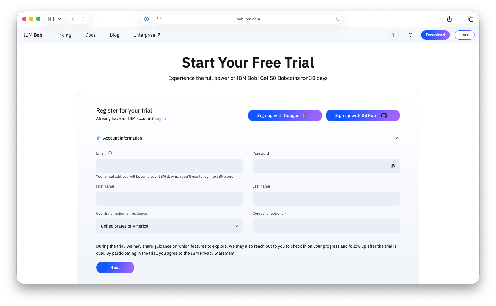
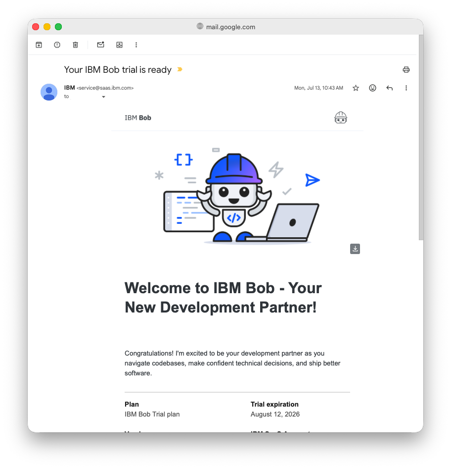
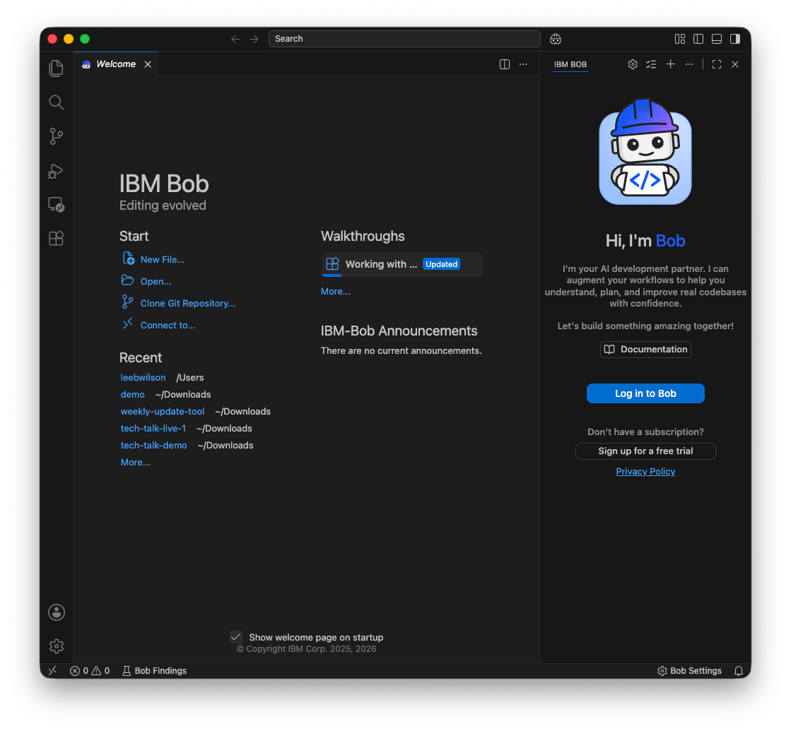
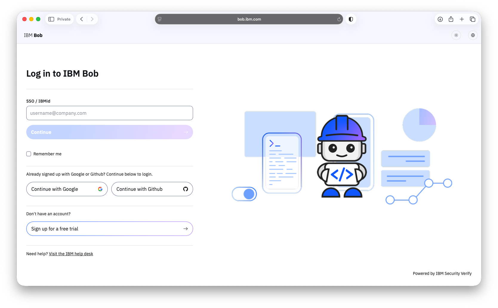
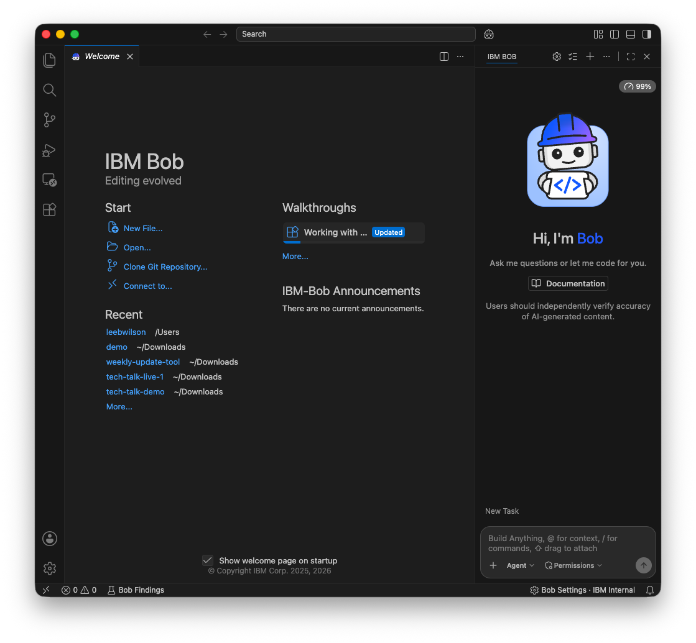

# Setting Up IBM Bob — Participant Guide

> ⏱️ **Complete this setup 2–3 days before the event** to avoid any delays on the day of the challenge.

---

## Overview

IBM Bob is an AI-powered coding assistant built on a VS Code-based IDE. This guide walks you through the three steps needed to get up and running:

1. [Register for IBM Bob](#step-1-register-for-ibm-bob)
2. [Download and install IBM Bob](#step-2-download-and-install-ibm-bob)
3. [Log in to IBM Bob](#step-3-log-in-to-ibm-bob)

---

## Before You Begin

### Email address requirements

- A **university email address** is preferred.
- **Gmail and similar personal accounts** are welcome.
- ❌ **Do not use** temporary or disposable email addresses — your account may not be approved.

### System requirements

| Requirement | Minimum | Recommended |
|---|---|---|
| **OS** | macOS, Windows, or Linux | — |
| **RAM** | 4 GB | 8 GB |
| **Disk space** | 500 MB free | — |
| **Network** | Active internet connection | — |

---

## Step 1: Register for IBM Bob

1. Visit **[https://ibm.biz/university-bob](https://ibm.biz/university-bob)** in your browser.

2. Complete and submit the access request form.



3. Check your inbox for a **confirmation email** — your access must be approved before you can proceed.



> **Note:** If you do not already have an IBMid, you will be prompted to create one during registration. You can also create one in advance at [ibm.com/account/reg](https://www.ibm.com/account/reg/us-en/signup?formid=urx-19776).

---

## Step 2: Download and Install IBM Bob

Once your access is approved, download the installer from **[https://bob.ibm.com/download](https://bob.ibm.com/download)**.

Choose the installer that matches your operating system:

---

### 🍎 macOS

**First, identify your chip type:**

1. Click the **Apple logo** (top-left corner of your screen).
2. Select **About This Mac**.
3. Check the **Chip** field:
   - **Apple M1 / M2 / M3 (or later)** → download the **mac-ARM** installer
   - **Intel** → download the **mac-intel** installer
4. Open the downloaded file.
5. Follow the steps in the installation wizard.

---

### 🪟 Windows

1. Download the `.exe` installer from the download page.
2. Run the downloaded `.exe` installer.
3. Follow the installation wizard prompts.
4. Choose your installation directory (the default is recommended).
5. Click **Finish** to complete the installation.

---

### 🐧 Linux

#### Debian / Ubuntu

1. Download the `.deb` file from the download page.
2. Install it with your package manager, or run the following command in a terminal (update the filename to match the version you downloaded):

```bash
sudo apt install ./IBM-Bob-linux-amd64-1.105.1+bob1.0.0.deb
```

#### Red Hat / Fedora

1. Download the `.rpm` file from the download page.
2. Install it with your package manager, or run the following command in a terminal (update the filename to match the version you downloaded):

```bash
sudo dnf install ./IBM-Bob-linux-x64-1.105.1+bob1.0.0.rpm
```

---

## Step 3: Log In to IBM Bob

1. **Open IBM Bob** from your Applications folder (macOS), Start menu (Windows), or applications launcher (Linux).

2. On first launch, IBM Bob will prompt you to **sign in**. Enter your IBMid credentials when prompted.



3. Your browser will open automatically and take you through the **authentication flow** at `bob.ibm.com/login`.
   - If your university or organisation has SSO configured, you will be redirected to your organisation's login page.
   - Otherwise, you will log in via IBMid.

 

4. After authenticating in the browser, **return to IBM Bob** — your session will be established automatically.



> **Tip:** If you encounter network or firewall issues during sign-in, see the IBM Bob documentation on [Configuring firewall rules for Bob](https://bob.ibm.com/docs/ide/troubleshooting/ts-firewall-rules).

---

## You're Ready! 🎉

Once logged in, you'll see the IBM Bob IDE with the **Bob chat panel** on the side. The panel has three main components:

| Component | Description |
|---|---|
| **Chat history** | Displays your full conversation with Bob at the top of the panel |
| **Input field** | Type your requests to Bob in natural language at the bottom |
| **Send button** | Click the paper plane icon, or press **Enter**, to send a message |

**Keyboard shortcuts to know:**

| Action | Mac | Windows / Linux |
|---|---|---|
| Open Bob chat panel | `Option + Cmd + B` | `Ctrl + Alt + B` |
| Inline chat (edit in editor) | `Cmd + K` | `Ctrl + K` |
| Send code to chat | `Cmd + L` | `Ctrl + L` |

---

## Troubleshooting

### I didn't receive my approval email

- Check your spam or junk folder.
- Ensure you did not use a disposable or temporary email address.
- Allow up to 2–3 business days for access to be approved — this is why early registration is strongly recommended.

### Installation seems slow or Bob is not performing well

Make sure you downloaded the **correct version** for your hardware. On macOS, re-check the chip type under **About This Mac** and re-download the mac-ARM or mac-intel installer as appropriate.

If you need to reinstall:
1. Download the correct version from [https://bob.ibm.com/download](https://bob.ibm.com/download).
2. Uninstall your current version.
3. Install the correct version.

---

## Helpful Links

| Resource | URL |
|---|---|
| University registration | [https://ibm.biz/university-bob](https://ibm.biz/university-bob) |
| Download IBM Bob | [https://bob.ibm.com/download](https://bob.ibm.com/download) |
| Create an IBMid | [https://ibm.com/account/reg](https://www.ibm.com/account/reg/us-en/signup?formid=urx-19776) |
| IBM Bob documentation | [https://bob.ibm.com](https://bob.ibm.com/docs/ide) |
