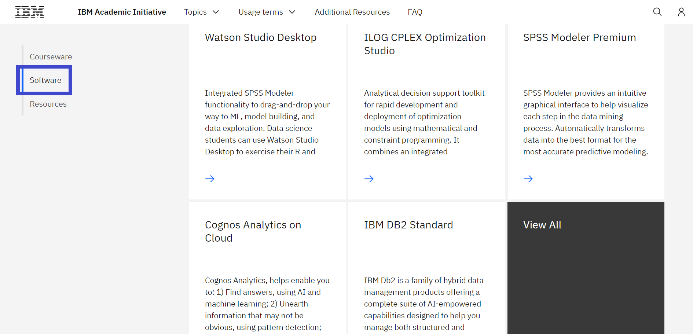
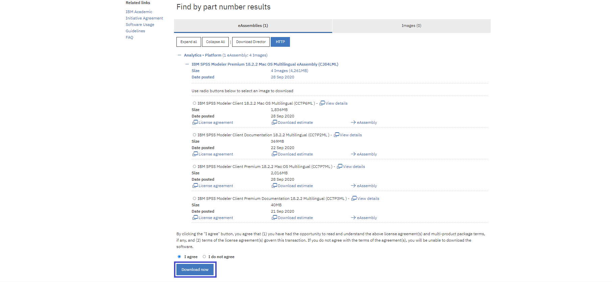
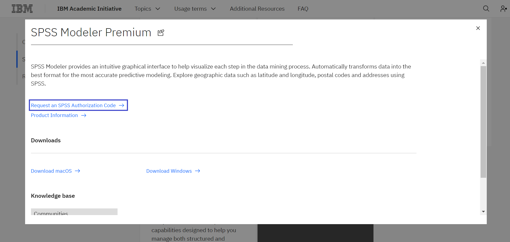

# Descargar SPSS Modeler Premium con IBM Academic Initiative
​
**Objetivo:** El propósito de esta guía es llevarlo por los pasos necesarios para ingresar al IBM Academic Initiative y descargar SPSS Modeler Premium
​
**Tiempo estimado:** 5-10 minutos
​
## Paso 1: Abrir el website de IBM Academic Initiative ibm.com/academic en su navegador
 

​
## Paso 2: Seleccione Already registered? Log in
 

​
## Paso 3: Introduzca el correo electrónico de su institución educativa y complete el proceso de inicio de sesión
 

​
## Paso 4: Visite la página Data Science
 

Menú Topics > See All > Data Science

​​
## Paso 5: Deslice hasta abajo y seleccione la pestaña de Software 
 

​

​
## Paso 6a: Seleccione Download macOS para descargar SPSS para sistema operativo macOS
 

​
## Paso 6b: Seleccione Download Windows para descargar SPSS para Sistema operativo Windows 
 

​
**Nota:** Al seleccionar el enlace Download se abrirá una nueva pestaña. Algunos 
navegadores pueden requerir que el usuario lo permita.
​
## Paso 7: Una vez abierta la pantalla IBM Software Download, deslice hasta abajo hasta Find by part number results y seleccione la opción HTTP 
 

Opción: macOS Download

​
Opción: Windows Download

​​
## Paso 8: Seleccione la imagen a descargar y marque la opción “I agree” una vez que haya leído y entendido los términos de licenciamiento.
 

Opción: macOS Download

​
Opción: Windows Download

​
**Nota:** Puede encontrar los términos de uso de software para el programa IBM Academic Initiative en: 
https://www.ibm.com/academic/faqs/agreement
​
​
## Paso 9: Seleccione el botón Download now y descargue el archivo en su disco local 
 
​
Opción: macOS Download

​
Opción: Windows Download

​
## Paso 10: Regrese al website IBM Academic Initiative y solicite el código de autorización SPSS (SPSS Authorization Code) en la tarjeta SPSS Modeler Premium.
 

​
**Nota:** El Código de autorización es necesario para activar el SPSS Modeler Premium.
​
## Paso 11: Coloque el Código de autorización (Authorization Code) en el SPSS Modeler Premium.
 

​
**Nota:** Para soporte de SPSS contacte a nuestro SPSS Community
https://developer.ibm.com/predictiveanalytics