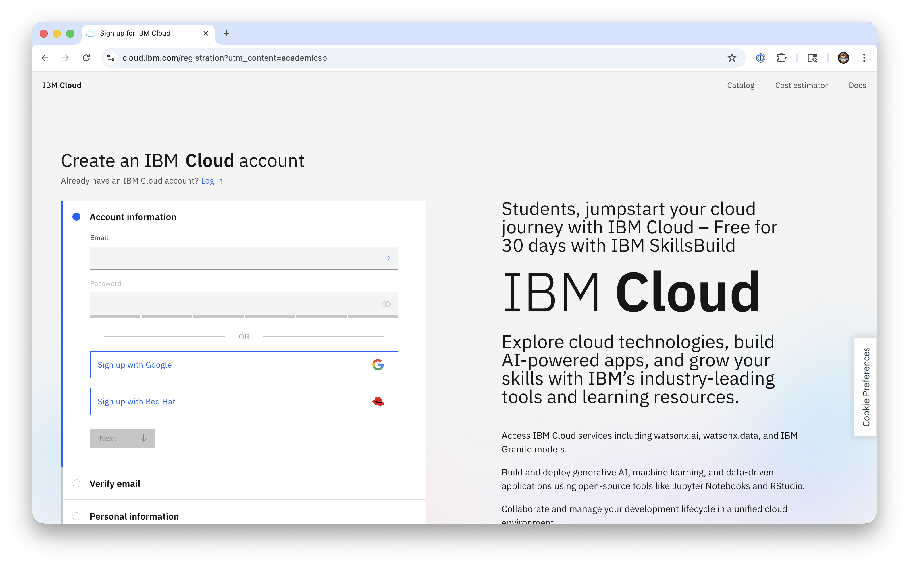
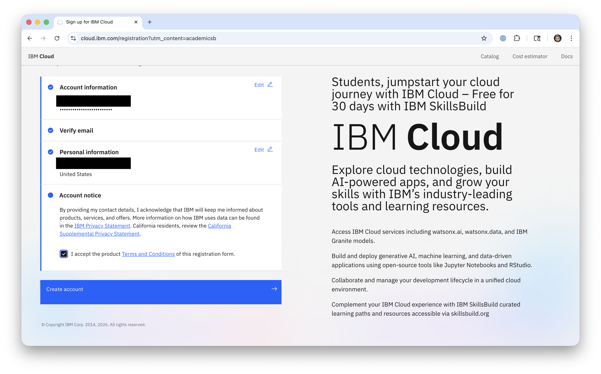

# How to Create a 30-day IBM Cloud Trial Account

The following guide will walk you through the steps required in order to create a **new** 30-day IBM Cloud trial account.
 

## Notice
Please do not provide credit card information on IBM Cloud unless you are actively upgrading to a paid account and are willing accepting to be billed for consumed services.
 

## Step 1 - Visit [IBM Cloud](https://cloud.ibm.com/registration?utm_content=academicsb) in a web browser

 

## Step 2 - Follow the on-screen instructions and complete the registration process

Your trial will be valid for 30-days.  If you are an active student or faculty member at a college or university you may extend your trial by [requesting](https://github.com/academic-initiative/documentation/blob/main/academic-initiative/how-to/How-to-request-and-IBM-Cloud-Feature-Code/readme.md) and [applying an IBM Cloud Feature Code](https://github.com/academic-initiative/documentation/blob/main/academic-initiative/how-to/How-to-apply-an-IBM-Cloud-Feature-Code/readme.md) before your trial expires.