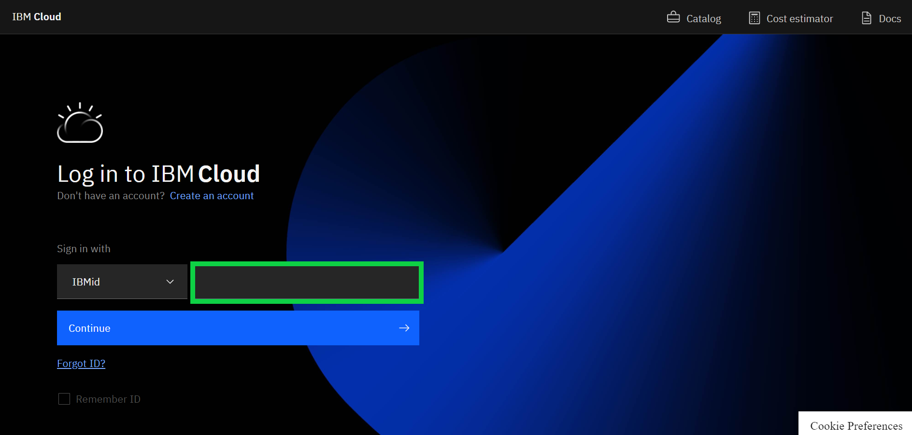
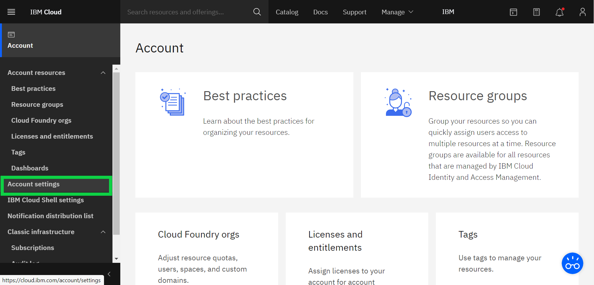

# How to Apply an IBM Cloud Feature Code

[日本語](/academic-initiative/jp/how-to/How-to-apply-an-IBM-Cloud-Feature-Code/readme.md);
[Português](/academic-initiative/pt-br/how-to/How-to-apply-an-IBM-Cloud-Feature-Code/readme.md);

**Objective:** The purpose of this guide is to take you through the steps required to apply an IBM Cloud Feature Code.

**Estimated time:** 5 – 10 minutes 

## Step 1: Open the [IBM Cloud website](https://cloud.ibm.com/) in a web browser.

## Step 2: Login using your IBMid and click Continue.

## Step 3: From the main Dashboard, click on Manage in the upper-right menu.

## Step 4: Click on Account from the drop-down menu.

## Step 5: Click on Account Settings from the left-hand menu.

## Step 6: Scroll down until you see the 'Subscription and Feature Code' section and click on Apply Code button.

## Step 7: Enter (or copy/paste) your 32-character feature code and click Apply.
