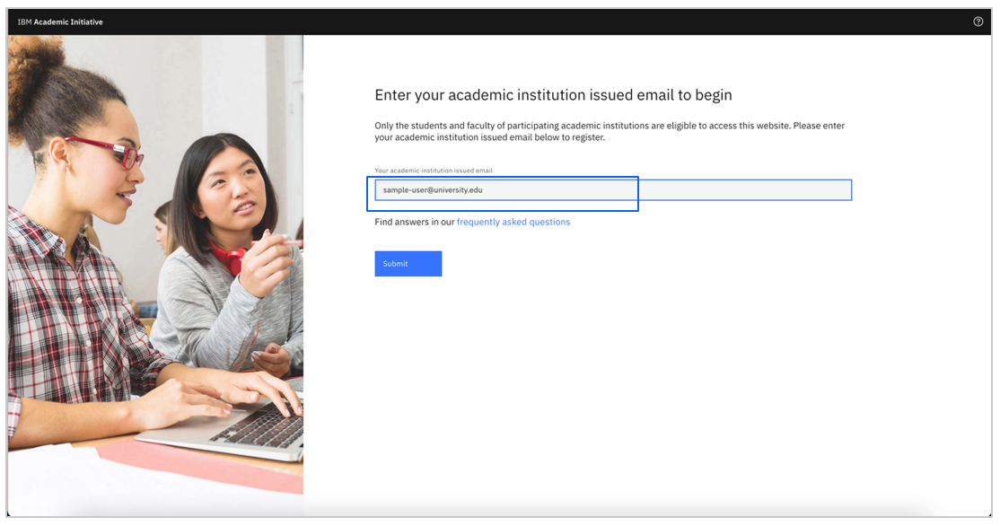
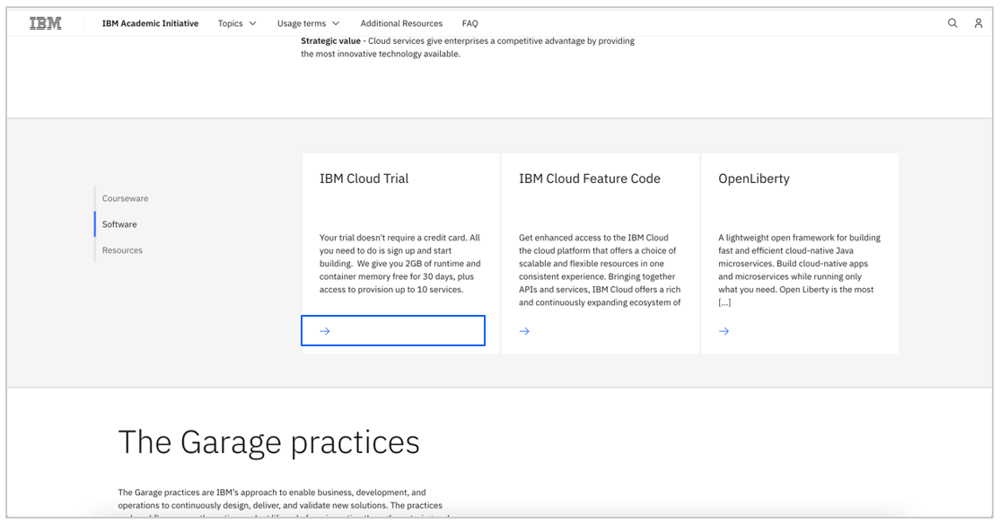
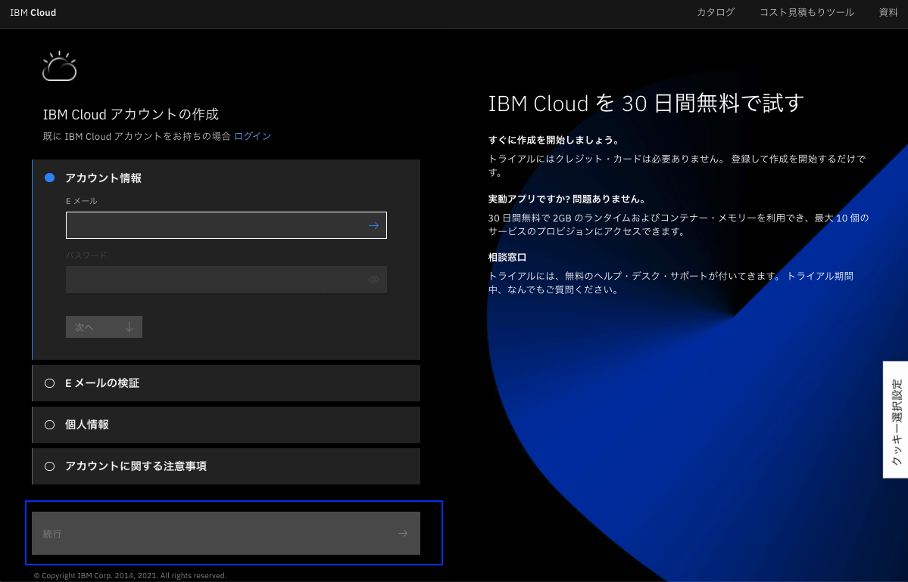

# IBM Cloud アカウントの登録方法

[English](/academic-initiative/how-to/How-to-create-an-IBM-Cloud-account/readme.md)

**目的：** このガイドの目的は、IBM Cloud Accountを作成する際の手順を説明することです。 このガイドでは、[IBM Academic Initiativeに登録済み](/academic-initiative/how-to/How-to-register-with-the-IBM-Academic-Initiative/readme-ja.md)であることを前提としています。

**推定所要時間：** 5-10分

## Step 1: [IBM Academic Initiative](https://ibm.com/academic)のWebサイトをWebブラウザで開きます。
 

 

## Step 2:  「**Already registered? Log in**」 をクリックします。
 

 
 
## Step 3: IBM Academic Initiativeに登録した教育機関、大学で発行されたEメールIDを入力し、ログインを行ってください。
 

 
 
## Step 4: IBM Cloudのトピック・ページを表示します。

**Topics menu > IBM Cloud**をクリックすると、すぐにページに移動できます。
 

 

## Step 5: スクロールダウンして、「**Software**」タブをクリックします。
 

   

## Step 6: 「**IBM Cloud Trial**」 をクリックします。
 

  

## Step 7: 「**Create a Trial account**」をクリックします。
 

  
 
## Step 8: 登録フォームに必要事項を入力します。

- 最初にIBM Academic Initiativeに登録したEメールアドレス（IBMid）を入力し、→をクリックします。Eメールアドレスが検証されます。

- 最後に「次へ」をクリックします。

- 登録したメールアドレスに送付された検証コードを入力し、「次へ」をクリックします。

**Note:** IBM Cloud はお客様のアカウントを確認するために入力したEメールアドレスに確認メールを送信します。そのメールに記載された確認コードの入力が必要になります。
 

 
 
## Step 9: 登録フォームに必要事項を入力します。

**Note:** 必要な情報を入力すると、ボタンが有効になります。
 

  
 
## Step 10: 画面の指示に従って追加のステップを完了し、アカウントを登録します。

 

## Step 11: [IBM Cloud](https://cloud.ibm.com)にログインします。ダッシュボードに移動し、リソース・サマリー、IBM Cloud のステータス、その他の一般的な情報を確認できます。
 

