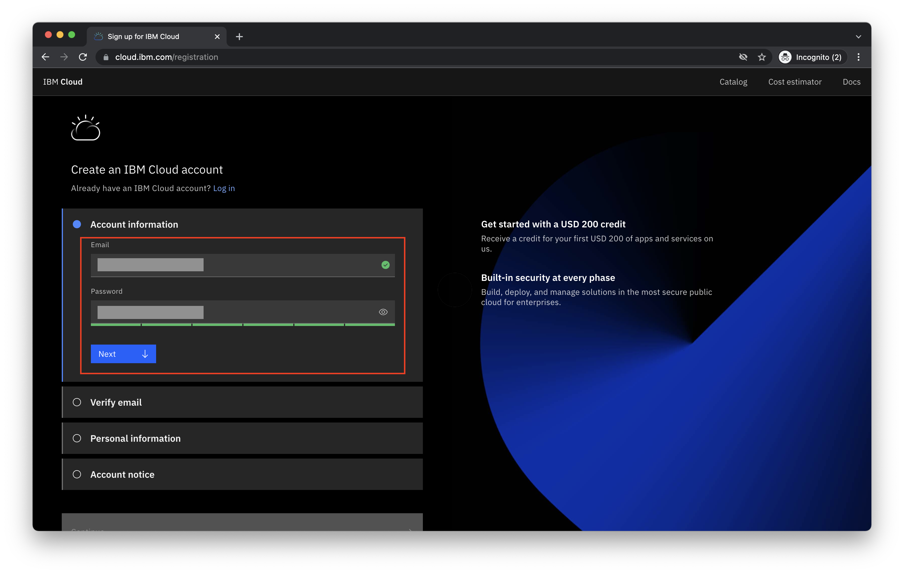
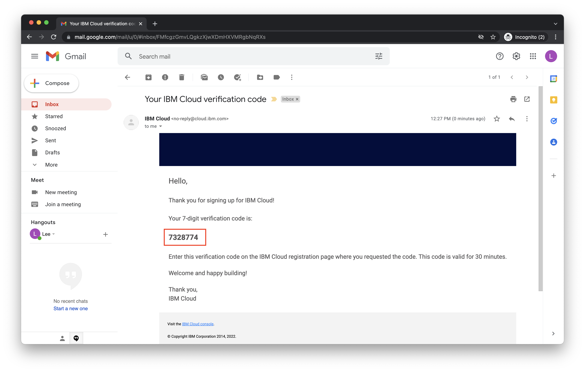
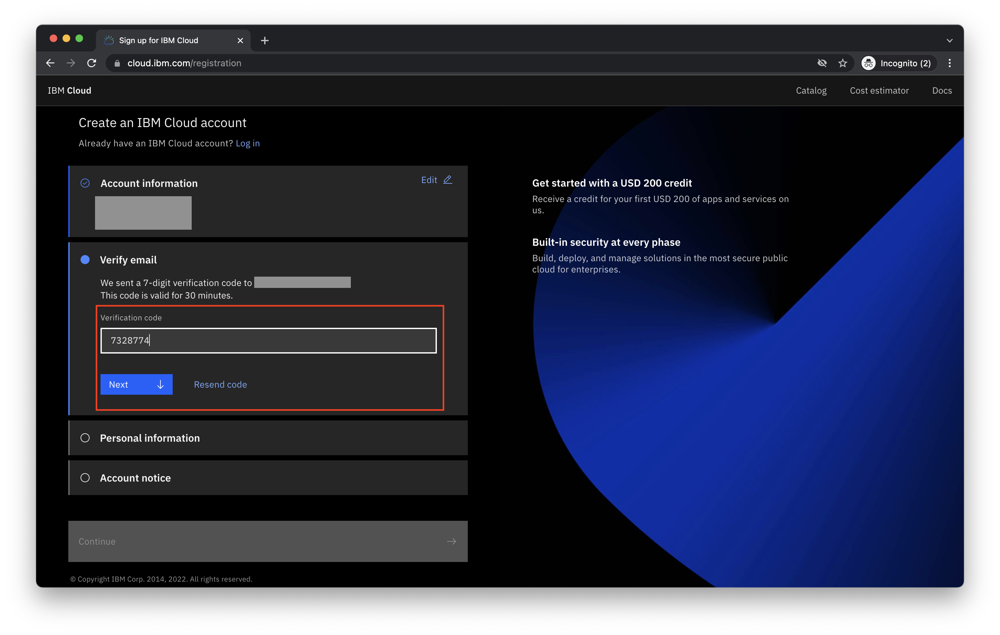
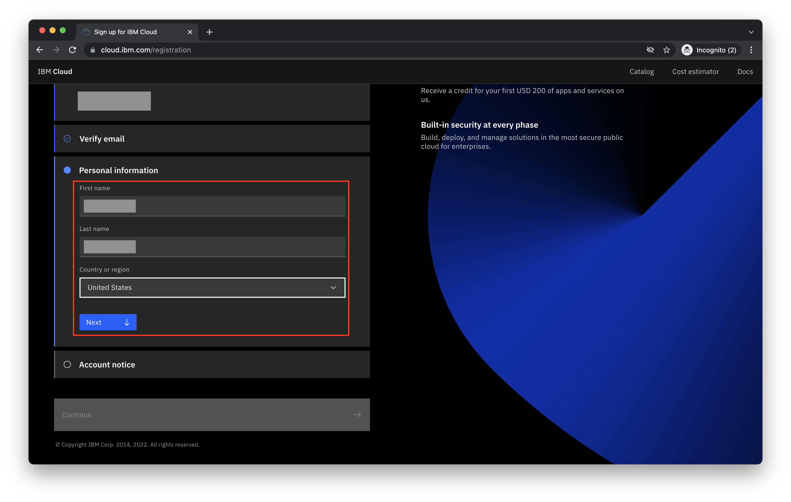
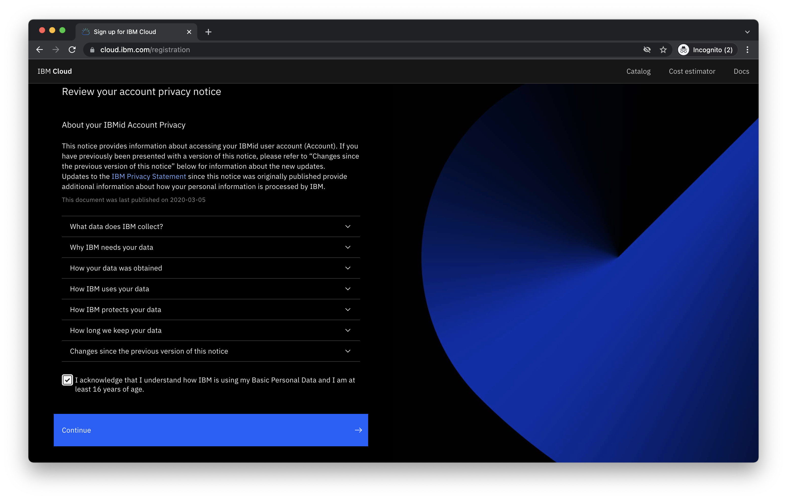
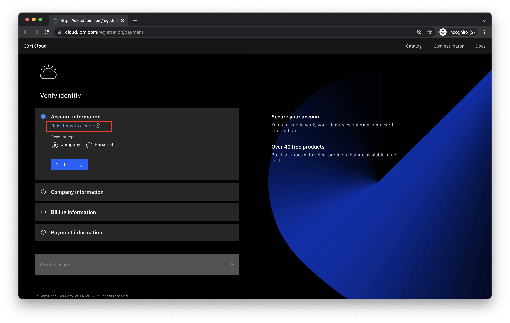
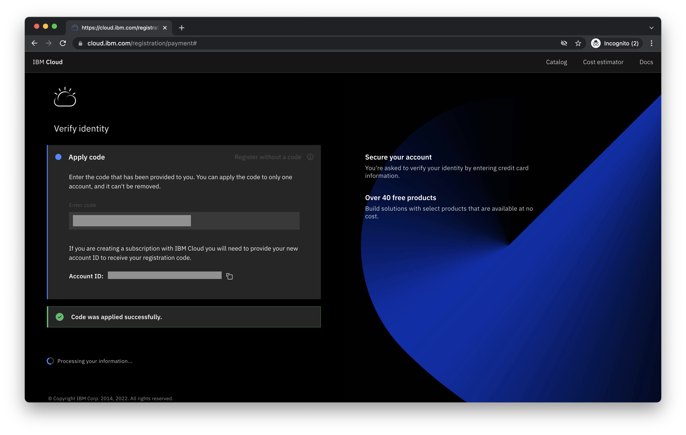
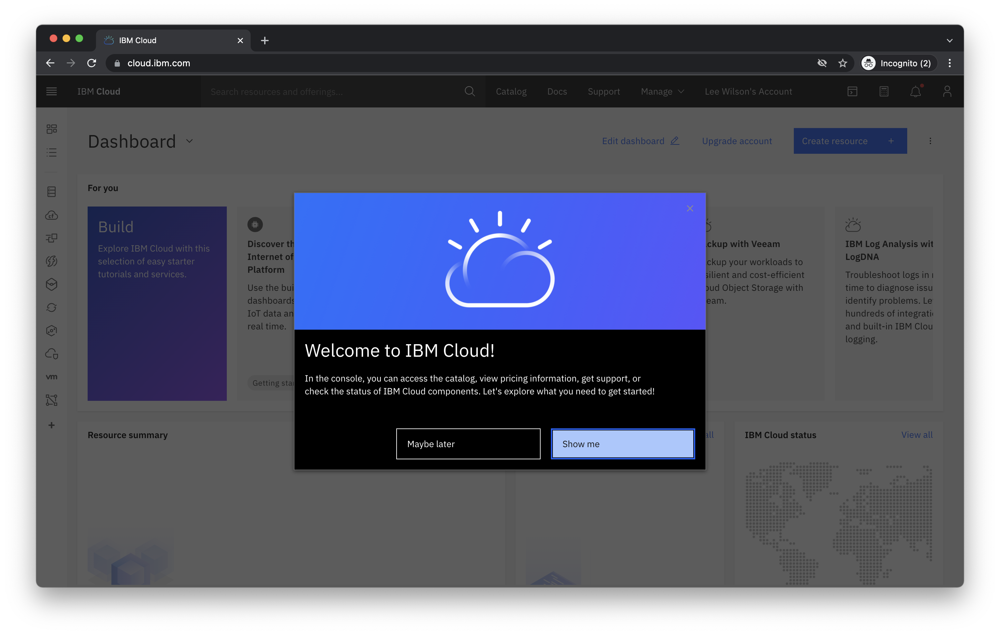

# How to Create an IBM Cloud Account 

The following guide will walk you through the steps required in order to create a **new** IBM Cloud account.
 
 

## Step 1 - Visit [cloud.ibm.com](https://cloud.ibm.com) in a web browser

 

## Step 2 - Click on **Create an account**

 

## Step 3 - Enter a valid **email address** and **password**.  Click **Next** to proceed.

 

## Step 4 - You will be emailed a verification code.  Please check your email inbox and enter the 7-digit verification code you received.  Click **Next** to proceed.

## Step 5 - Provide your **First name**, **Last name** and **Country or region**. Click **Next** to proceed.

## Step 6 - Complete the **Account notice** and click on **Continue** to proceed.

## Step 7 - Complete the **Account privacy notice** and click on **Continue** to proceed.

## Step 8 - At the **Verify identity** screen, click on the **Register with a code** option.

## Step 9 - Enter your 32-character IBM Cloud Feature Code in the **Enter code** text box.  Click **Create account** to proceed.

_Note: Students and educators at degree-granting accredited academic institutions may [obtain an IBM Cloud Feature Code](https://github.com/academic-initiative/documentation/blob/main/academic-initiative/how-to/How-to-request-and-IBM-Cloud-Feature-Code/readme.md) through the [IBM Academic Initiative](https://www.ibm.com/academic).  All others should receive an IBM Cloud Feature Code from their event coordinator._

## Step 10 - Success!

