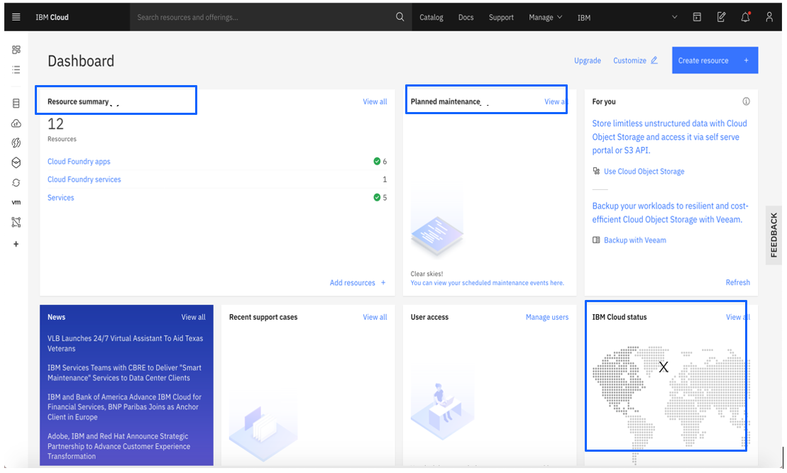

# How to Create an IBM Cloud Account 

**Objective:** The purpose of this guide is to walk you through the steps to be followed 
when creating an IBM Cloud Account.  This guide will assume you have already [registered with the IBM Academic Initiative](/academic-initiative/how-to/How-to-register-with-the-IBM-Academic-Initiative/readme.md).

**Estimated time:** 5-10 minutes

## Step 1: Open the [IBM Academic Initiative](https://ibm.com/academic) website in a web browser.
 

 

## Step 2: Click **Already registered? Log in.**
 

 
 
## Step 3: Enter your academic institution, college, university issued email ID and complete the login process.
 

 
 
## Step 4: Visit the  IBM Cloud topic pages

You can quickly navigate to the page by clicking on the **Topics menu > IBM Cloud**
 

 

## Step 5: Scroll down and click **Software** tab.
 

   

## Step 6: Click **IBM Cloud Trial.** 
 

  

## Step 7: Click **Create a Trial account.**
 

  
 
## Step 8: Enter the required details in the registration form.

**Note:** You must share a valid email address, IBM Cloud will send you a confirmation email to verify your account and you may be required to enter a verification code.
 

 
 
## Step 9: Complete the required details in the registration form.

**Note:** The button will be activated once you enter the required  information.
 

  
 
## Step 10: Complete any additional steps as prompted and register your account.

 

## Step 11: Log into [IBM Cloud](https://cloud.ibm.com). You will be directed to the dashboard where you can find the resources summary, IBM Cloud status, and other general information.
 

