# How to download IBM ILOG CPLEX Optimization Studio

**Objective:** The purpose of this guide is to walk you through the steps required to login to the IBM SkillsBuild Software Downloads website and download the IBM ILOG CPLEX Optimization Studio.

**Estimated time:** 5-10 minutes

## Step 1: Open the [IBM SkillsBuild Software Downloads](https://ibm.com/academic) website in a web browser.
 

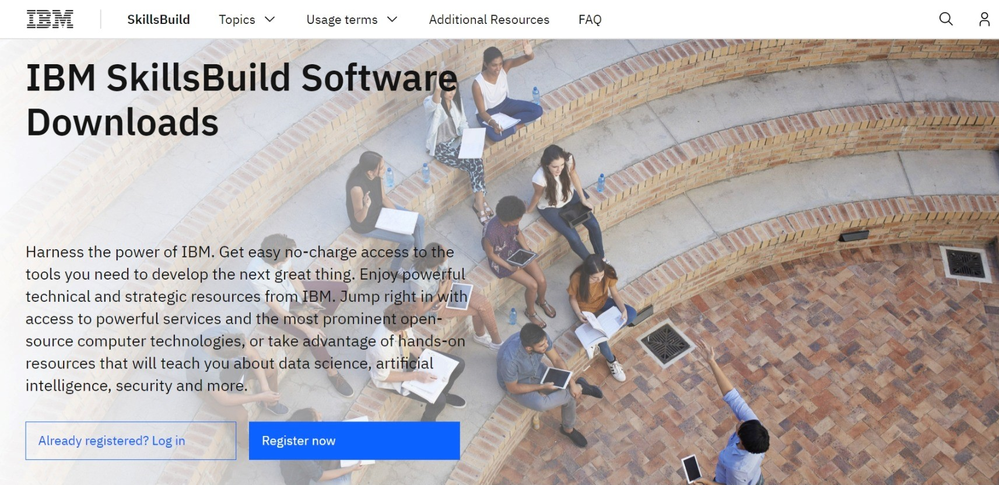

## Step 2: Click **Already registered? Log in.**
 

## Step 3: Enter your academic institution, college, university issued email ID and complete the login process.
 

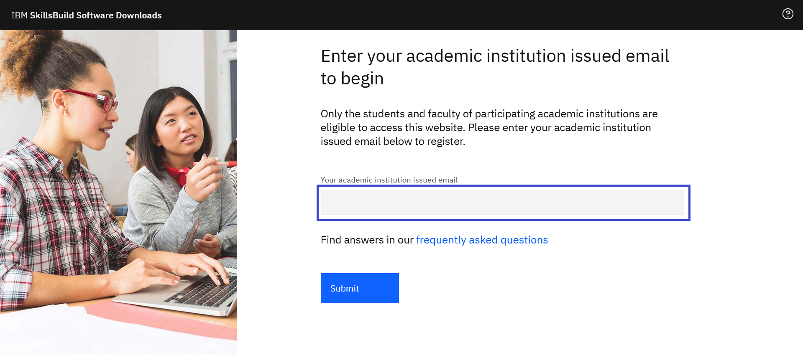

## Step 4: Visit the Data Science topic page.
Topics menu > See All > Data Science
 

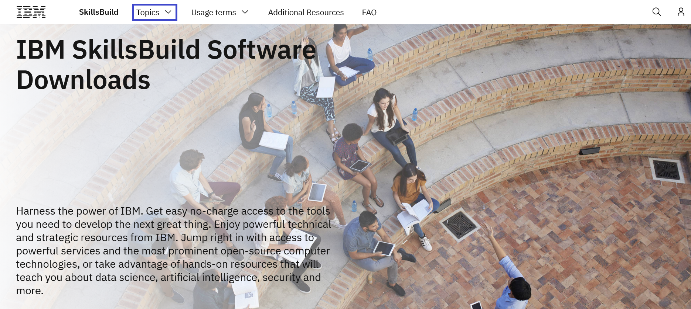
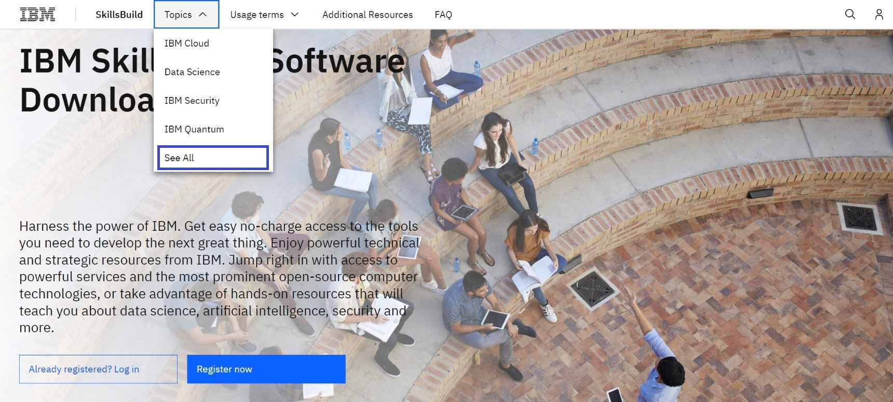
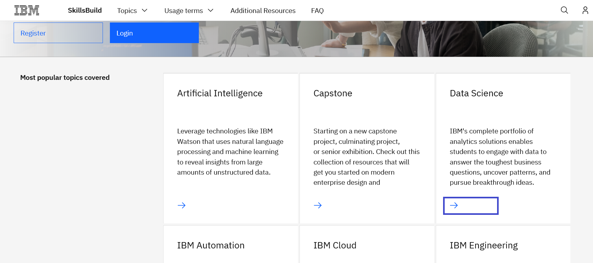

## Step 5: Scroll down and click Software tab.
 

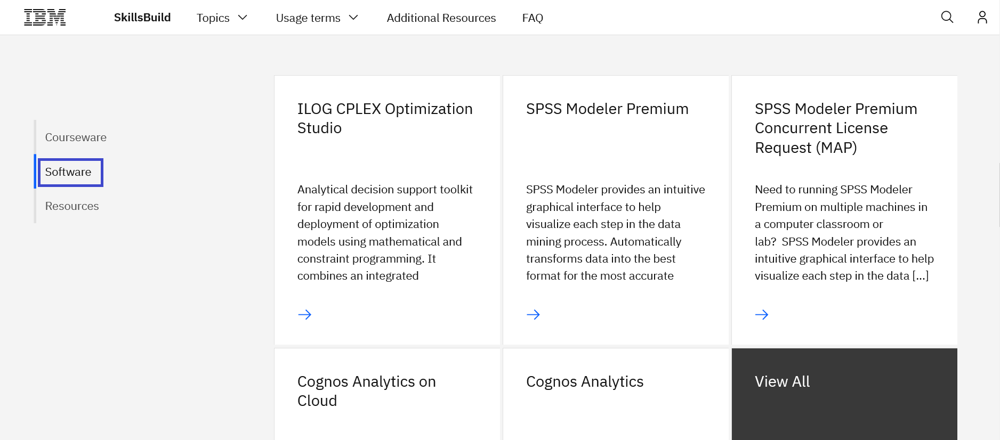

# Step 6: Click the ILOG CPLEX Optimization Studio tile.
 

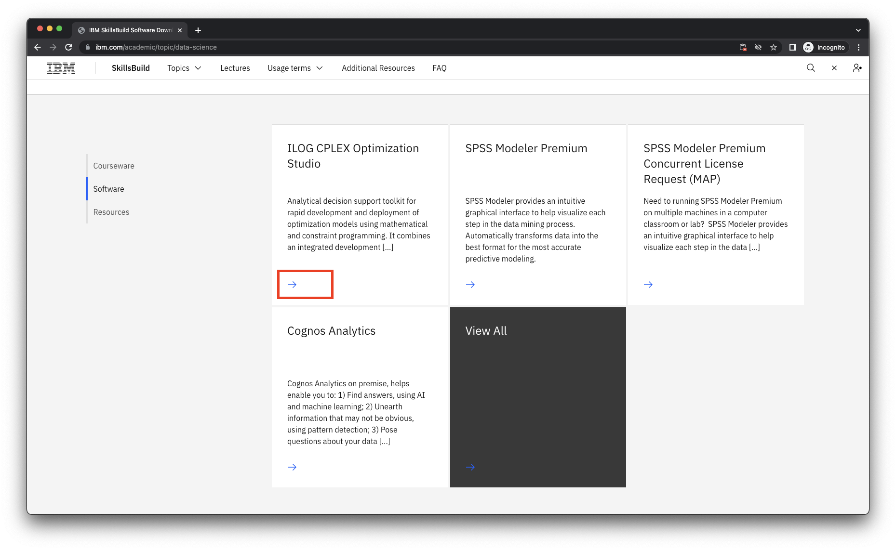

## Step 6a: Click the Download link to download IBM ILOG CPLEX Optimization Studio.
 

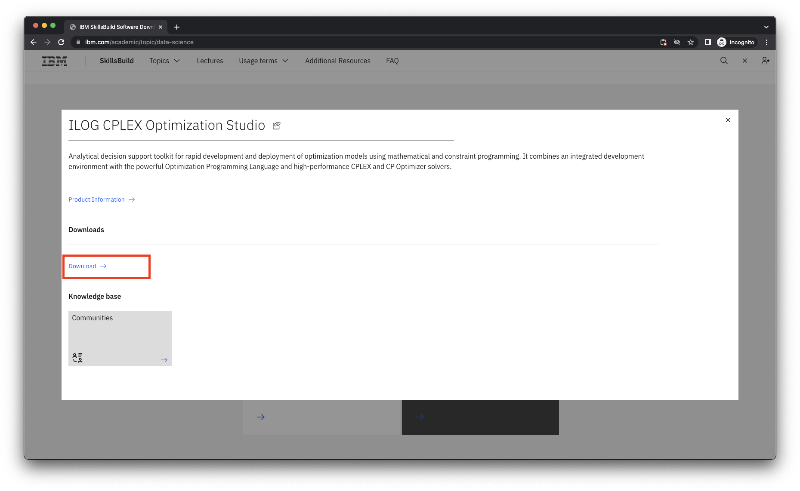

**Note:** When you click Download, a new tab will open. Some browsers may require the user to give permission for this tab to be operable.

## Step 7: Once you open the IBM Software Download link, scroll down to Find by part number results and click the HTTP option.
 

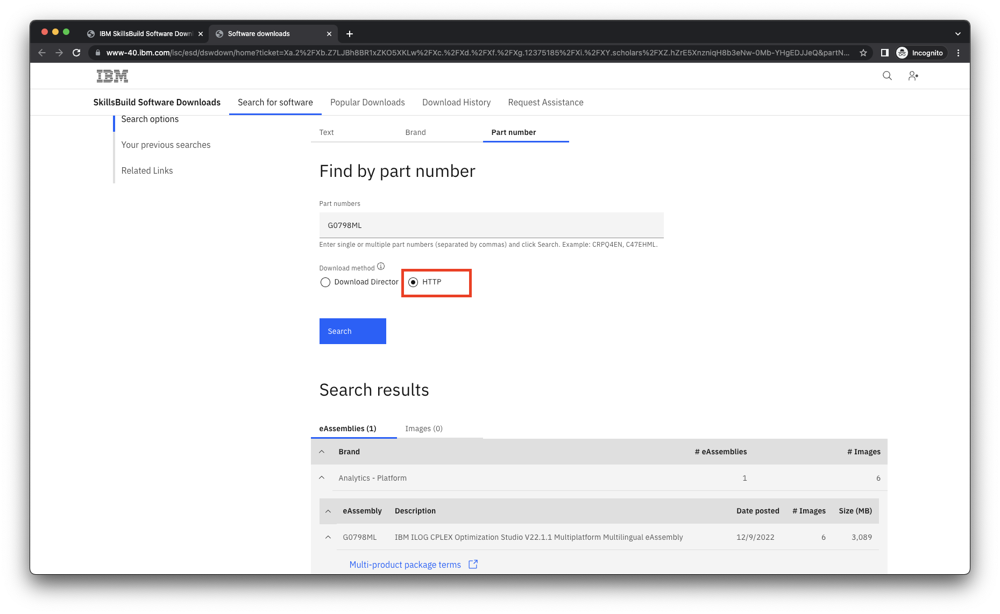

## Step 8: Select the image to download and after you read and understand the license agreement, click “I agree”.
 

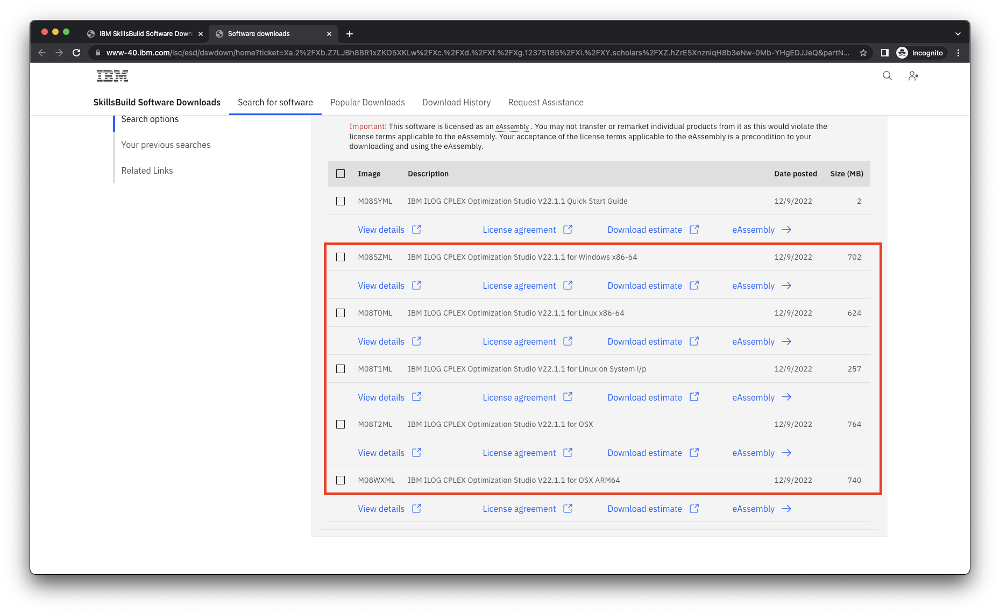

**Note:** The terms for the IBM SkillsBuild Software Downloads program can be found at: 
https://www.ibm.com/academic/faqs/agreement.

## Step 9: Click Download now and save the file(s) to your local hard drive.
 

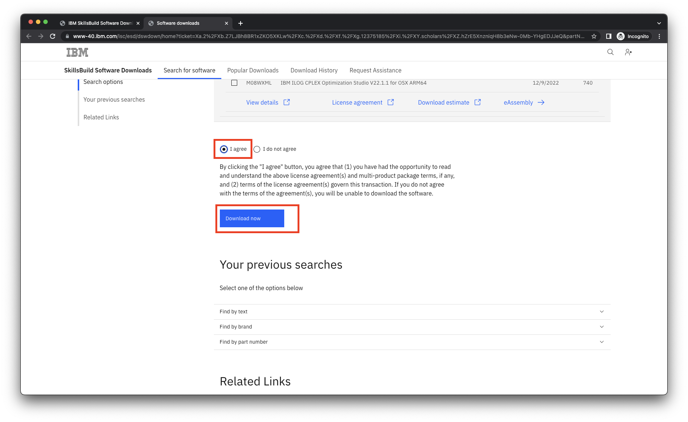
