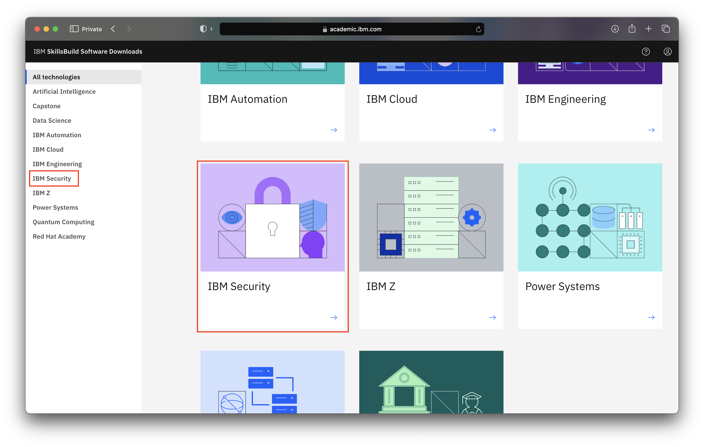
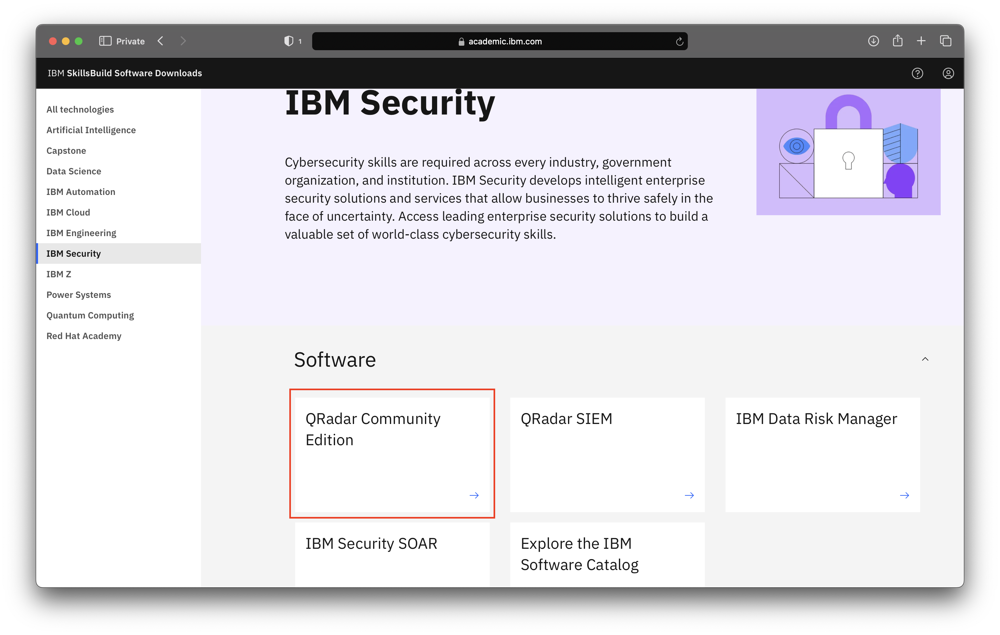
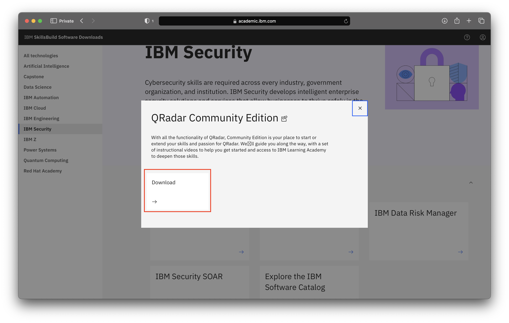
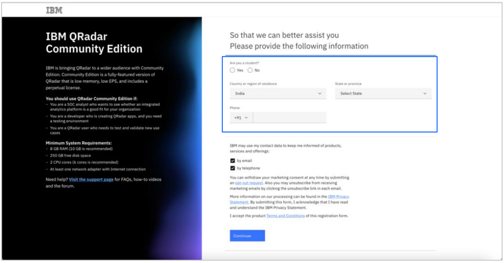

# How to download Qradar Community Edition

**Objective** The purpose of this guide is to walk you through the steps to be followed when downloading Qradar 
Community Edition from the IBM SkillsBuild Technology Access website.

**Estimated time:** 5-10 minutes

## Step 1: Open [IBM SkillsBuild Technology Access](http://ibm.com/academic) in a web browser.
 

## Step 2: Click **Access software downloads**
 

## Step 3: Enter your academic institution, university, college issued email ID and complete the login process.
 

## Step 4: Visit the IBM Security topics page.
 

 

## Step 5: Click Download under the QRadar Community Edition tab.
 

 

**Note:** When you click Download, a new tab will open. Some browsers may require the user to give permission for this tab to be operable.

## Step 6: Once the screen opens, fill in the information and verify your email.
 

**Note:** Login with your academic institution email as it is associated with an IBMid and you will not need to create any additional accounts.

## Step 7: Complete the required information to get access to the academic version of QRadar Community Edition.
 

## Step 8: Once the information submission is completed, the IBM MRS Tool page will be displayed. Click Download to get the QRadar file.
 

**Note:** 
* For more documentation on QRadar, visit: https://www.ibm.com/community/qradar
* For more product information, visit: https://www.ibm.com/community/qradar/ce/
