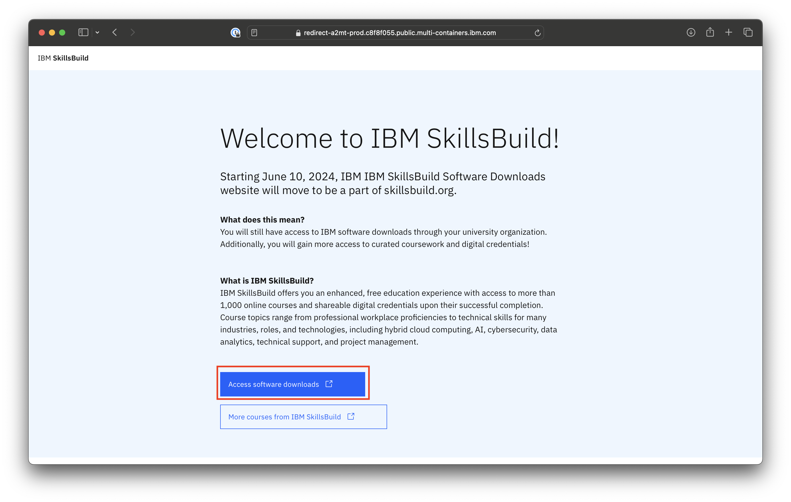
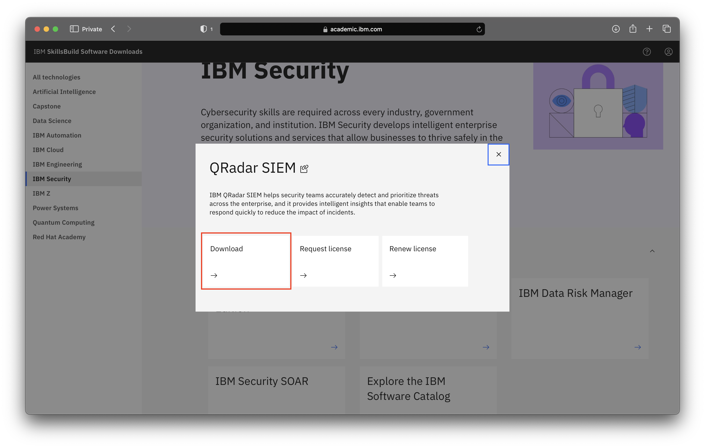

# How to download QRadar SIEM

**Objective** The purpose of this guide is to walk you through the steps to be followed when downloading QRadar SIEM from the IBM SkillsBuild Software Downloads website.

**Estimated time:** 5-10 minutes

## Step 1: Open [IBM SkillsBuild Software Downloads](http://ibm.com/academic) in a web browser.
 

## Step 2: Click **Access software downloads**
 

## Step 3: Enter your academic institution, university, college issued email ID and complete the login process.
 

## Step 4: Visit the IBM Security topics page.
 

 

## Step 5: Click Download under the QRadar SIEM.
 

 

**Note:** When you click Download, a new tab will open. Some browsers may require the user to give permission for this tab to be operable.

## Step 6: Once you open the IBM Software Download link, scroll down to Find by part number results and click the HTTP tab.
 

## Step 7: Select the image to download and after you read and understand the license agreement, click “I agree”.
 

**Note:** The terms for the IBM SkillsBuild Software Downloads program can be found at: 
https://www.ibm.com/academic/faqs/agreement.

## Step 8: Click Download now and save the file(s) to your local hard drive.
 

## Step 9: Return to the IBM SkillsBuild Software Downloads Security topic page and request a QRadar SIEM License in the QRadar SIEM card.
 

**Note:**  The license will be delivered via email in a few days.