# How to download SPSS Modeler Premium

**Objective:** The purpose of this guide is to walk you through the steps required to login to the IBM SkillsBuild Technology Access and download the SPSS Modeler Premium.

**Estimated time:** 5-10 minutes

## Step 1: Open the [IBM SkillsBuild Technology Access](https://ibm.com/academic) website in a web browser.
 

## Step 2: Click **Access software downloads**
 

## Step 3: Enter your academic institution, college, university issued email ID and complete the login process.
 

## Step 4: Visit the Data Science topic page.
 

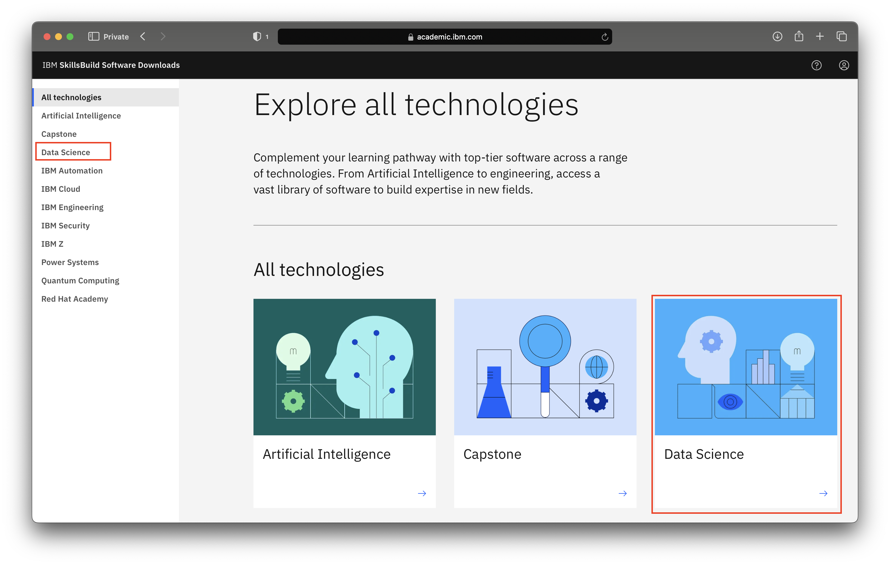

## Step 6: Click the SPSS Modeler Premium tile.
 

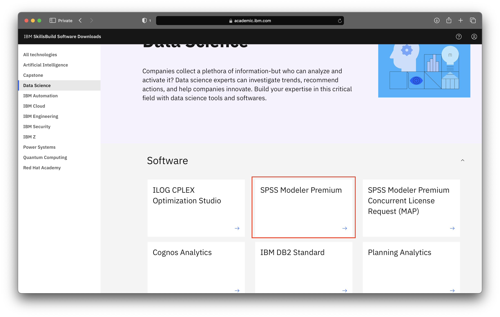

## Step 6a: Click the Download macOS link to download SPSS for macOS operating system.
 

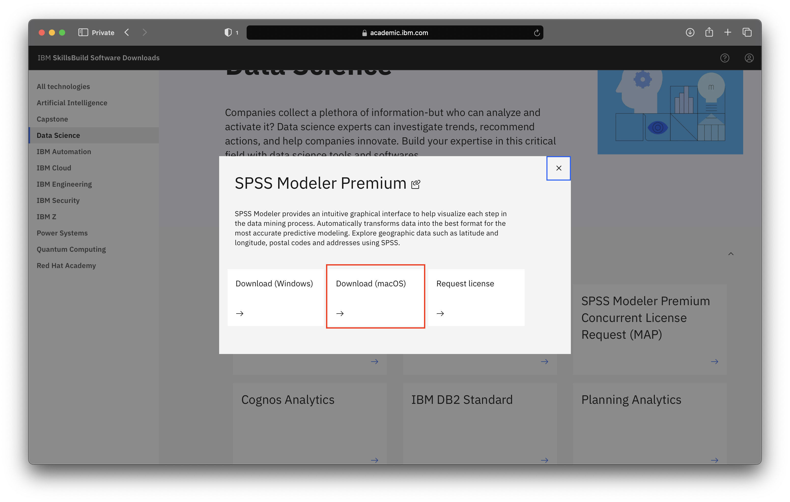

## Step 6b: Click the Download Window link to download SPSS for Windows operating system.
 

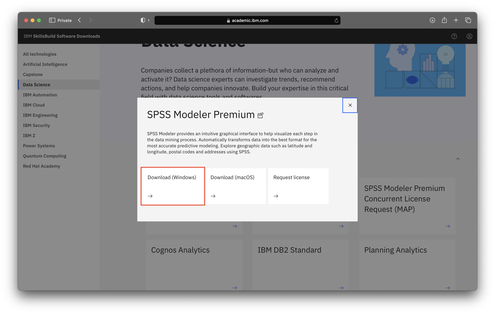

**Note:** When you click Download, a new tab will open. Some browsers may require the user to give permission for this tab to be operable.

## Step 7: Once you open the IBM Software Download link, scroll down to Find by part number results and click the HTTP tab.
 

Option: macOS download
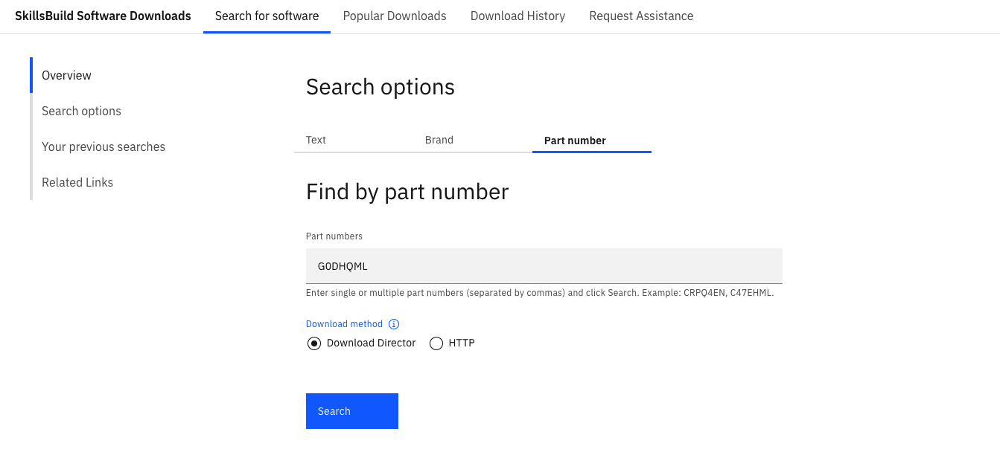

Option: Windows download
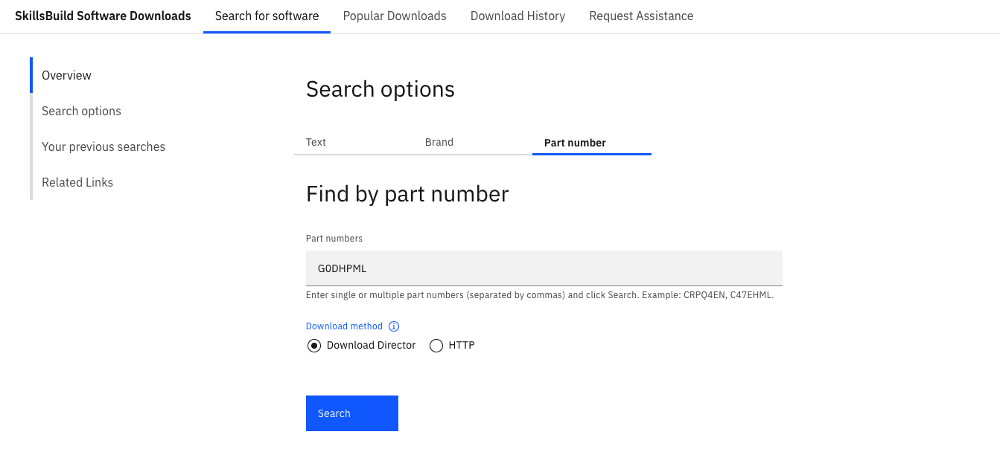

## Step 8: Select the image to download and after you read and understand the license agreement, click “I agree”.
 

Option: macOS download
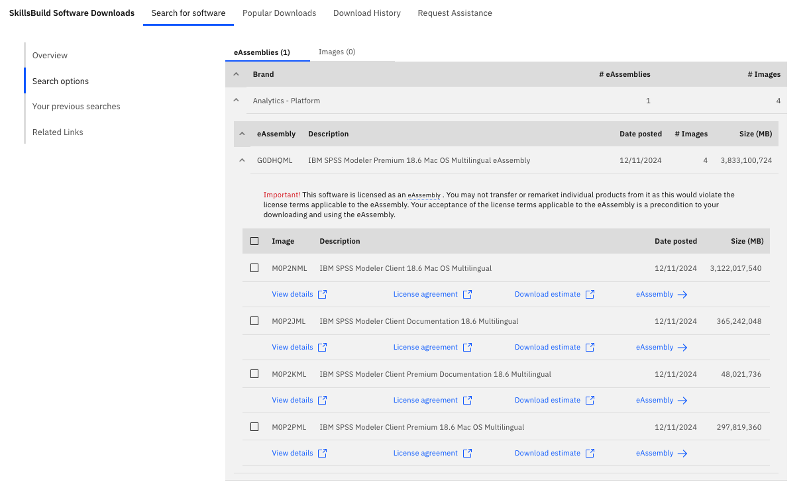

Option: Windows download
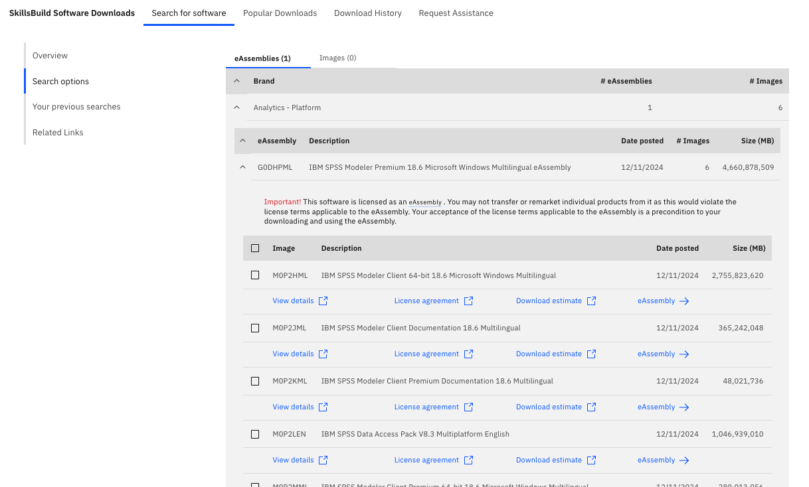

**Note:** The terms for the IBM SkillsBuild Technology Access program can be found at: 
https://www.ibm.com/academic/faqs/agreement.

## Step 9: Click Download now and save the file(s) to your local hard drive.
 

Option: macOS download
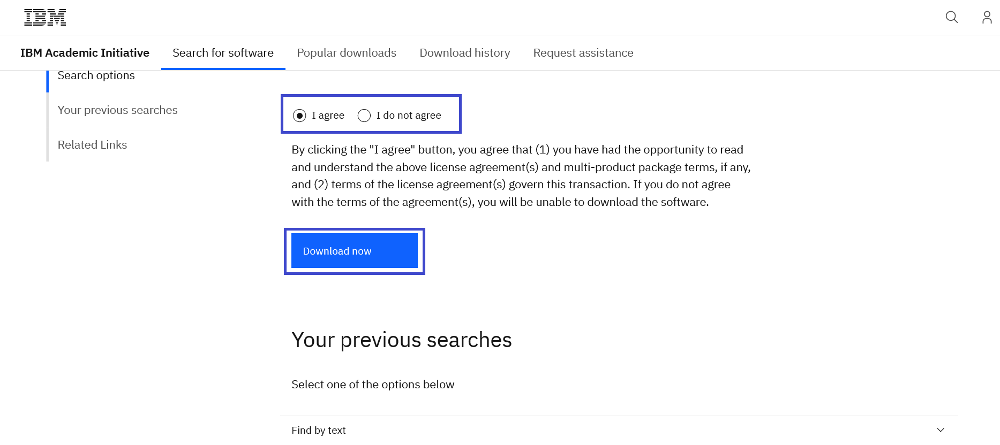

Option: Windows download
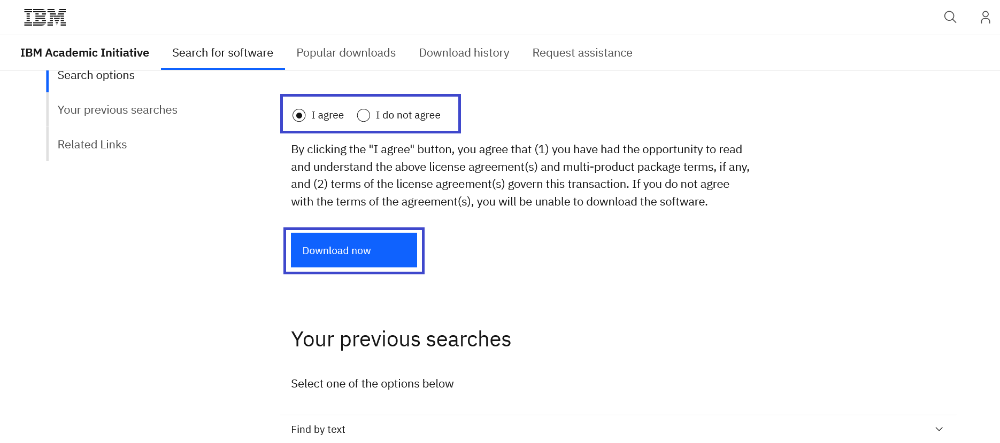

## Step 10: Return to the IBM SkillsBuild Technology Access Data Science topic page and request an SPSS Authorization Code in the SPSS Modeler Premium card.
 

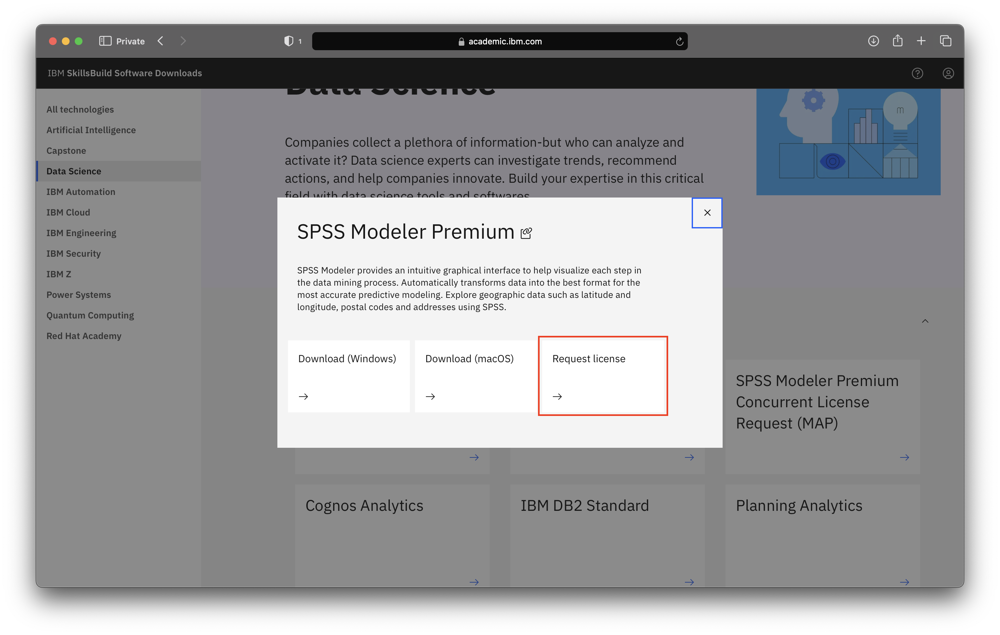

**Note:**  The authorization code is necessary to activate the SPSS Modeler Premium.

## Step 11: Enter the Authorization Code in the SPSS Modeler Premium.
 

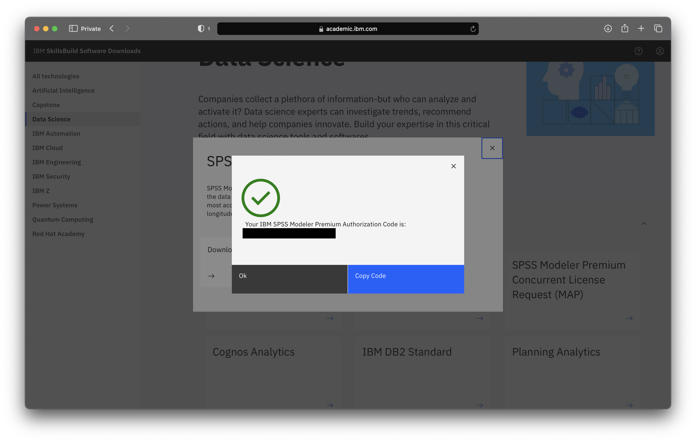

**Note:** For SPSS support, please reach out to our SPSS Community at:
https://developer.ibm.com/predictiveanalytics

