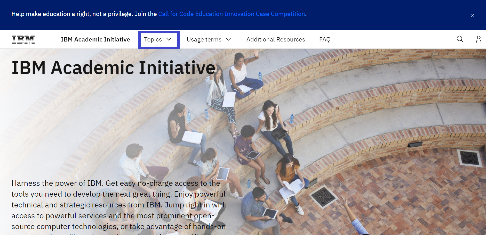
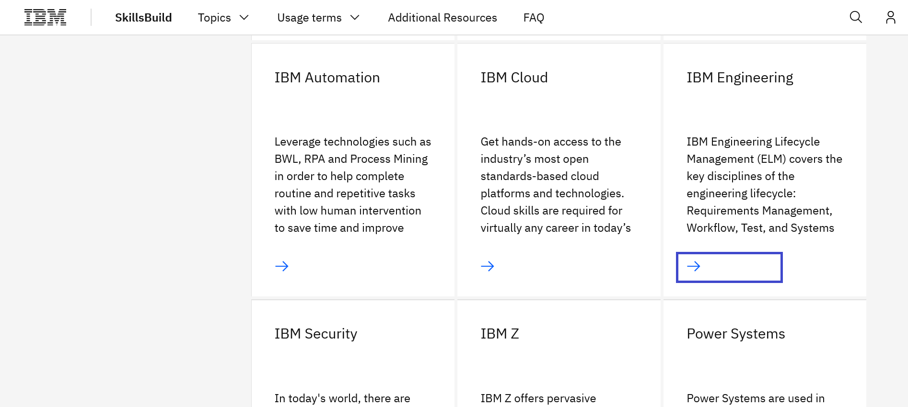
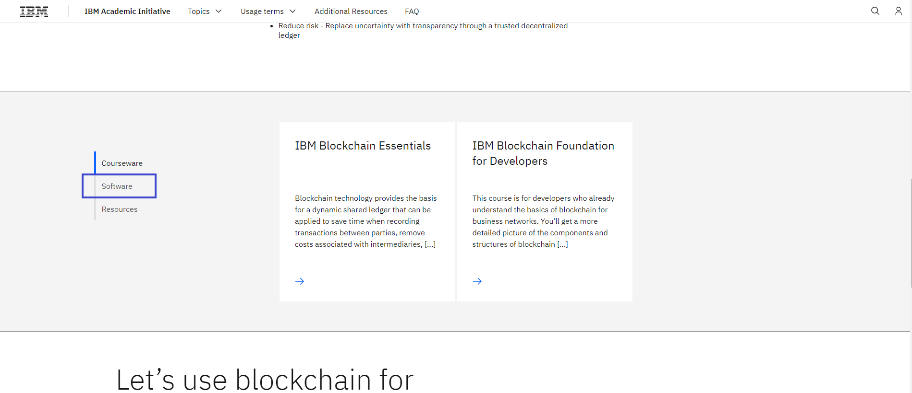
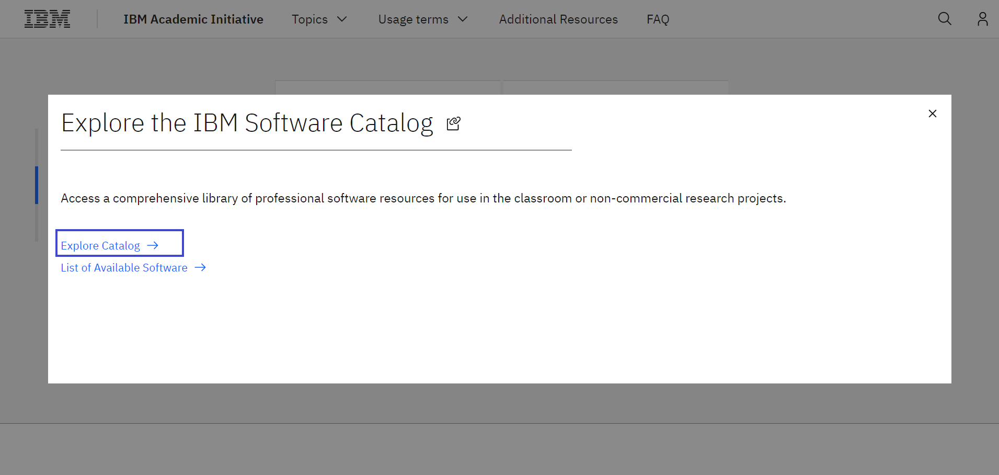
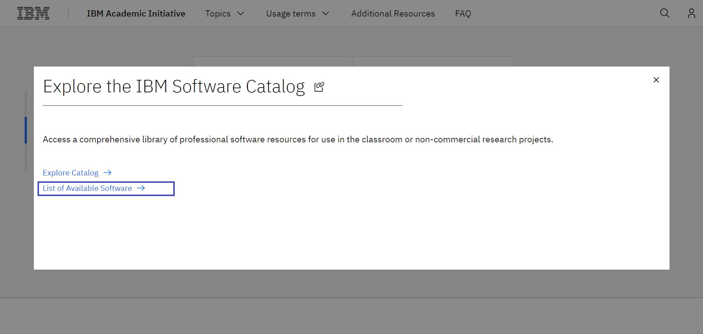
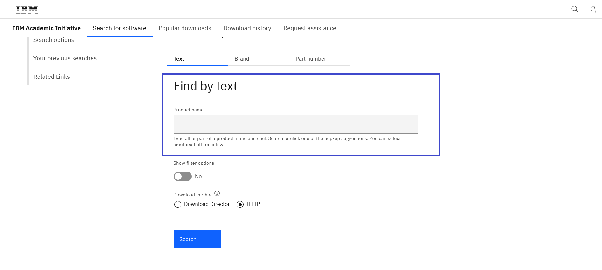
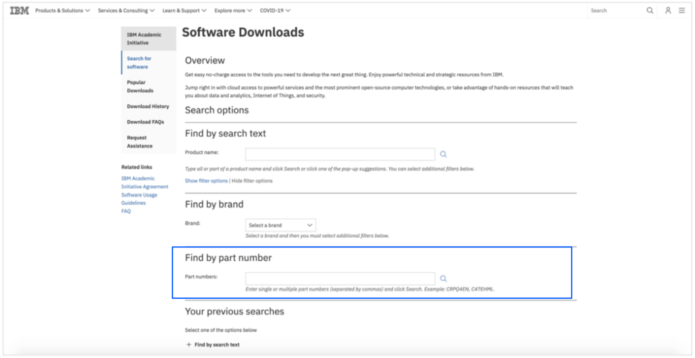
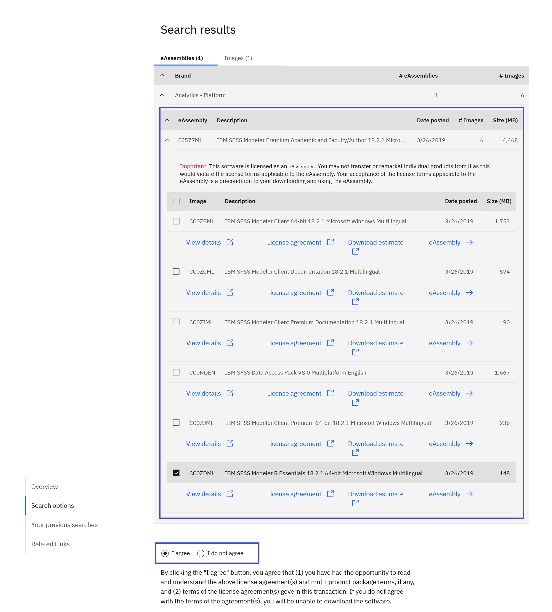
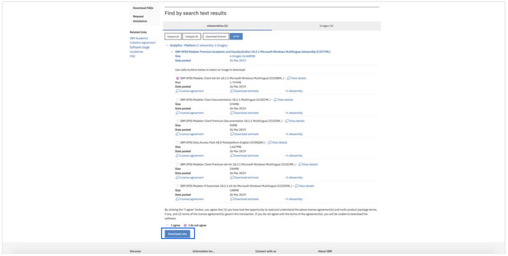

# Explore the IBM Software Catalog 

[Português](/academic-initiative/pt-br/how-to/How-to-explore-the-IBM-Academic-Initiative-Software-Catalog/readme.md);

**Objective:**
The purpose of this guide is to walk you through the necessary steps required to explore the IBM Software Catalog made available to IBM SkillsBuild Software Downloads users and how you can download the artifacts.

**Estimated time:** 5-10 minutes

## Step 1: Open the [IBM SkillsBuild Software Downloads](http://ibm.com/academic) in a web browser.
 

## Step 2: Click **Already registered? Log in.**
 

## Step 3: Enter your academic institution, college, university issued email ID and complete the login process.
 

## Step 4: Visit any of the topic pages.
Example - Topics menu > See All > IBM Engineering
 

 

 

## Step 5: Scroll down and click Software tab.
 

## Step 6a: Click the Explore Catalog link under Explore the IBM Software Catalog tab.
 

 

## Step 6b: Click List of Available Software link under Explore the IBM Software Catalog tab to see the list of available software.
 

## Step 7: Search for the desired artifact by entering the relevant name or number. The results will include all eligible/relevant products.
 

 

## Step 8: Once you find the artifact, click the HTTP tab and choose the artifact you want to download. Accept the terms and conditions, by clicking “I agree” to continue with the downloading process.
 

## Step 9: Click Download now to start downloading your chosen artifact.
 

