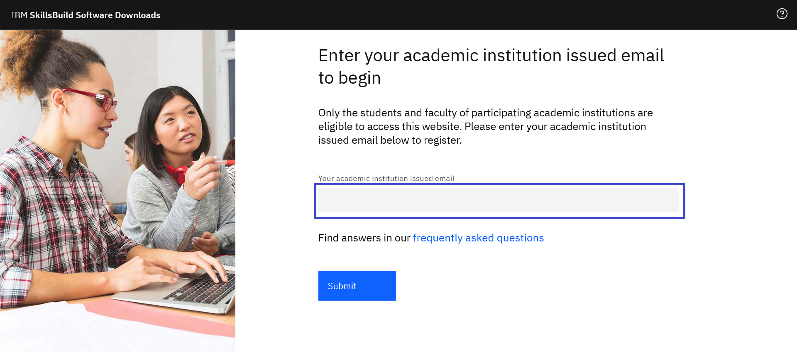
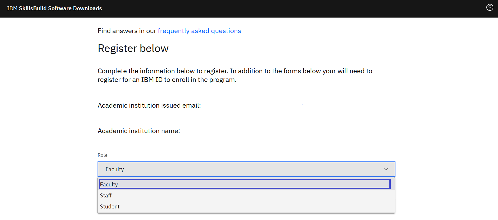
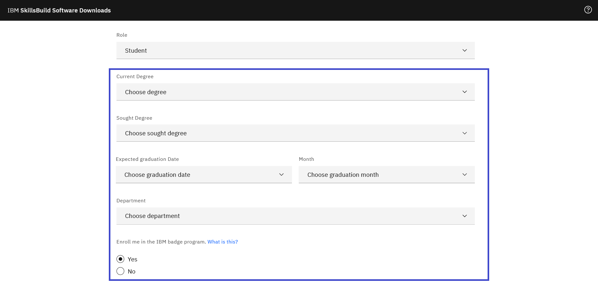
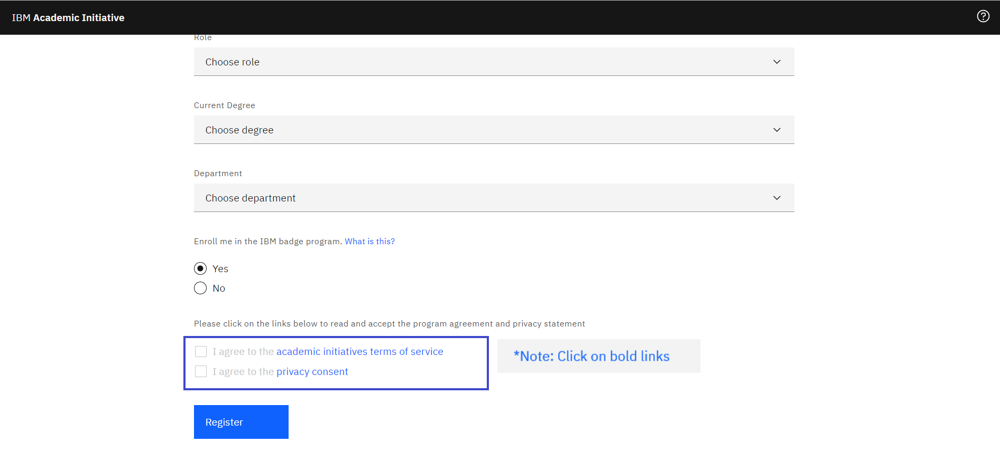
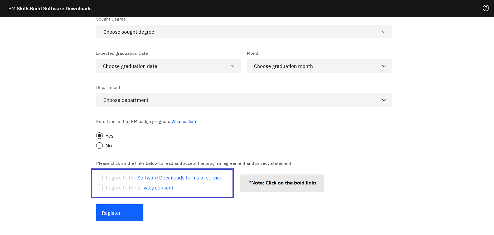

# How to register with the IBM Academic Initiative 

[日本語](/academic-initiative/jp/how-to/How-to-register-with-the-IBM-Academic-Initiative/readme.md)

**Objective:** The purpose of this guide is to walk you through the steps to be followed when you register as a student or a faculty member in the IBM Academic Initiative website.

**Estimated time:** 5-10 minutes

## Step 1: Open the [IBM Academic Initiative](https://ibm.com/academic) website in a web browser.
 

## Step 2: Click **Register Now.**
 

## Step 3: Enter your academic institution, university, college issued email ID.
 

## Step 4: Select whether you are a student or a faculty member.
 

## Step 5: Enter the required information.
 

## Step 6: Select if would like to participate in the [IBM Badge Program](https://www.ibm.com/training/credentials)
 

## Step 7: After you read the IBM Academic Initiative Agreement and Privacy Statement, click **“I agree”.**
 

 
## Step 8: Click **Register**.
 

 
## Step 9: If you already have an IBMid with the academic institution issued email ID, you will be asked to login with that same account now. If you do not have an IBMid along with the academic institution issued email ID, you will be asked to create one at this time.
 

## Step 10: Return to the IBM Academic Initiative website and login.