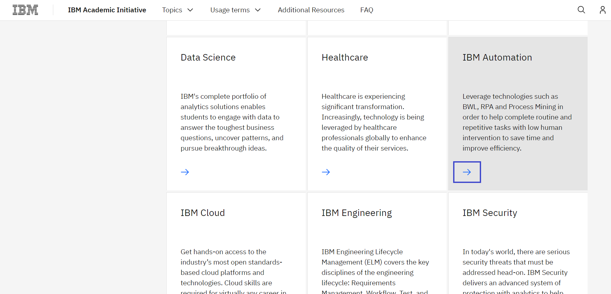
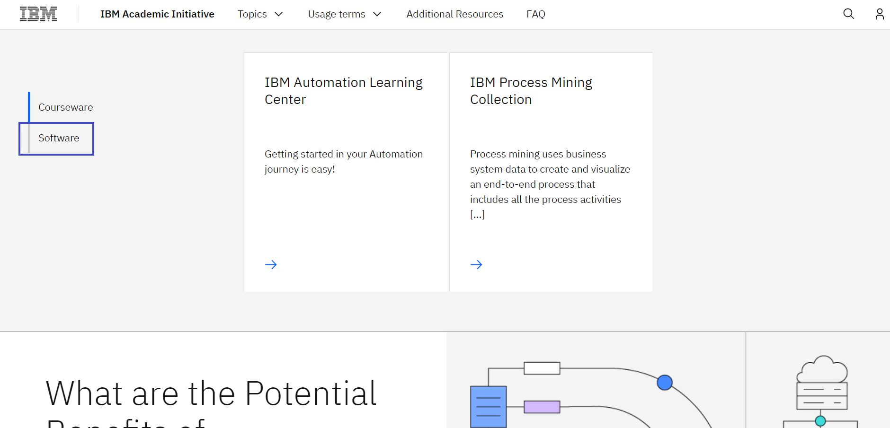

# How to request Blueworks Live access 

**Objective:** 
The purpose of this guide is to walk you through the steps to be followed when accessing Blueworks Live through the IBM Academic Initiative website.

**Estimated time:** 5 – 10 minutes

## Step 1: Open the [IBM Academic Initiative](https://ibm.com/academic) website in a web browser.
 

## Step 2: Click **Already registered? Log in.**
 

## Step 3: Enter your academic institution, university, college issued email ID and complete the login process.
 

## Step 4: Visit the IBM Automation topics page.
Topics menu > See All > IBM Automation
 

 

 

## Step 5: Scroll down and click Software tab.

## Step 6: Select Blueworks Live and click the Create a Blueworks Live Account link. 

 

Please use the same IBMid that was first used to register in the IBM Academic Initiative website.
 

## Step 7: Now, return to the IBM Academic Initiative tab. Then click the Request Academic Access link to request that your trial account must be converted to an academic account.

