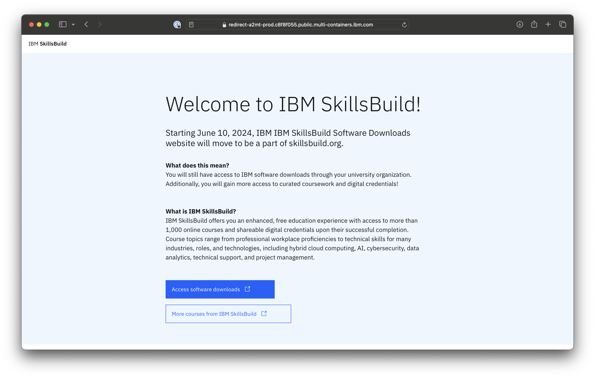
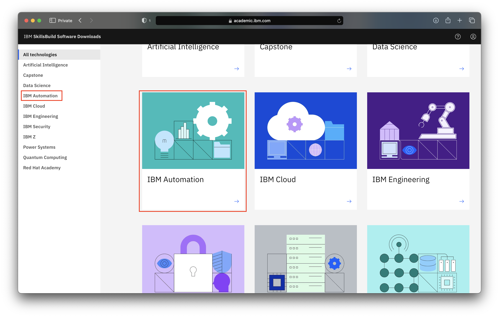
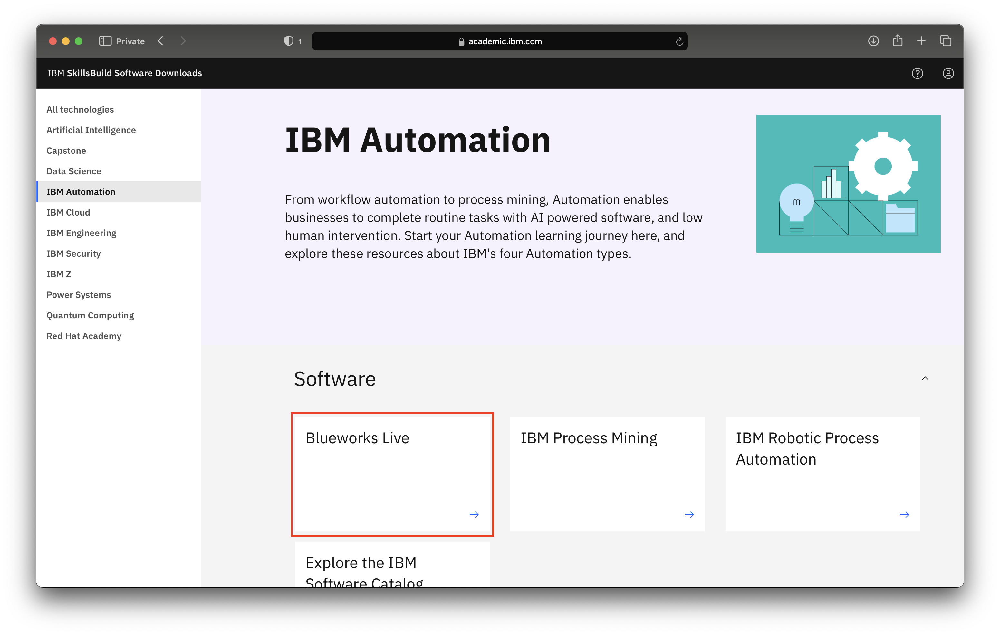
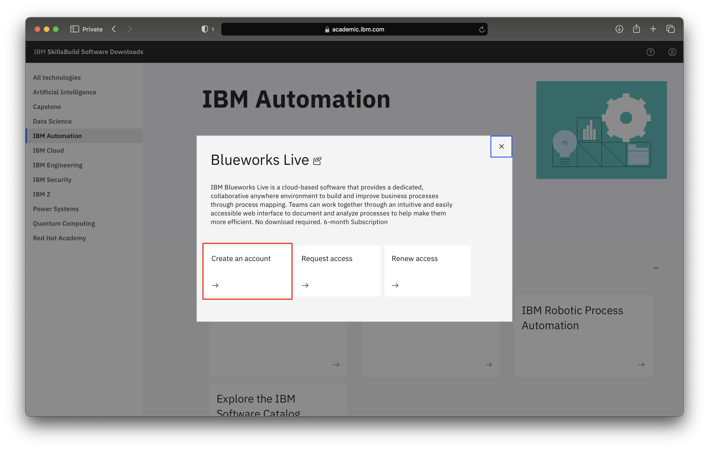
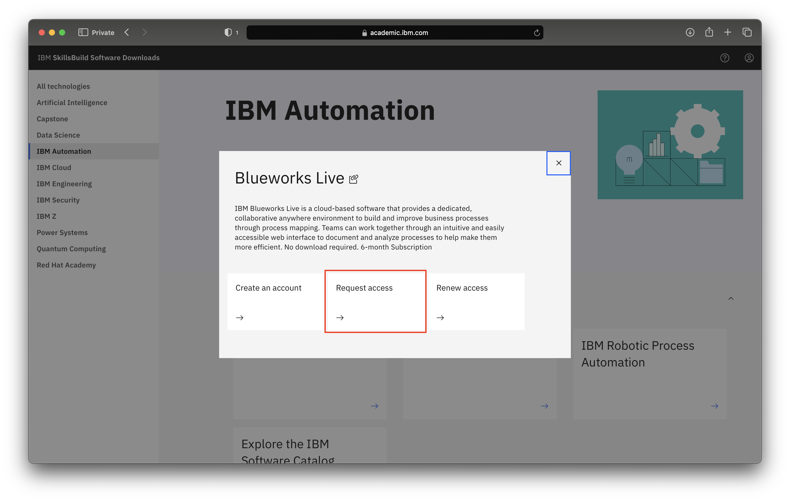

# How to request Blueworks Live access 

**Objective:** 
The purpose of this guide is to walk you through the steps to be followed when accessing Blueworks Live through the IBM SkillsBuild Software Downloads website.

**Estimated time:** 5 – 10 minutes

## Step 1: Open the [IBM SkillsBuild Software Downloads](https://ibm.com/academic) website in a web browser.
 

## Step 2: Click **Access software downloads**
 

## Step 3: Enter your academic institution, university, college issued email ID and complete the login process.
 

## Step 4: Visit the IBM Automation topics page.
 

 

## Step 5: Select Blueworks Live and click the Create an account button. 

 

Please use the same IBMid that was first used to register in the IBM SkillsBuild Software Downloads website.
 

## Step 7: Now, return to the IBM SkillsBuild Software Downloads tab. Then click the Request Access link to request that your trial account must be converted to an academic account.

