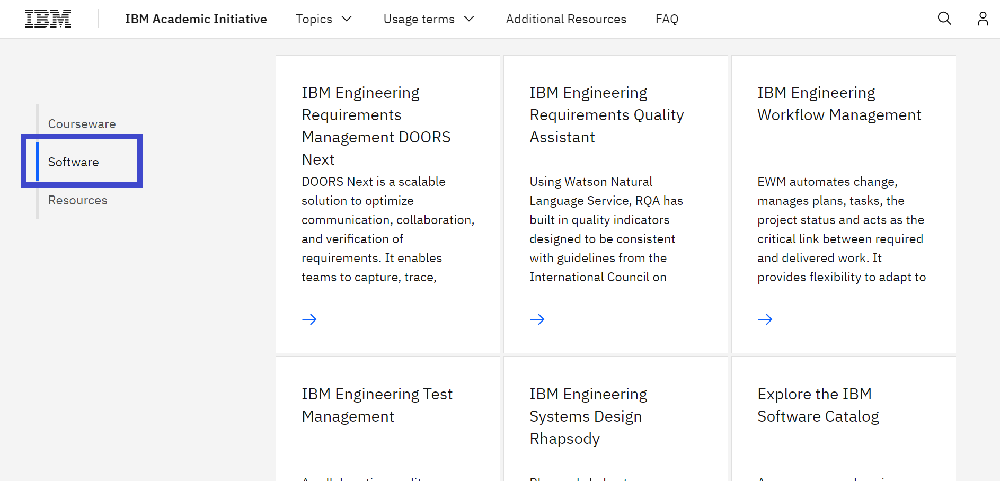
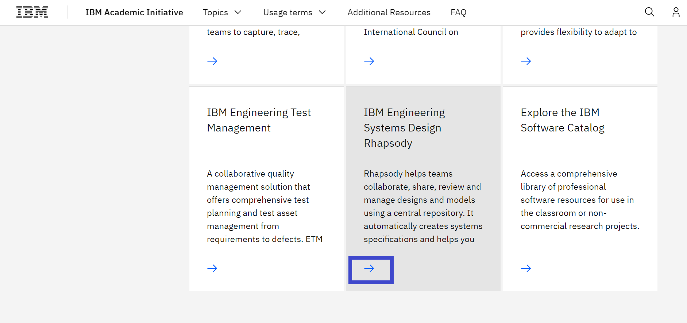
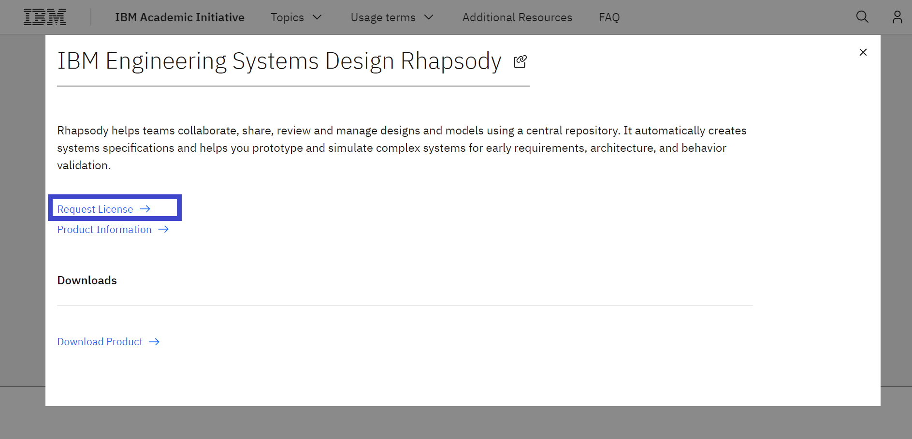
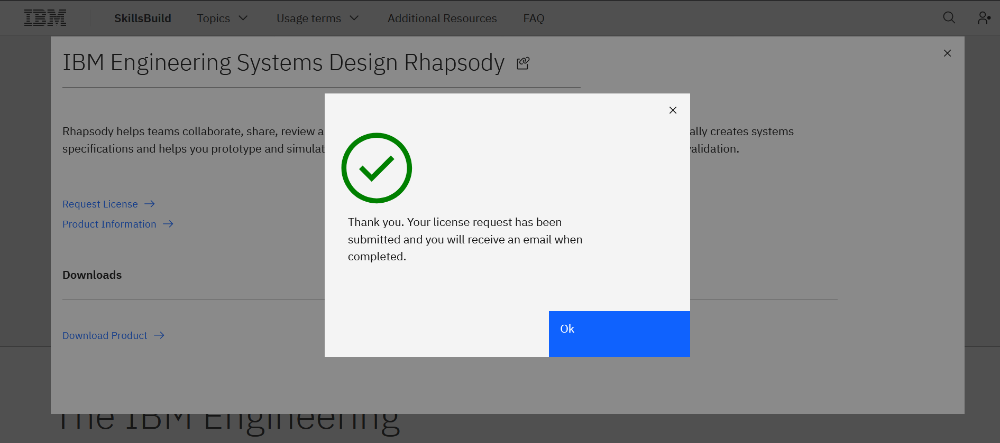
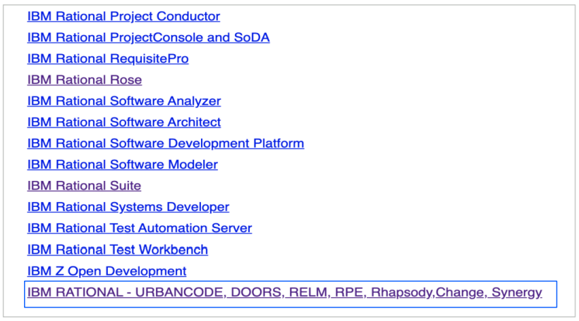

# Hot to request an IBM Rhapsody license

**Objective:**
The purpose of this guide is to walk you through the steps to be followed when requesting Rhapsody v9.0 from the IBM SkillsBuild Software Downloads website.

**Estimated time:** 5-10 minutes

## Step 1: Open the [IBM SkillsBuild Software Downloads](https://ibm.com/academic) website in a web browser.
 

## Step 2: Click **Already registered? Log in.**
 

## Step 3: Enter your academic institution, university, college issued email ID and complete the login process.
 

## Step 4: Visit the IBM Engineering topic page
Topics menu > See All > IBM Engineering
 

## Step 5: Scroll down and click Software tab.
 

## Step 6: Click Request License under the  IBM Engineering System Design Rhapsody tab. 
 

**Note:** When you click Request License, the request is sent to the IBM Engineering team, once your request is approved you will receive an email with the instructions to get the license.
 

## Step 7: Once you receive the confirmation email, click the link to the IBM Rational License Key Center.
 

## Step 8: Scroll down and click the link (highlighted below) to get the License Key needed for Rhapsody v9.0.
 

