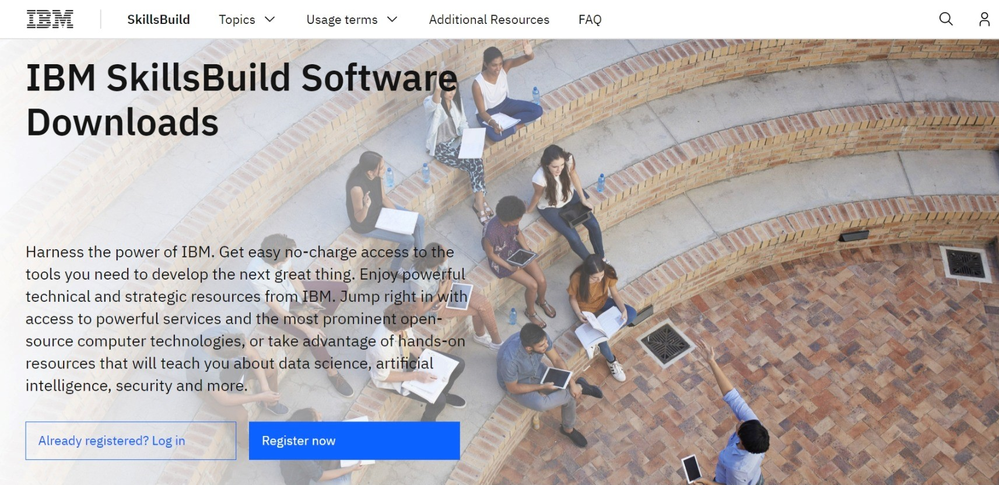
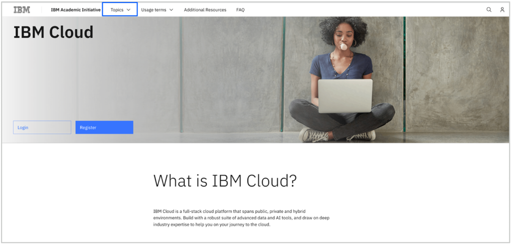
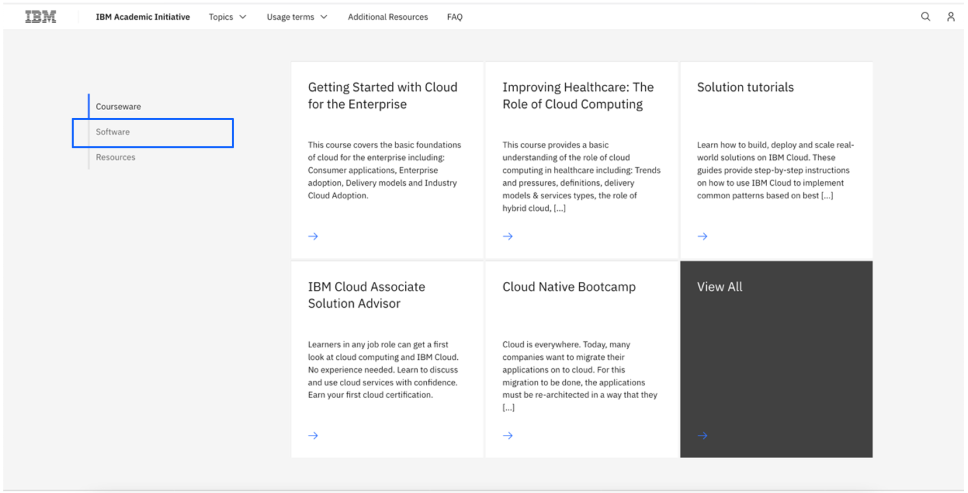
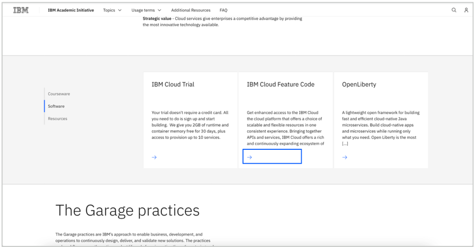
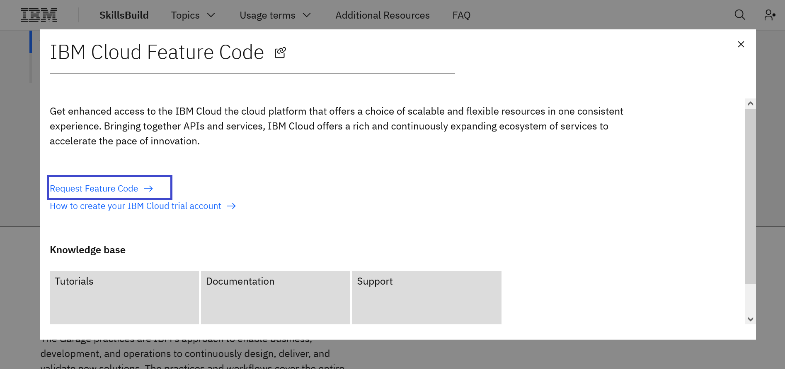

# How to request an IBM Cloud Feature Code 

[日本語](/academic-initiative/jp/how-to/How-to-request-and-IBM-Cloud-Feature-Code/readme.md);
[Português](/academic-initiative/pt-br/how-to/How-to-request-and-IBM-Cloud-Feature-Code/readme.md);

**Objective:** The purpose of this guide is to walk you through the steps to be followed to request an IBM Cloud Feature Code.  This guide will assume you have already [registered with IBM SkillsBuild Software Downloads](/academic-initiative/how-to/How-to-register-with-the-IBM-Academic-Initiative/readme.md).

**Estimated time:** 5-10 minutes

 
## Step 1: Open the [IBM SkillsBuild Software Downloads](https://ibm.com/academic) website in a web browser.
 

 

## Step 2: Click **Already registered? Log in.**
 

 
 
## Step 3: Enter your academic institution, college, university issued email ID and complete the login process.
 

  

## Step 4: Visit the  IBM Cloud topic pages

You can quickly navigate to the page by clicking on the **Topics menu > IBM Cloud**
 

  

## Step 5: Scroll down and click **Software** tab.
 

  
 
## Step 6: Click **IBM Cloud Feature Code.** 
 

  

## Step 7: Click **Request Feature Code.**
    
 
## Step 8: The feature code will be displayed.  It will also be emailed to your registered email ID.
 

