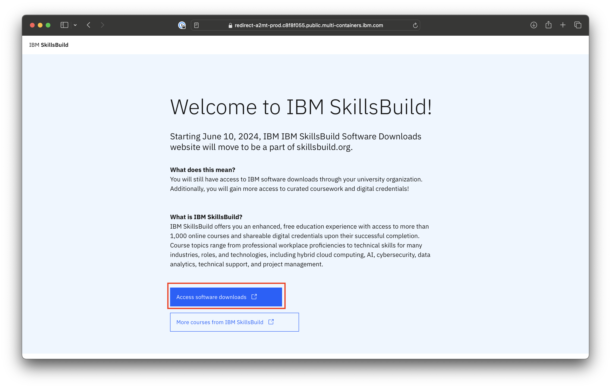
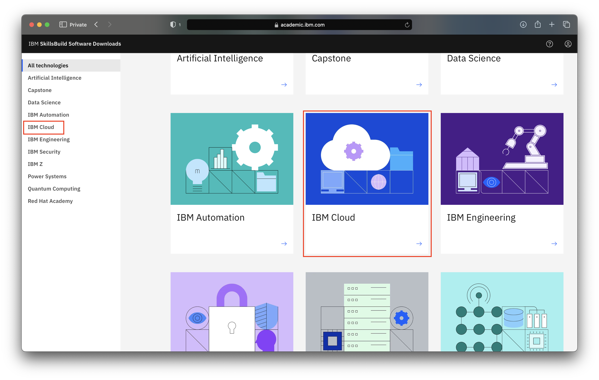
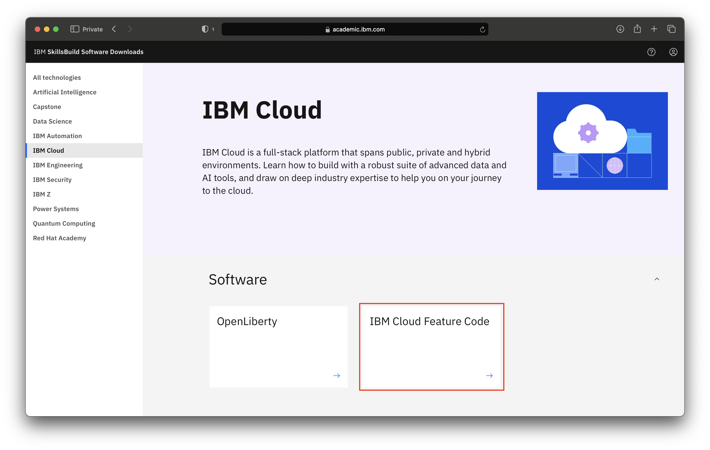
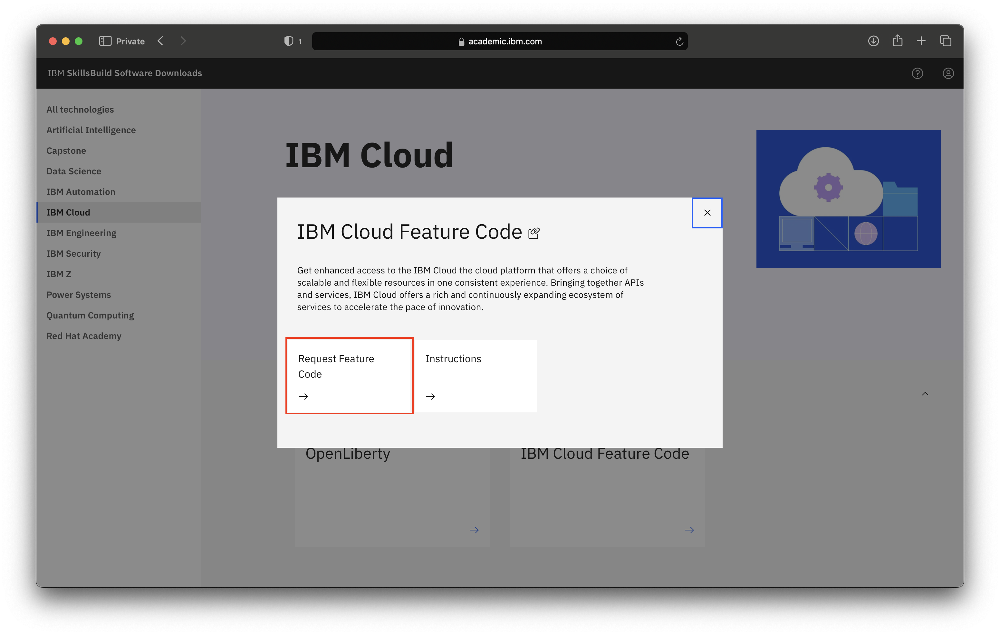
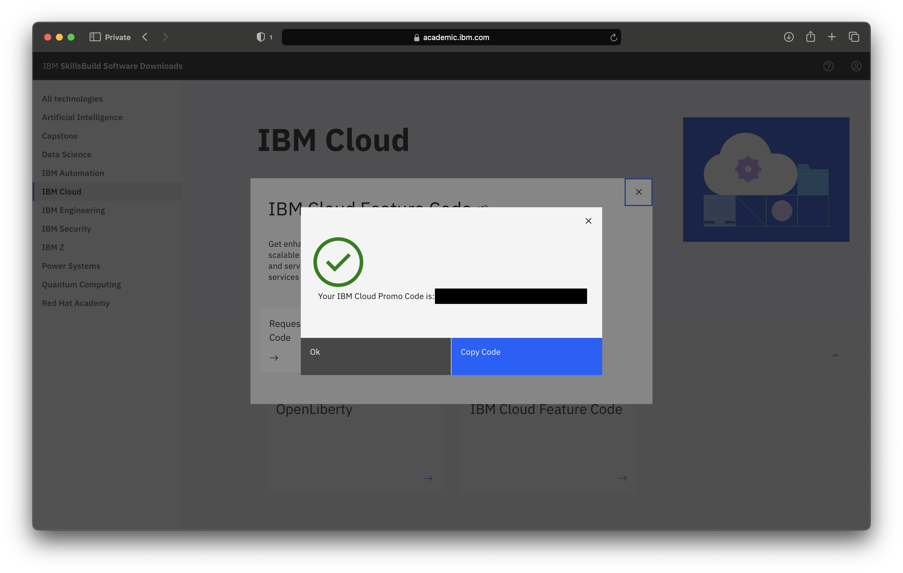

# How to request an IBM Cloud Feature Code 

**Objective:** The purpose of this guide is to walk you through the steps to be followed to request an IBM Cloud Feature Code.  This guide will assume you have already [registered with IBM SkillsBuild Software Downloads](/academic-initiative/how-to/How-to-register-with-the-IBM-Academic-Initiative/readme.md).

**Estimated time:** 5-10 minutes

 
## Step 1: Open the [IBM SkillsBuild Software Downloads](https://ibm.com/academic) website in a web browser.
 

## Step 2: Click **Access software downloads**
 

 
 
## Step 3: Enter your academic institution, college, university issued email ID and complete the login process.
 

  

## Step 4: Visit the  IBM Cloud topic pages
 

  
 
## Step 5: Click **IBM Cloud Feature Code.** 
 

  

## Step 6: Click **Request Feature Code.**
    
 
## Step 7: The feature code will be displayed.  It will also be emailed to your registered email ID.
 

