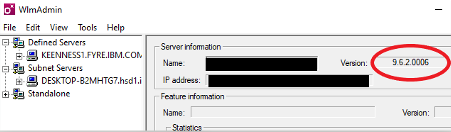

# Instructions for IBM SPSS Modeler Premium Network Download and Installation

[Português](/academic-initiative/pt-br/how-to/Instructions-for-IBM-SPSS-Modeler-Premium-Network-Download-and-Installation/readme.md);

Please review and follow these steps to complete the installation of IBM SPSS Modeler for your institution. 

## Determine the number of licensed uses required:
Identify the number of devices that will be licensed per SPSS License Manager (SLM) installation machine. Request the authorization code(s) be generated from the IBM SkillsBuild Software Downloads website; code requests are typically processed on Wednesdays. 

## Download the IBM SPSS License Manager (SLM):
Once you have obtained the concurrent machine authorization code from IBM SkillsBuild Software Downloads,  download the IBM SPSS Concurrent Licensing Manager from this location: 

https://ibm.ent.box.com/s/dvf8z6ek8qkd69uhykju5webtmtwx1pt

Make your selection based on your **server** operating system: 

- **spss_clt_9.8_win_en.zip** (for Windows operating system)
- **spss_clt_9.8_mac_en.tar.tar.gz** (for Macintosh operating system)
- **spss_clt_9.8_lnx_en.tar.tar.gz** (For Linux operating system)

Each of these downloads is a compressed file that must first be unzipped. 

## Install the SPSS License Manager (SLM):
The example below outlines the steps to be taken when installing to a **Windows** server machine: 

1. Extract the content of the file **spss_clt_9.8_win_en.zip** to a folder on disc. You will see two folders: 

2. From the **manager** folder right click on the file `setup.exe` and select the **Run as administrator** option:

 
3. From the **tools** folder right click on the file `setup.exe` and select the **Run as administrator** option:

 
**It is recommended to use the default path C:\Program Files (x86)\Common Files\SafeNet Sentinel\Sentinel RMS License Manager**

_NOTE: Once you have installed the license manager and tools, the SLM version is 9.6.2.0006 as seen in the Sentinel RMS Server Administration (WlmAdmin) tool:_

## License the SPSS License Manager (SLM):

To license the newly installed License Manager, open an administrator command prompt. Change directory to WinNT subfolder (C:\Program Files (x86)\Common Files\SafeNet Sentinel\Sentinel RMS License Manager\WinNT) and use the `licenseactivator` command followed by your 20 character network authorization code: 

 
To complete the licensing process, Stop then Restart the Sentinel License Manager Service: 

## Download the IBM SPSS Modeler 18.x Client:

From the IBM SkillsBuild Software Downloads website: (www.ibm.com/academic) download the SPSS Modeler Premium software the file based on OS in use:

 
Mac OS: 

 
 
Windows OS:

  

This technote contains additional information on the download, installation and licensing of the SLM: https://www.ibm.com/support/pages/node/6233924

## Install IBM SPSS Modeler 18.x Client:

**To Install the software.** Follow the steps outlined in the IBM SPSS Modeler Premium 18.2 Installation and Configuration Guide found on the SPSS Modeler 18.2 documentation site: https://www.ibm.com/support/pages/spss-modeler-182-documentation. 

For an individual installation, review the steps outlined in Chapter 2. 

To push a silent installation of the software to several different workstations with the same hardware, review the “Silent Installation” instructions also in Chapter 2. 

_NOTE: To install, you must be logged on to your computer with administrator privileges._
