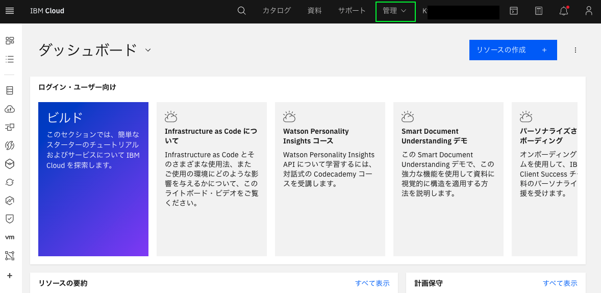
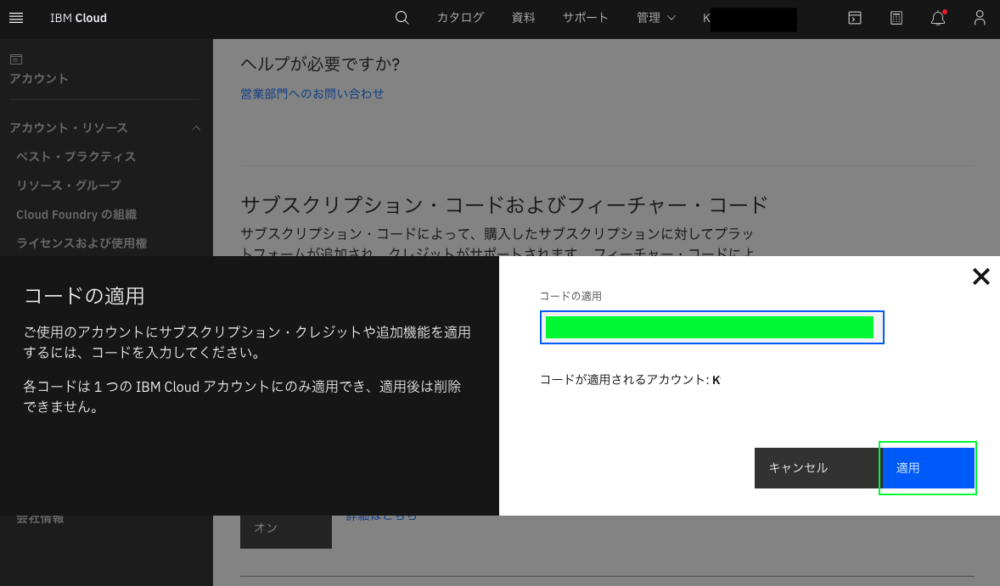

# IBM Cloud フィーチャー・コードの適用方法

**目的：** このガイドの目的は、IBM Cloud フィーチャー・コードを適用するために必要な手順を説明することです。

**推定所要時間：** 5-10分 

## Step 1: [IBM Cloud ウェブサイト](https://cloud.ibm.com/) をWebブラウザで開きます。

## Step 2: IBMidを入力し、「続行」をクリックし、次にパスワードを入力し、ログインします。

## Step 3: ダッシュボードから、右上のメニューにある「管理」をクリックします。

## Step 4: ドロップダウンメニューから「アカウント」をクリックします。

## Step 5: 左側のメニューから「アカウント設定」をクリックします。

## Step 6: 「サブスクリプション・コードおよびフィーチャー・コード」セクションが表示されるまで下にスクロールし、「コードの適用」ボタンをクリックします。

## Step 7: 25文字のフィーチャー・コードを入力（またはコピー／ペースト）し、「適用」をクリックします。
