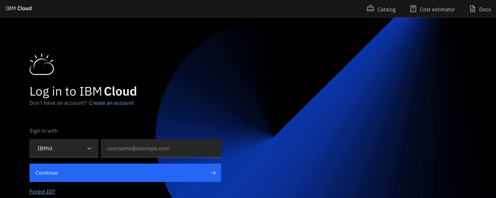

# フィーチャー・コードを使用したIBM Cloud Accountの作成方法

**目的：** このガイドの目的は、フィーチャー・コード (promo code)を使用して、IBM Cloud Accountを作成するために必要な手順を説明することです。

**推定所要時間：** 5-10分 

## Step 1: [IBM Cloud ウェブサイト](https://cloud.ibm.com/) をWebブラウザで開きます。

## Step 2: IBMidを入力し、「Continue」をクリックします。

## Step 3: 「Next」をクリックします。

## Step 4: メールで7桁の認証コードが届きますので、その認証コードを入力（またはコピー／ペースト）して「Next」をクリックします。

## Step 5: 認証が終了したら「Continue」をクリックします。

## Step 6: Account privacy noticeを読んで確認し、画面下のチェックボックスにチェックを入れて「Continue」をクリックします。

## Step 7: 「Register with a code」をクリックします

## Step 8: メールで送付された25文字のフィーチャー・コードを入力（またはコピー／ペースト）し、「Create account」をクリックします。

## Step 9: Dashboardが表示されたら、作成完了です。

