# IBM Cloud アカウントの登録方法

[English](/academic-initiative/how-to/How-to-create-an-IBM-Cloud-account/readme.md);
[Português](/academic-initiative/pt-br/how-to/How-to-create-an-IBM-Cloud-account/readme.md);

以下のガイドはIBM Cloudのアカウントを**新規に**作成するための手順を説明します。
 

## 前提条件

- **IBM Cloud フィーチャー・コード** -IBM Cloudのトライアルアカウントを新規に開設するためには、32文字の英数字からなるIBM Cloudフィーチャーコードが必要です。  [IBM SkillsBuild Software Downloads](https://www.ibm.com/academic) の参加者は [このガイドを使ってコードをリクエストすることができます。](https://github.com/academic-initiative/documentation/blob/main/academic-initiative/jp/how-to/How-to-request-and-IBM-Cloud-Feature-Code/readme.md).  それ以外の方は、クラスまたはイベント主催者からコードを入手してください。
 

## 注意
有料アカウントに積極的にアップグレードし、使用したサービスの請求に同意する場合を除き、IBM Cloud にクレジットカード情報を提供しないでください。
 

## Step 1 - Webブラウザで[cloud.ibm.com](https://cloud.ibm.com)にアクセスします。

 

## Step 2 - **アカウントの作成**をクリックします

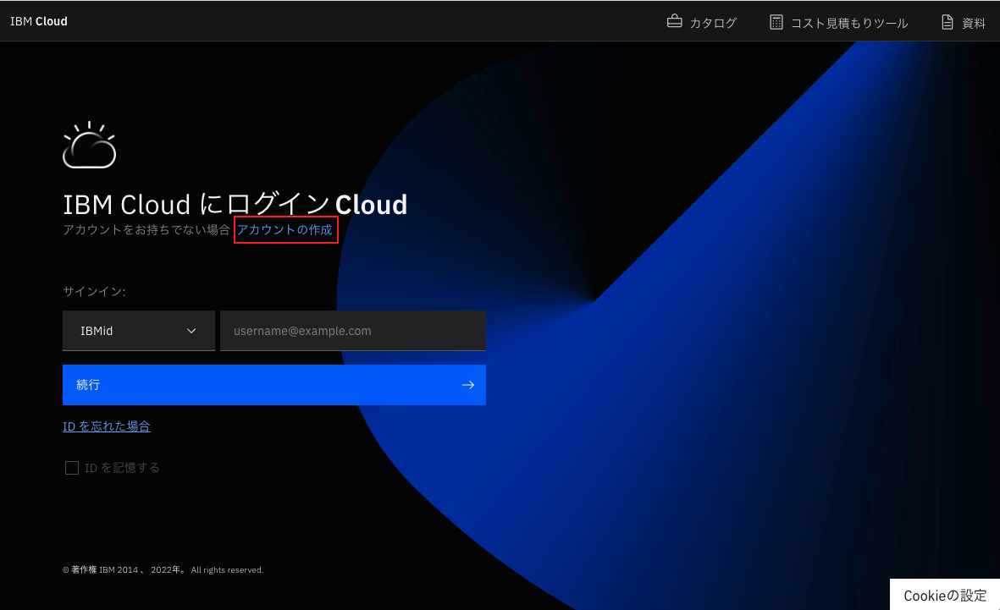 

## Step 3 - 有効な**Eメールアドレス** と **パスワード**を入力し、 **次のステップ** をクリックして先に進みます。

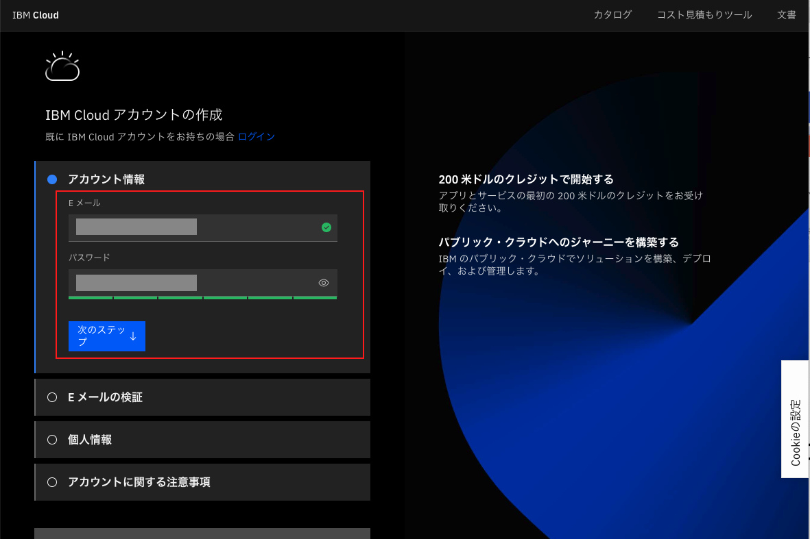 

## Step 4 - 認証コードがメールで送信されます。メールの受信箱を確認し、受け取った7桁の認証コードを入力してください（下の例を参照）。   **次のステップ** をクリックして先に進みます。

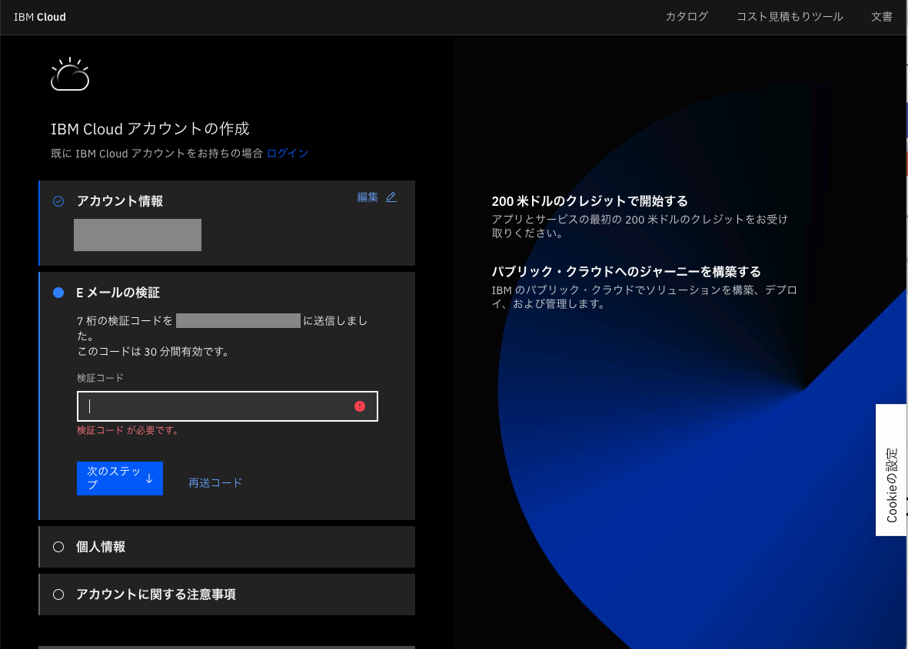

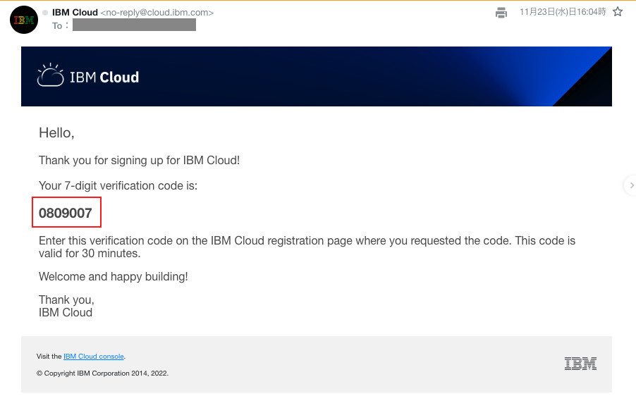

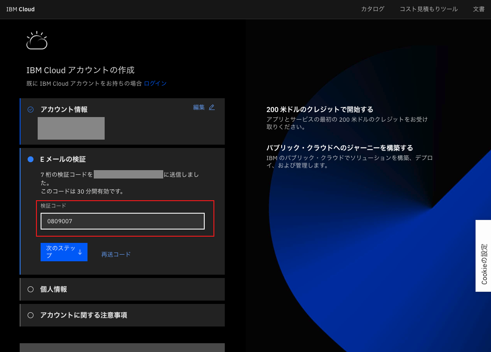

## Step 5 - **名前**、 **姓**、 **国またはリージョン**を入力してください。 **次のステップ**をクリックして先に進みます。

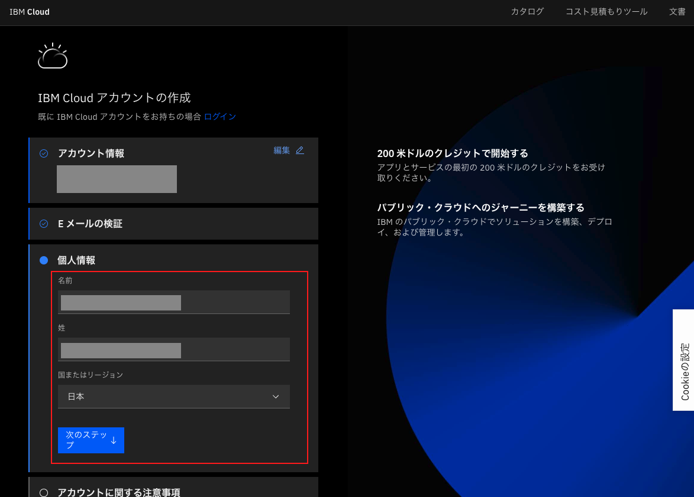

## Step 6 - Complete the **アカウントに関する注意事項** を確認し、問題なければチェックを入ます。**続行**をクリックして先に進みます。

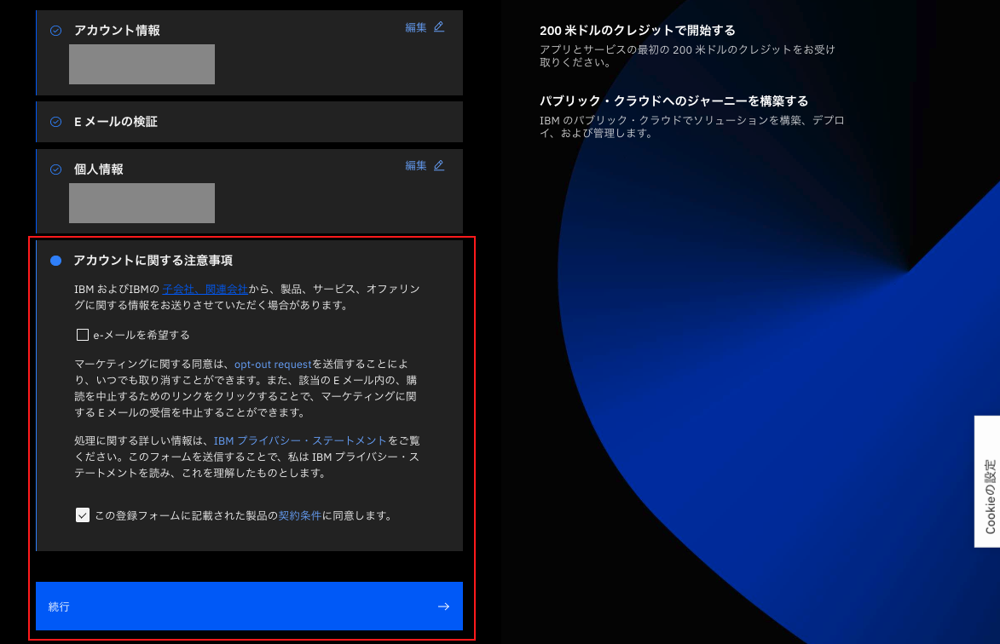

## Step 7 - Complete the **アカウントのプライバシー通知** を確認し、問題なければチェックを入れます。**続行**をクリックして先に進みます。

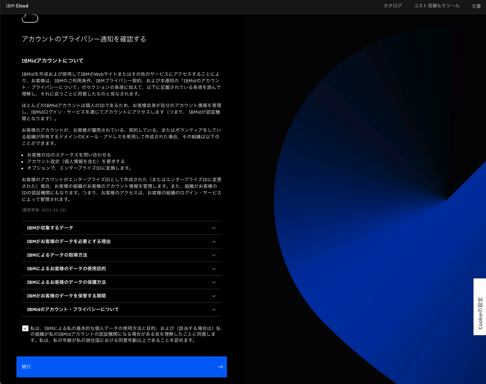

## Step 8 - **本人確認** の画面が表示されるので,  **コードを使用して登録する** をクリックします。

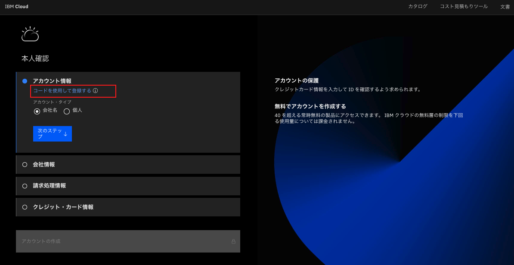

### 注意
有料アカウントに積極的にアップグレードし、使用したサービスの請求に同意する場合を除き、IBM Cloud にクレジットカード情報を提供しないでください。
 
 

## Step 9 -  **コードの入力** のテキストボックスに32文字の英数字からなるIBM Cloudフィーチャーコードを入力します。   **アカウントの作成** をクリックして先に進みます。

_Note: 学位を授与する認定学術機関の学生および教育関係者は、 [IBM SkillsBuild Software Downloads](https://www.ibm.com/academic)から [IBM Cloud Feature Code を入手](https://github.com/academic-initiative/documentation/blob/main/academic-initiative/jp/how-to/How-to-request-and-IBM-Cloud-Feature-Code/readme.md) することができます。  それ以外の方は、イベント・コーディネーターからIBM Cloudフィーチャーコードを受け取ってください。_

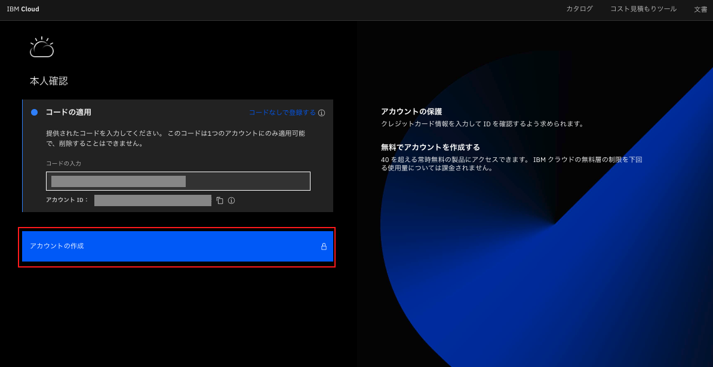

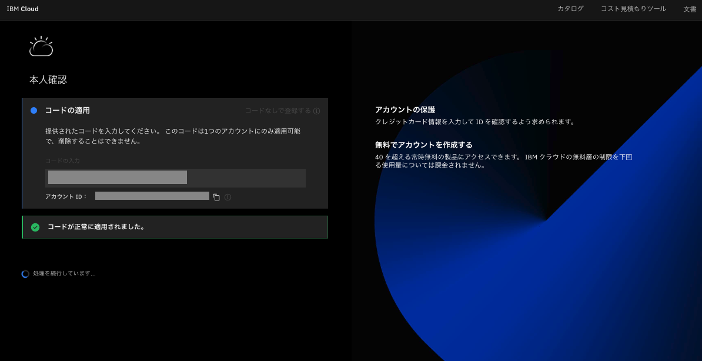

## Step 10 - 成功しました!

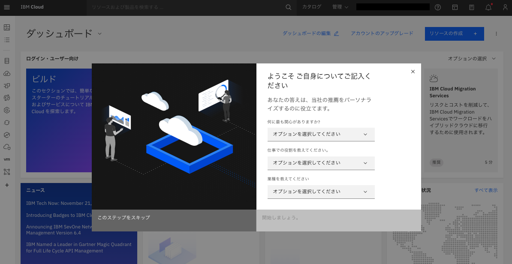

## トラブルシューティング

Q: IBM Cloud Feature Codeを適用する際に、コード付きのエラーメッセージが表示されました。 どうすればよいですか？
 
A: コード提供担当者にお問い合わせください。 ほとんどの場合、コードの交換が必要になります。
 
 
Q:IBM Cloud アカウントの登録時に、クレジット カード情報を登録しました。これを取り消すことはできますか?
 
A: いいえ、クレジットカードを入力すると、従量課金制のアカウントが作成され、無料と有料の両方のサービスを利用できるようになります。これは元に戻すことができません。 有料サービスからの請求は、ご登録のクレジットカードに請求されます。ご利用の際は、[使用料通知](https://cloud.ibm.com/docs/billing-usage?topic=billing-usage-spending)を設定されることをお勧めします。
 
 
Q: IBM Cloud のトライアル アカウントの有効期限が切れたので、アップグレードしてクレジットカード情報を登録するように要求されています。 どのような選択肢がありますか？
 
A: [アカウントのアップグレード](https://cloud.ibm.com/docs/account?topic=account-upgrading-account)により、既存のアカウントを再アクティベートして引き続き使用するか、新しい電子メールアドレスを使用して全く新しいアカウントを作成することができます。
 