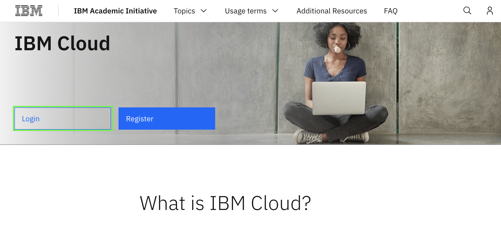
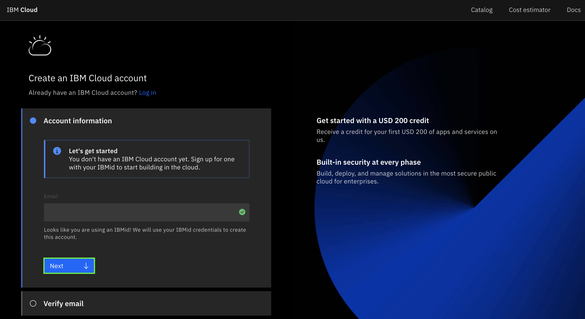
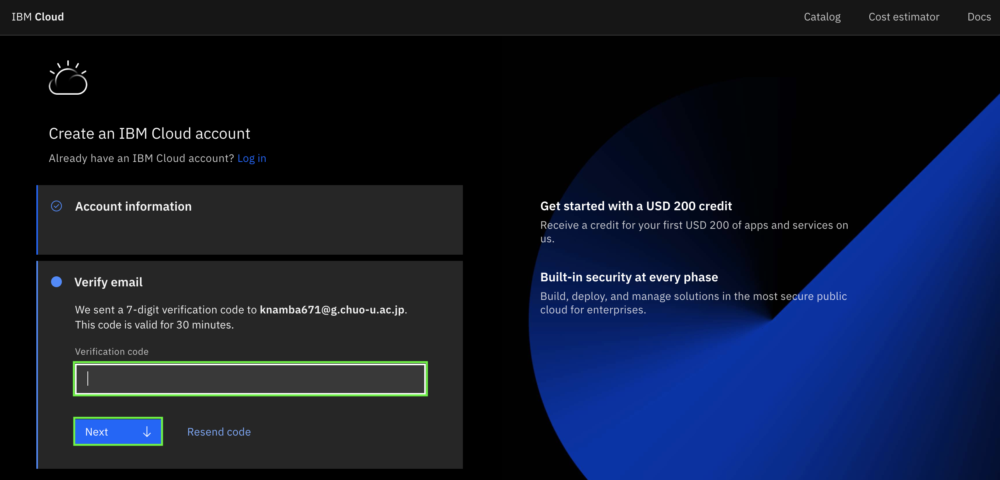
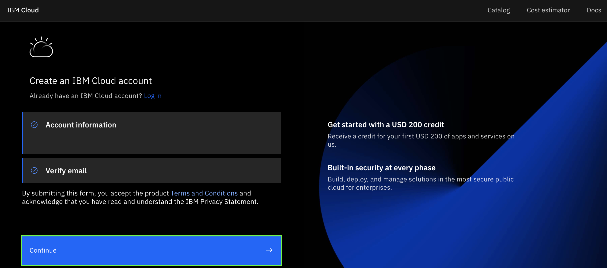
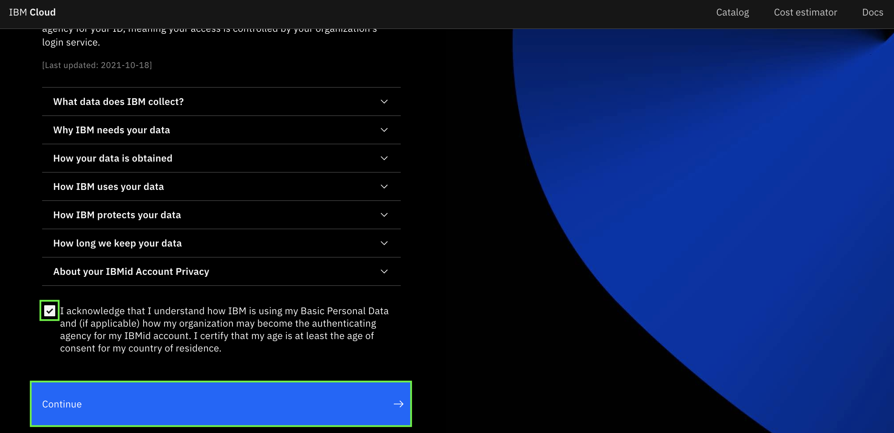
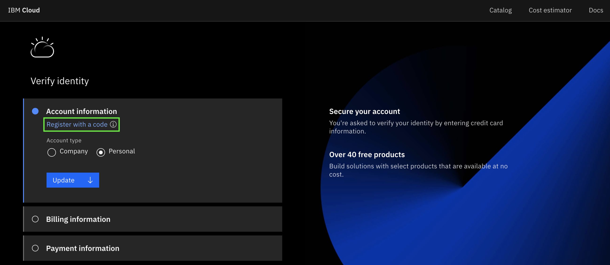
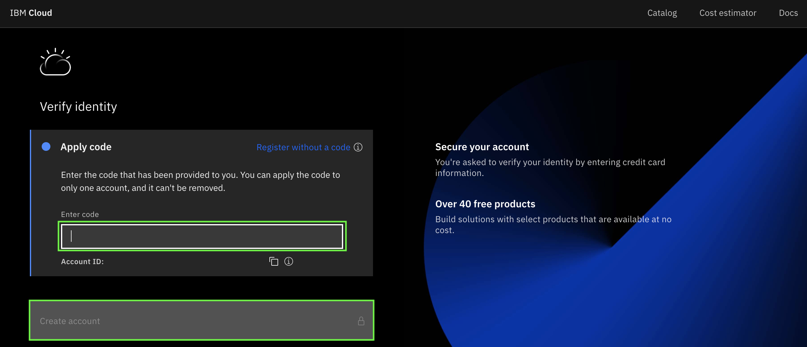
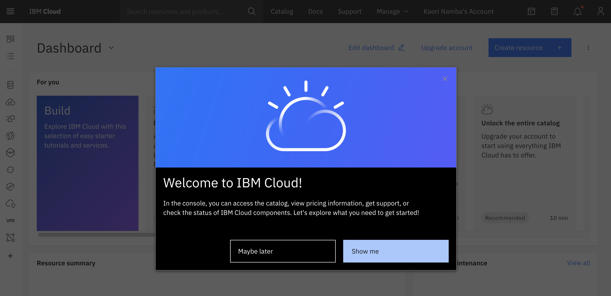

# IBM Cloud アカウントの登録方法

**目的：** このガイドの目的は、IBM Cloud Accountを作成する際の手順を説明することです。 

**前提** このガイドは、[IBM Academic Initiativeに登録済み](/academic-initiative/how-to/How-to-register-with-the-IBM-Academic-Initiative/readme-ja.md)で、[フィーチャー・コードを入手済み](/academic-initiative/how-to/How-to-request-and-IBM-Cloud-Feature-Code/readme.md)であることを前提としています。

**推定所要時間：** 5-10分

## Step 1: [IBM Academic Initiative](https://ibm.com/academic)のWebサイトをWebブラウザで開きます。
 

 

## Step 2:  「**Already registered? Log in**」 をクリックします。
 

 
 
## Step 3: IBM Academic Initiativeに登録した教育機関、大学で発行されたEメールIDを入力し、ログインを行ってください。
 

 
 
## Step 4: IBM Cloudのトピック・ページを表示します。

**Note:** **Topics** - **IBM Cloud** メニューをクリックすると、すぐにページに移動できます。 
 

 

## Step 5: **Login** をクリックします。
 

 

## Step 6: IBM Academic Initiativeに登録したEメールアドレス（IBMid）を入力し、「**Continue**」をクリックします。
 

   

## Step 6: 「**Next**」をクリックします。
 

  

## Step 8: IBM Academic Initiativeに登録したメールアドレスに7桁の認証コードが届きます。その認証コードを入力（またはコピー／ペースト）して「**Next**」をクリックします。

 

  
 
## Step 9: 認証が終了したら「**Continue**」をクリックします。

 

 
 
## Step 10: Account privacy noticeを読んで確認し、画面下のチェックボックスにチェックを入れて「**Continue**」をクリックします。

 

  
 
## Step 11: 「**Register with a code**」をクリックします。

 

  

## Step 12: IBM Academic Initiativeに登録したメールアドレスに届いている32文字のフィーチャー・コードを入力（またはコピー／ペースト）し、「**Create account**」をクリックします。
 

## Step 13: Dashboardが表示されたら、作成完了です。
 

