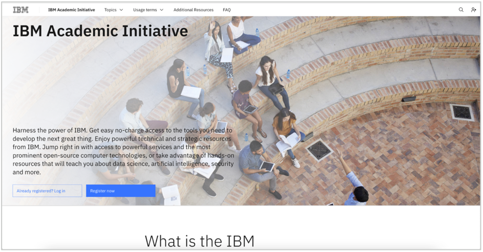
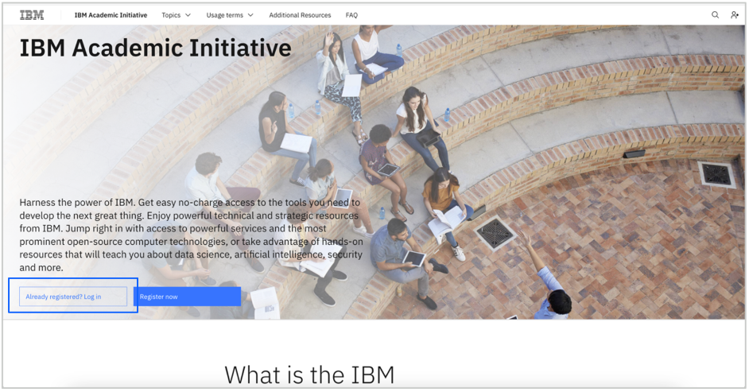
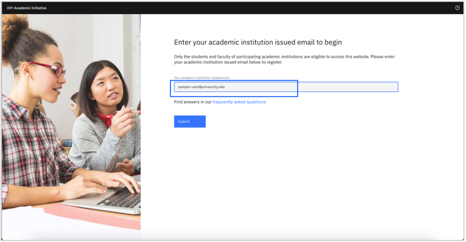
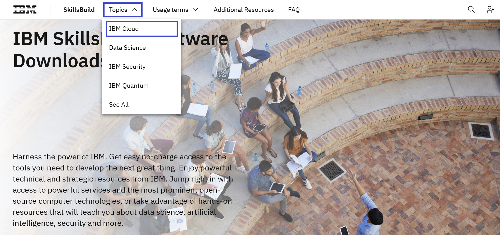
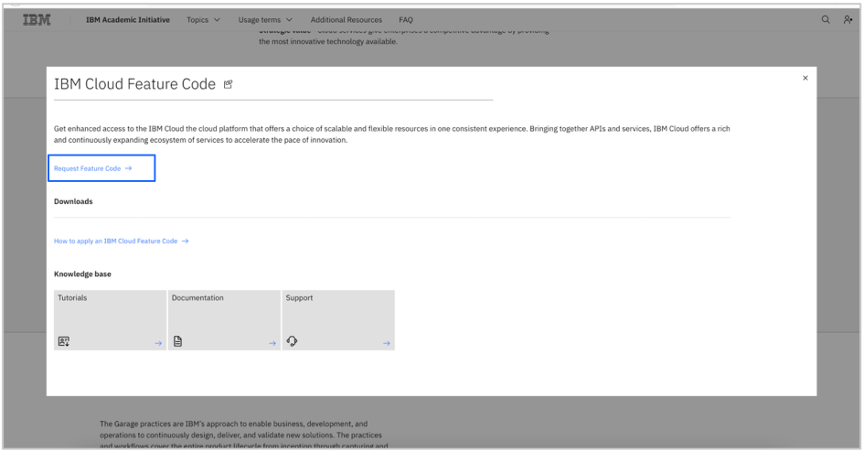
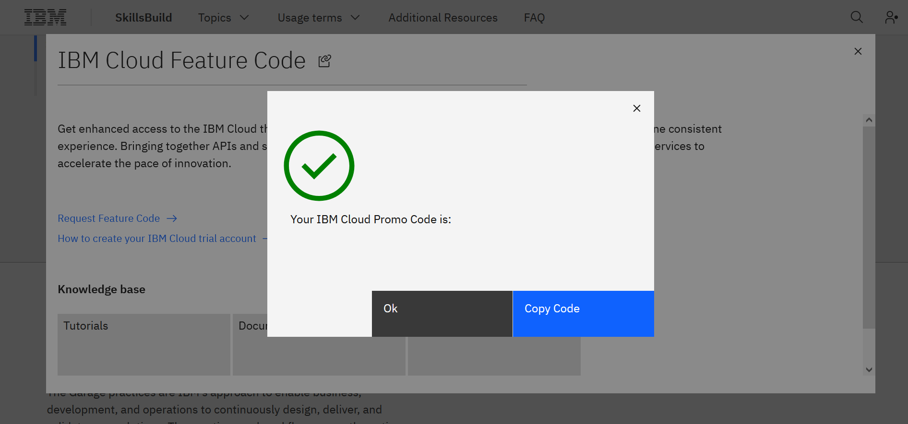

# IBM Cloud フィーチャー・コードのリクエスト方法

**目的：** このガイドの目的は、IBM Cloud フィーチャー・コードをリクエストするための手順を説明することです。 このガイドでは、[IBM Academic Initiativeに登録済み](/academic-initiative/how-to/How-to-register-with-the-IBM-Academic-Initiative/readme-ja.md)であることを前提としています。

**推定所要時間：** 5-10分

 
## Step 1: [IBM Academic Initiative](https://ibm.com/academic)のWebサイトをWebブラウザで開きます。
 

 

## Step 2: 「**Already registered? Log in**」 をクリックします。
 

 
 
## Step 3: IBM Academic Initiativeに登録した教育機関、大学で発行されたEメールIDを入力し、ログインを行ってください。
 

  

## Step 4: IBM Cloudのトピックページを表示します。

**Topics** - **IBM Cloud** メニューをクリックすると、すぐにページに移動できます。
 

  

## Step 5: スクロールダウンして、「**Software**」タブをクリックします。
 

  
 
## Step 6: 「**IBM Cloud Feature Code**」をクリックします。
 

  

## Step 7: 「**Request Feature Code**」 をクリックします。

**Note:** **Request Feature Code** がない場合は、**Register or login to access this resource** をクリックしてログインしてください。
 
    
 
## Step 8: フィーチャー・コードが表示されます。 また、登録したメールIDにもメールで通知されます。

ここで表示（送付）されたフィーチャー・コードは[IBM Cloud アカウントの登録方法](/academic-initiative/how-to/How-to-create-an-IBM-Cloud-account/readme.md)または[IBM Cloud フィーチャー・コードの適用方法](/academic-initiative/how-to/How-to-apply-an-IBM-Cloud-Feature-Code/readme-ja.md)で使用します。
 
