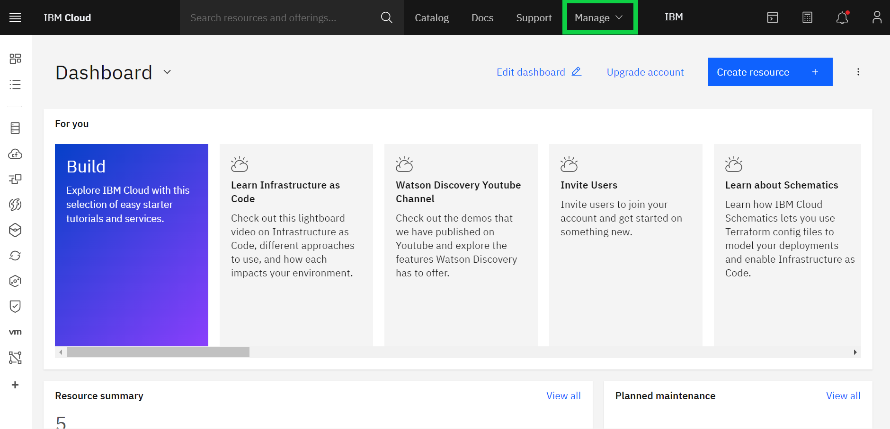
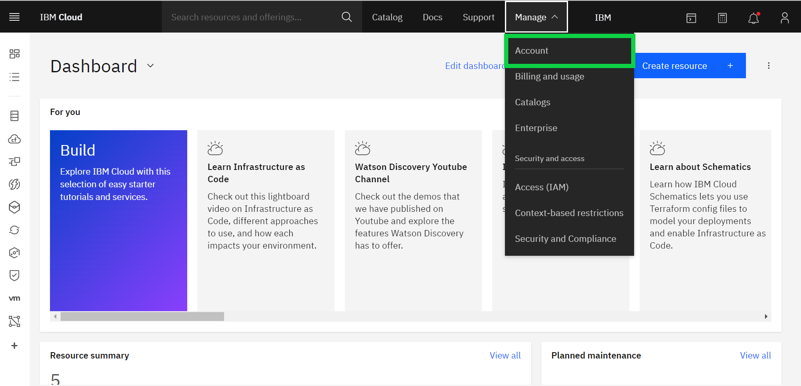
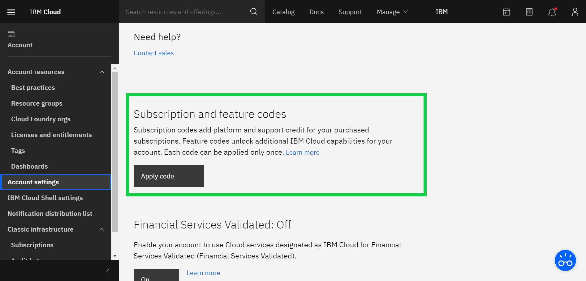
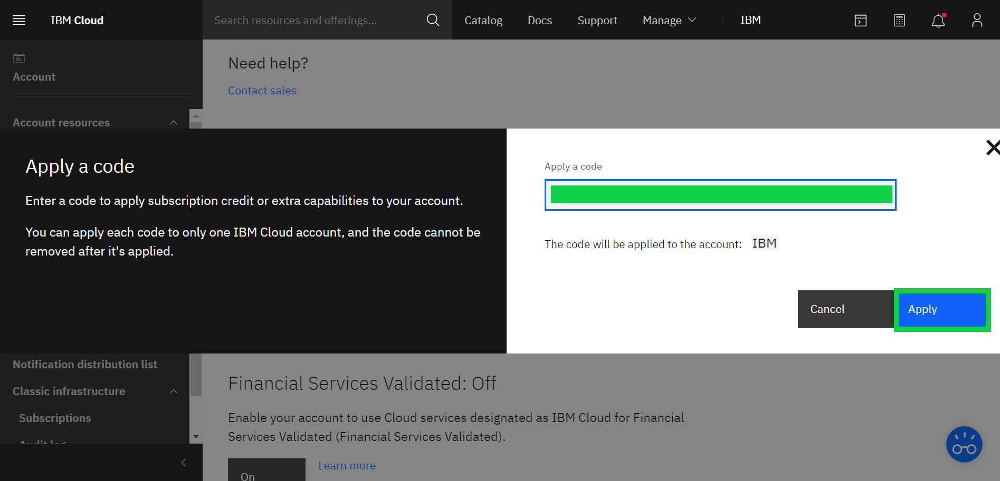

# Como aplicar um código IBM Cloud Feature Code

[日本語](/academic-initiative/jp/how-to/How-to-apply-an-IBM-Cloud-Feature-Code/readme.md)

**Objetivo:** O objetivo deste guia é levá-lo através das etapas necessárias para aplicar um IBM Cloud Feature Code.

**Tempo estimado:** 5 – 10 minutos 

## Passo 1: Abra [IBM Cloud website](https://cloud.ibm.com/) em seu navegador web.

## Passo 2: Faça o login usando seu IBMid e clique em Continuar.

## Passo 3: Do Painel principal, clique em Gerenciar no menu superior direito.

## Passo 4: Clique em Conta a partir do menu suspenso.

## Passo 5: Clique em Configurações de conta no menu do lado esquerdo.

## Passo 6: Role para baixo até ver a seção 'Assinatura e Código de Recurso' e clique no botão Aplicar Código.

## Passo 7: Insira (ou copie/colar) seu código de característica de 32 caracteres e clique em Aplicar.
