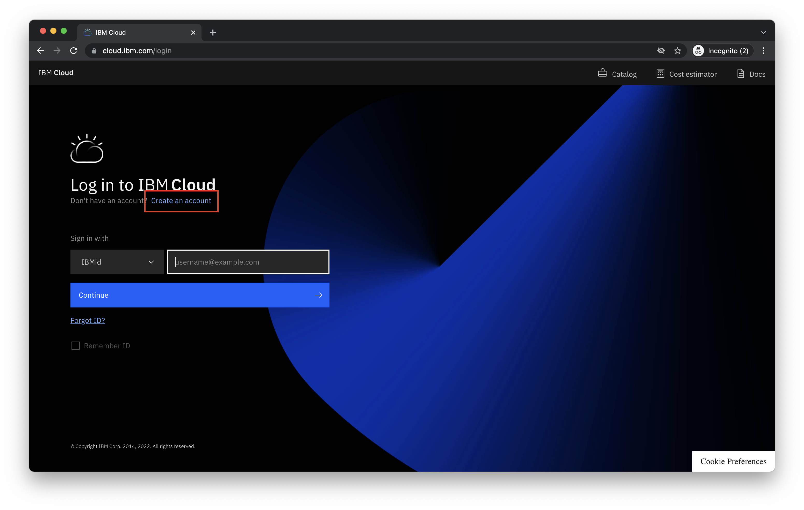
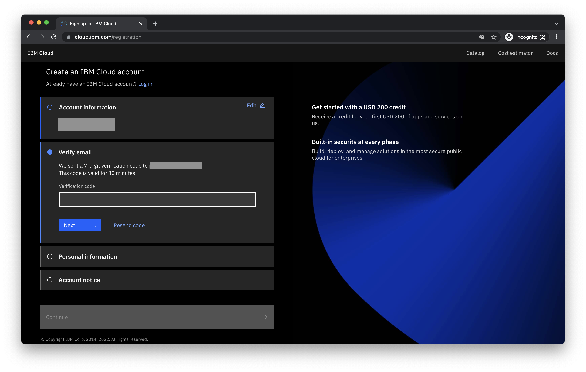
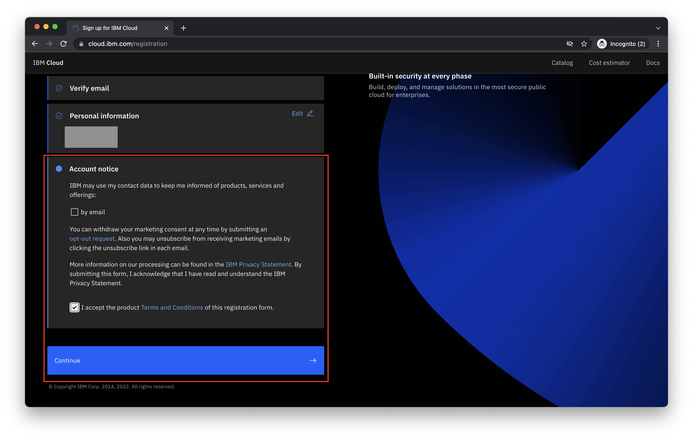
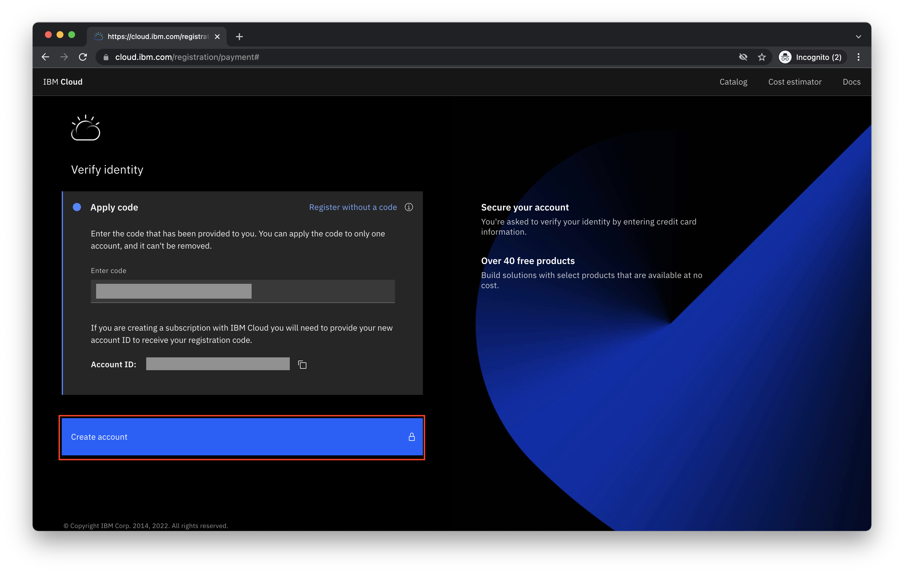

# Como criar uma conta IBM Cloud

O seguinte guia o guiará através dos passos necessários para criar uma **nova** conta IBM Cloud.
 

## Pré-requisitos

- **IBM Cloud Feature Code** - É necessário um código alfanumérico de 32 caracteres IBM Cloud Feature Code para abrir uma nova conta de teste IBM Cloud.  Participantes de [IBM SkillsBuild Software Downloads](https://www.ibm.com/academic) podem [request a code using these instructions](https://github.com/academic-initiative/documentation/blob/main/academic-initiative/how-to/How-to-request-and-IBM-Cloud-Feature-Code/readme.md). Todos os outros devem obter seu código do organizador da classe ou do evento.
 

## Aviso
Favor não fornecer informações de cartão de crédito no IBM Cloud a menos que você esteja atualizando ativamente para uma conta paga e esteja disposto a aceitar ser cobrado por serviços consumidos.
 

## Passo 1 - Visite [cloud.ibm.com](https://cloud.ibm.com) no seu navegador web

 

## Passo 2 - Clique em **Create an account**

 

## Passo 3 - coloque um **email address** e **password**.  Clique **Next** para prosseguir.

 

## Passo 4 - Você receberá um código de verificação por e-mail.  Por favor, verifique sua caixa de entrada de e-mail e digite o código de verificação de 7 dígitos que você recebeu (exemplo abaixo).  Clique em . **Next** para prosseguir.

## Passo 5 - Preencha com seu **First name**, **Last name** e **Country or region**. Clique **Next** para prosseguir.

## Passo 6 - Complete o **Account notice** e clique em **Continue** para prosseguir.

## Passo 7 - Complete o **Account privacy notice** e clique em **Continue** para prosseguir.

## Passo 8 - No  **Verify identity** clique na opção **Register with a code**.

### Aviso
Favor não fornecer informações de cartão de crédito no IBM Cloud a menos que você esteja atualizando ativamente para uma conta paga e esteja disposto a aceitar ser cobrado por serviços consumidos.
 
 

## Passo 9 - Digite seu código de 32 caracteres IBM Cloud Feature Code no **Enter code** Clique **Create account** para prosseguir.

_Note: Estudantes e educadores de instituições acadêmicas credenciadas para a graduação podem [obtain an IBM Cloud Feature Code](https://github.com/academic-initiative/documentation/blob/main/academic-initiative/how-to/How-to-request-and-IBM-Cloud-Feature-Code/readme.md) através de [IBM SkillsBuild Software Downloads](https://www.ibm.com/academic).  Todos os outros devem receber um IBM Cloud Feature Code do seu coordenador de eventos._

## Passo 10 - Successo!

## Solução de problemas

P: Eu recebi uma mensagem de erro com código ao aplicar o IBM Cloud Feature Code.  O que eu devo fazer?
 
R: Favor entrar em contato com o fornecedor do código para assistência.  O mais provável é que você precise de um código de substituição.
 
 
P: Durante o registro de uma conta IBM Cloud eu forneci um cartão de crédito.  Posso desfazer isto?
 
R: Não, entrar com um cartão de crédito cria uma conta Pay-As-You-Go e permite utilizar tanto serviços gratuitos como pagos. Isto não pode ser desfeito.  Quaisquer encargos dos serviços pagos serão faturados no cartão de crédito em arquivo. Recomendamos a criação de uma conta de [spending notifications](https://cloud.ibm.com/docs/billing-usage?topic=billing-usage-spending) para ajudar a evitar cobranças indesejadas.
 
 
P: Minha conta de teste IBM Cloud expirou e agora está me pedindo para atualizar e fornecer um cartão de crédito.  Quais são as minhas opções?
 
R: Você pode [upgrade your account](https://cloud.ibm.com/docs/account?topic=account-upgrading-account) para reativar e continuar usando sua conta existente ou criar uma nova conta usando um novo endereço de e-mail.
 
