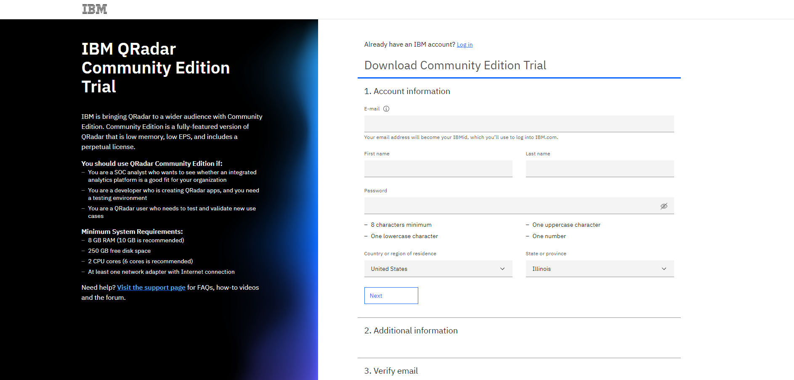
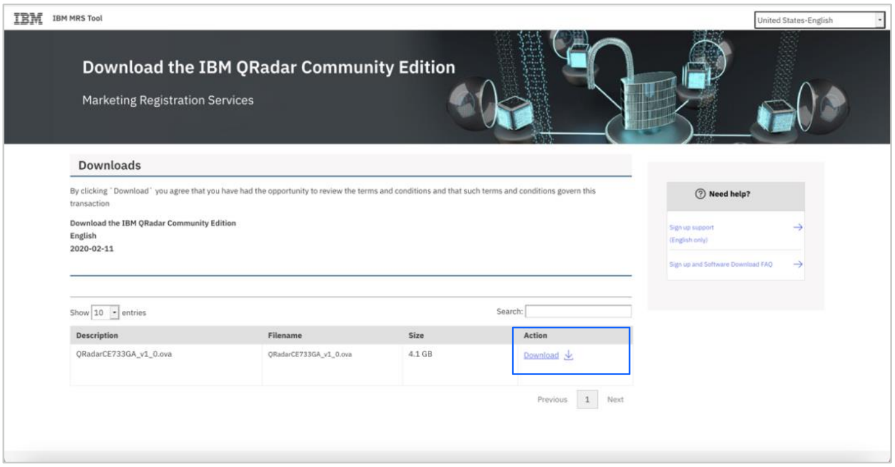

# Como fazer o download do Qradar Community Edition

**Objetivo:** O propósito deste guia é orientá-lo pelas etapas necessárias para fazer o download do Qradar Community Edition através do site IBM SkillsBuild Software Downloads 

**Tempo estimado:** 5-10 minutos

## Passo 1: Abra o site [IBM SkillsBuild Software Downloads](http://ibm.com/academic) em seu navegador.
 

## Passo 2: Clique em **Already registered? Log in.**
 

## Passo 3: Entre com o seu e-mail ID emitido pela sua instituição de ensino, faculdade e complete o processo de login.
 

## Passo 4: Visite em tópicos a página IBM Security
Topics menu > See All > IBM Security
 

 

 

## Passo 5: Role para baixo e clique na guia de Software.
 

## Step 6: Click Download under the QRadar Community Edition tab.
 

 

**Note:** Quando você clicar em Download, uma nova guia será aberta. Alguns navegadores podem solicitar que o usuário permita que essa guia seja operada.

## Passo 7: Quando a nova guia abrir, complete as informações e verifique seu e-mail.
 

**Note:** Faça login com seu e-mail insitucional, pois está associado a um IBMid e você não precisará criar uma conta adicional.

## Passo 8: Complete as informações necessárias para acessar a versão acadêmica do QRadar Community Edition.
 

## Passo 9: Quando o envio das informações for concluída, a página IBM MRS Toll será exibida. Clique em Download para obter o arquivo QRadar.
 

**Note:** 
* Para mais documentações sobre QRadar, visite: https://www.ibm.com/community/qradar
* Para mais informações sobre produtos, visite: https://www.ibm.com/community/qradar/ce/