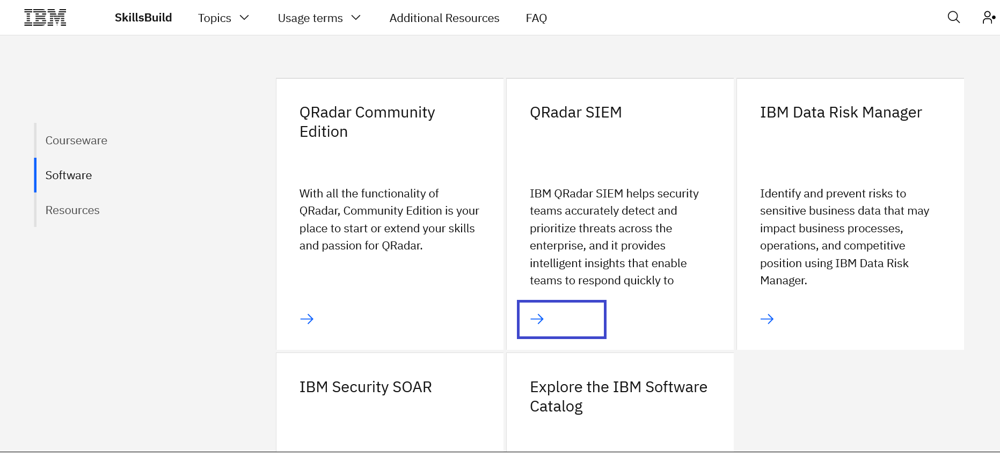
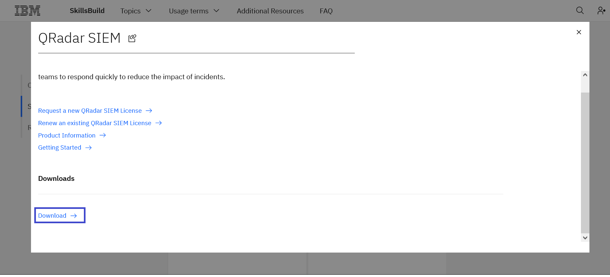
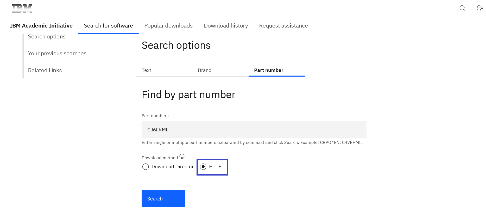
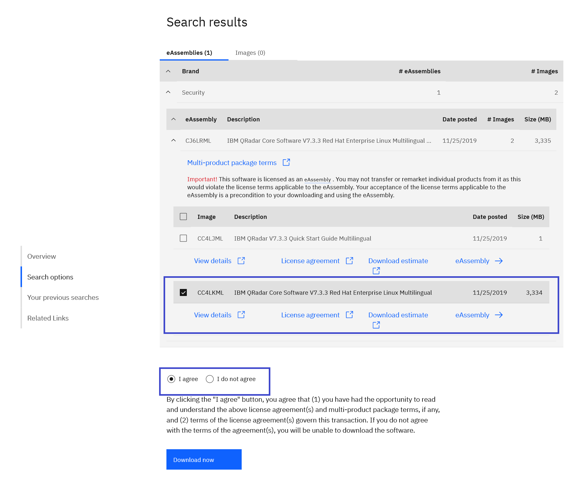
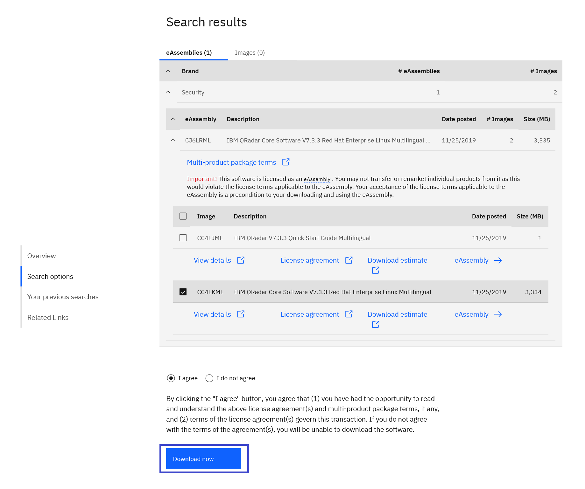

# Como fazer o download do QRadar SIEM

**Objetivo:** O propósito deste guia é orientá-lo pelas etapas necessárias para fazer o download do QRadar SIEM através do site IBM SkillsBuild Software Downloads.

**Tempo estimado:** 5-10 minutos

## Passo 1: Abra o site [IBM SkillsBuild Software Downloads](http://ibm.com/academic) em seu navegador.
 

## Passo 2: Clique em **Already registered? Log in.**
 

## Passo 3: Entre com o seu e-mail ID emitido pela sua instituição de ensino, faculdade e complete o processo de login.
 

## Passo 4: Visite em tópicos a página IBM Security.
Topics menu > See All > IBM Security
 

 

 

## Passo 5: Role a página para baixo e clique na aba Software
 

## Passo 6: Clique em Donwload abaixo de QRadar SIEM.
 

 

**Note:** Quando você clicar em Download, uma nova guia será aberta. Alguns navegadores podem solicitar que o usuário permita que essa guia seja operada.

## Passo 7: Depois de abrir o link IBM Software Download, desça a página até resultados de Find by part number e clique na guia HTTP.
 

## Passo 8: Selecione a imagem para download e após ler e entender o contrato de licença, clique em "I agree".

 

**Note:** Os termos do programa IBM SkillsBuild Software Downloads program podem ser encontrados em: 
https://www.ibm.com/academic/faqs/agreement.

## Passo 9: Clique em Donwload e salve os arquivos em seu disco rígido.
 

## Passo 10: Retorne para página IBM SkillsBuild Software Downloads, na página de Security e solicite uma licença do QRadar SIEM no card QRadar SIEM.
 

**Note:**  A licença vai ser enviada por e-mail em alguns dias.