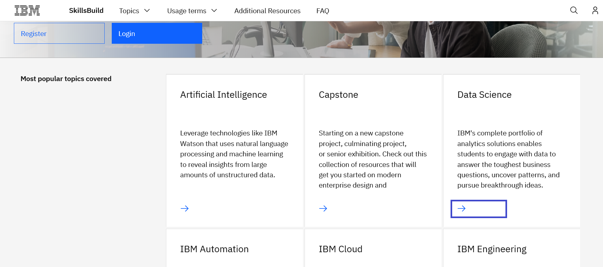
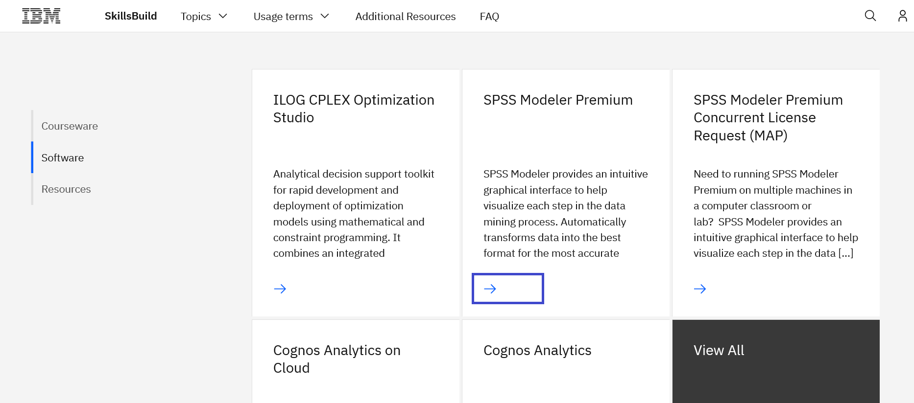
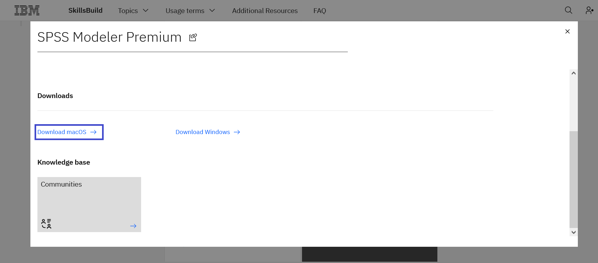
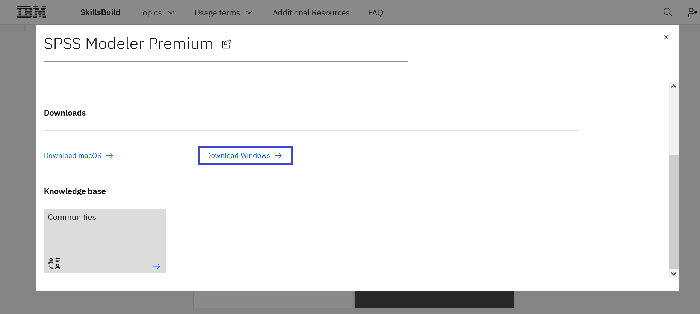
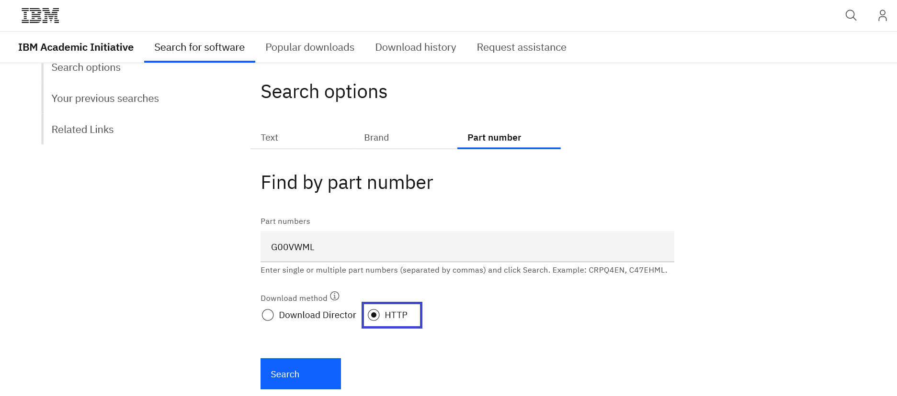
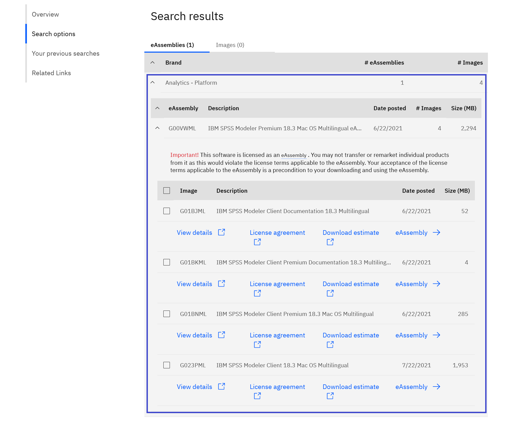
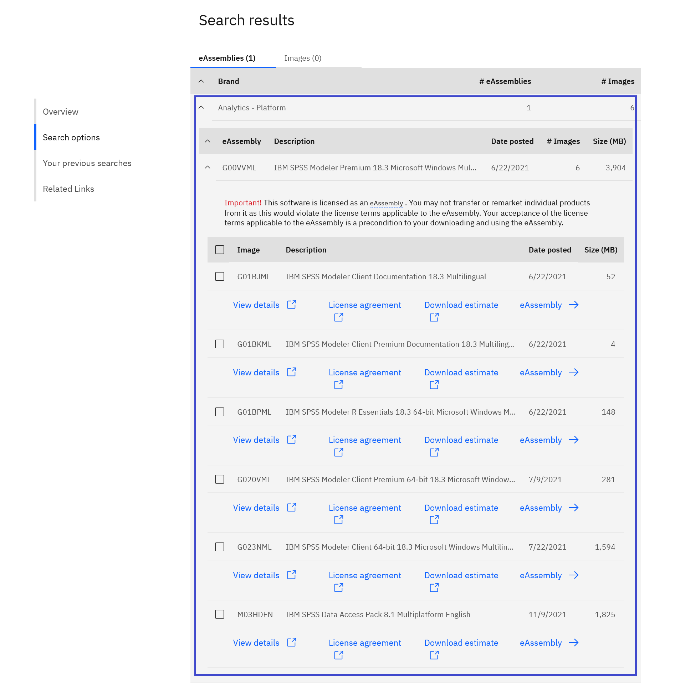
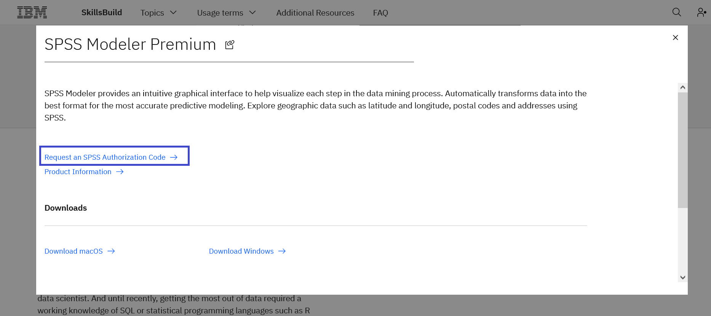

# Como fazer o download do SPSS Modeler Premium

**Objetivo:** O objetivo deste guia é guiá-lo através dos passos necessários para fazer o login no IBM SkillsBuild Software Downloads e baixar o SPSS Modeler Premium.

**Tempo estimado:** 5-10 minutos

## Passo 1: Abra o [IBM SkillsBuild Software Downloads](https://ibm.com/academic) em seu navegador web.
 

## Passo 2: Clique **Already registered? Log in.**
 

## Passo 3: Digite sua instituição acadêmica, faculdade, e-mail de identificação emitido pela universidade e complete o processo de login.
 

## Passo 4: Visite a página do tópico Data Science.
Topics menu > See All > Data Science
 

## Passo 5: Role para baixo e clique na guia Software.
 

## Clique no SPSS Modeler Premium.
 

## Passo 6a: Clique no link Download macOS para baixar o SPSS para o sistema operacional macOS.
 

## Passo 6b: Clique no link Download Window para baixar o sistema operacional SPSS para Windows.
 

**Note:** Quando você clicar em Download, uma nova aba se abrirá. Alguns navegadores podem exigir que o usuário dê permissão para que esta aba possa ser operada.

## Passo 7: Uma vez aberto o link de download do software IBM, role para baixo para Encontrar por resultados de número de peça e clique na aba HTTP.
 

Option: macOS download

Option: Windows download

## Passo 8: Selecione a imagem para baixar e depois de ler e entender o contrato de licença, clique em "Eu concordo".
 

Option: macOS download

Option: Windows download

**Note:** Os termos para o programa IBM SkillsBuild Software Downloads podem ser encontrados em: 
https://www.ibm.com/academic/faqs/agreement.

## Passo 9: Clique em Download agora e salve o(s) arquivo(s) em seu disco rígido local.
 

Option: macOS download

Option: Windows download

## Passo 10: Retornar à página do tópico Ciência dos Dados da IBM SkillsBuild Software Downloads e solicitar um Código de Autorização SPSS no cartão SPSS Modeler Premium.
 

**Note:**  O código de autorização é necessário para ativar o SPSS Modeler Premium.

## Passo 11: Insira o Código de Autorização no SPSS Modeler Premium.
 

**Note:** Para obter suporte do SPSS, por favor, entre em contato com nossa Comunidade SPSS em:
https://developer.ibm.com/predictiveanalytics
