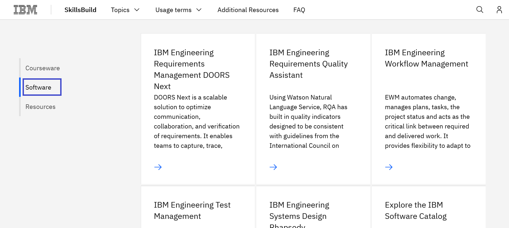
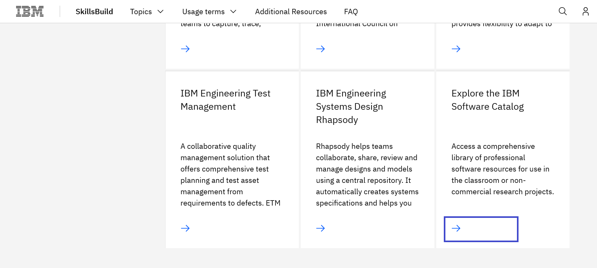
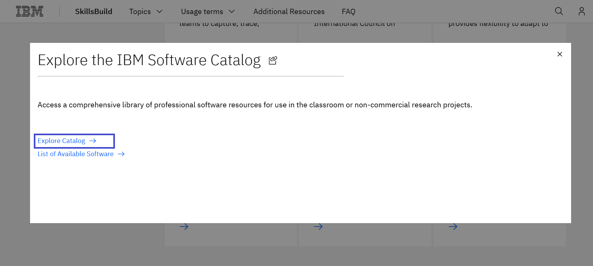
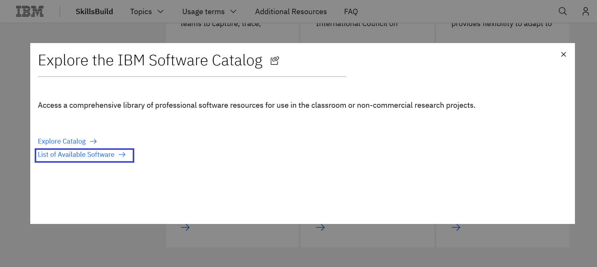
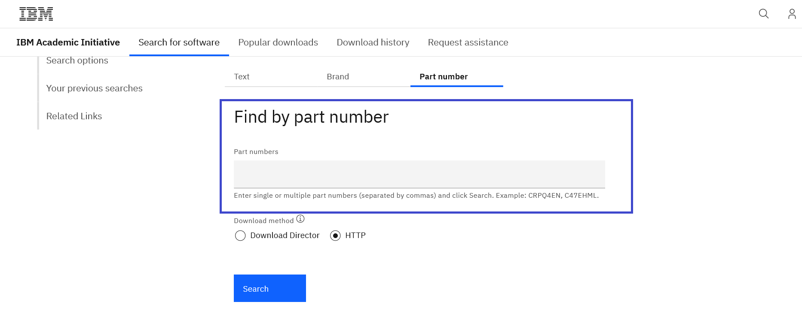
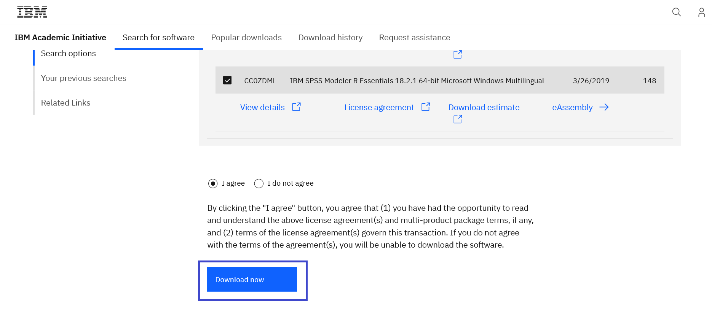

# Explore o IBM Software Catalog 

**Objetivo:**
O propósito deste guia é orientá-lo pelas etapas necessárias para explorar o IBM Software Catalog disponível para os usuários do IBM SkillsBuild Software Downloads e como você pode fazer o download dos artefatos.

**Tempo Estimado:** 5-10 minutos

## Passo 1: Abra o site [IBM SkillsBuild Software Downloads](http://ibm.com/academic) em seu navegador.
 

## Passo 2: Cloque **Already registered? Log in.**
 

## Passo 3: Entre com o seu e-mail ID emitido pela sua instituição de ensino, faculdade e complete o processo de login.
 

## Passo 4: Visite qualquer uma das páginas de tópicos
Example - Topics menu > See All > IBM Engineering
 

 

 

## Passo 5: Role a página e clique em Software
 

## Passo 6a: Clique no link que está abaixo da guia Explore the IBM Software Catalog.
 

 

## Passo 6b: Clique no link List of Available Software abaixo da guia Explore the IBM Software Catalog para ver a lista de software disponivel.
 

## Passo 7: Pesquise pelo artefato desejado, digitando o nome ou número. Os resultados incluirão todos os produtos elegíveis ou relevantes.
 

 

## Passo 8: Assim que achar o artefato, clique na guia HTTP e escolha o artefato que você deseja fazer o download. Aceite os termos e condições, clicando em "I agree" para continuar o processo de download.
 

## Passo 9: Clique em Download para iniciar o donwload do artefato escolhido.
 

