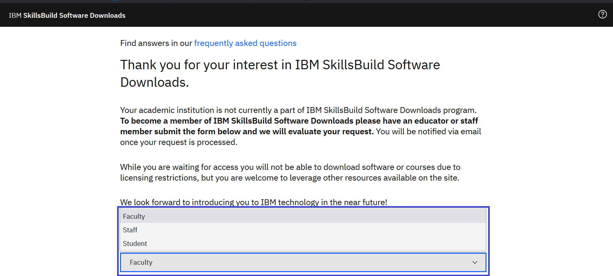
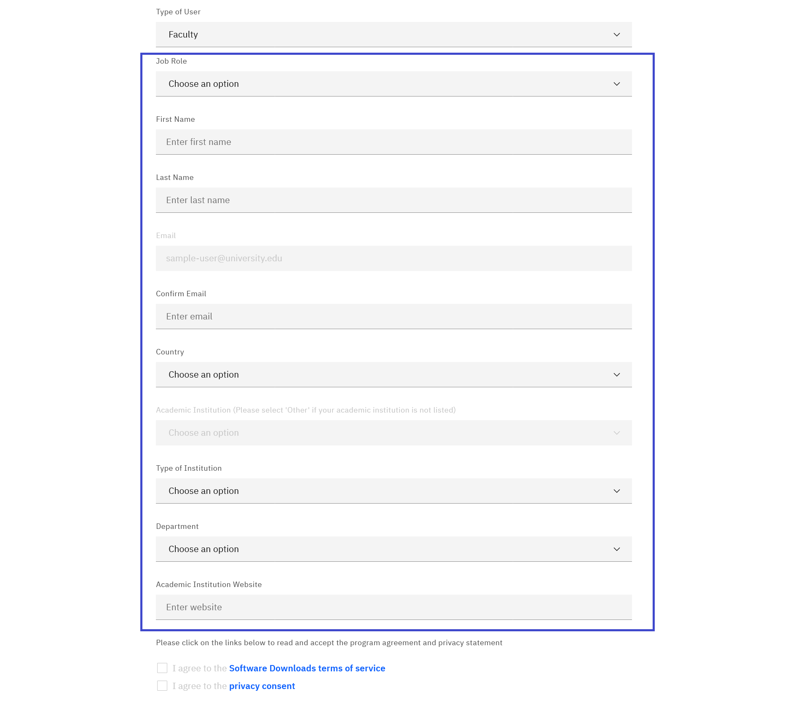
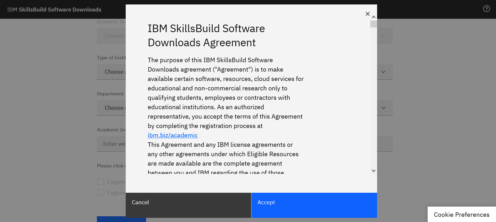
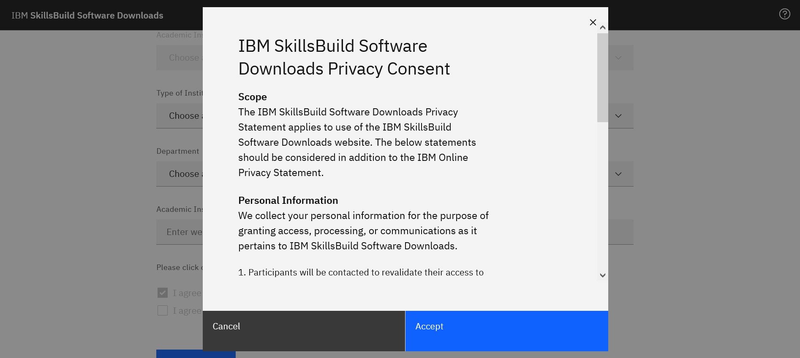

# Como indicar sua instituição para acesso ao IBM SkillsBuild Software Downloads 

**Objetivo:** O objetivo deste guia é guiá-lo através dos passos a serem seguidos ao nomear uma instituição acadêmica para a IBM SkillsBuild Software Downloads.

**Tempo estimado:**  
5 – 10 minutos (registrar)  
7 – 10 dias úteis (tempo estimado para revisão)

## Passo 1: Abra os [downloads do software IBM SkillsBuild](https://ibm.com/academic) em um navegador web.
 

## Passo 2: Clique em **Registre-se agora**.
 

## Passo 3: Digite sua instituição acadêmica, universidade, e-mail de identificação emitido pela faculdade.  Se sua instituição não faz parte do IBM SkillsBuild Software Downloads, você receberá um formulário a ser preenchido.
 

## Passo 4: No menu suspenso, escolha o "Tipo de usuário" que melhor descreve seu perfil.
**Nota:** Somente um membro do corpo docente ou da equipe pode indicar suas instituições acadêmicas.
 

## Passo 5: Digite as informações necessárias.
 

## Passo 6: Clique e revise o Acordo de Download de Software SkillsBuild da IBM e a Declaração de Privacidade.
 

## Passo 7: Após ler o Acordo de Downloads do Software SkillsBuild da IBM e a Declaração de Privacidade, clique em **aceitar**.
 

# Step 8: Clique **Submit**.

# Passo 9: Uma vez que seu registro tenha sido processado, você receberá uma notificação por e-mail.
 

# Passo 10 : Se aprovado, retorne ao site da IBM SkillsBuild Software Downloads e complete seu processo de registro.