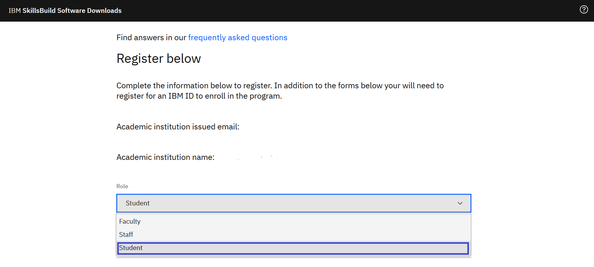
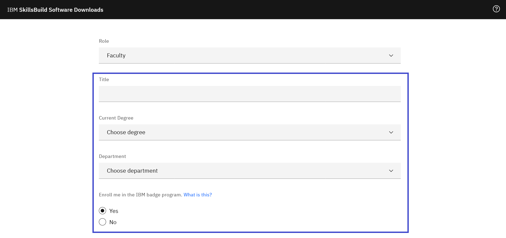

# Como se registrar na IBM SkillsBuild Software Downloads

[日本語](/academic-initiative/jp/how-to/How-to-register-with-the-IBM-Academic-Initiative/readme.md)

**Objetivo:** O objetivo deste guia é guiá-lo através dos passos a serem seguidos quando você se registrar como estudante ou membro do corpo docente no site da IBM SkillsBuild Software Downloads.

**Tempo estimado:** 5-10 minutos

## Passo 1: Abra [IBM SkillsBuild Software Downloads](https://ibm.com/academic) em um navegador web.
 

## Passo 2: Clique **Register Now.**
 

## Passo 3: Digite sua instituição acadêmica, universidade, e-mail de identificação emitido pela faculdade.
 

## Passo 4: Selecione se você é um estudante ou um membro do corpo docente.
 

## Passo 5: Digite as informações necessárias.
 

## Passo 6: Selecione se gostaria de participar do [IBM Badge Program](https://www.ibm.com/training/credentials)
 

## Passo 7: Depois de ler o Contrato de Download de Software IBM SkillsBuild e a Declaração de Privacidade, clique **“I agree”.**
 

 
## Step 8: Clique **Register**.
 

 
## Passo 9: Se você já possui um IBMid com a instituição acadêmica emitida por e-mail ID, você será solicitado a fazer o login com essa mesma conta agora. Se você não tiver um IBMid junto com a instituição acadêmica emitida por e-mail ID, você será solicitado a criar uma neste momento.
 

## Passo 10: Retornar ao site da IBM SkillsBuild Software Downloads e login.