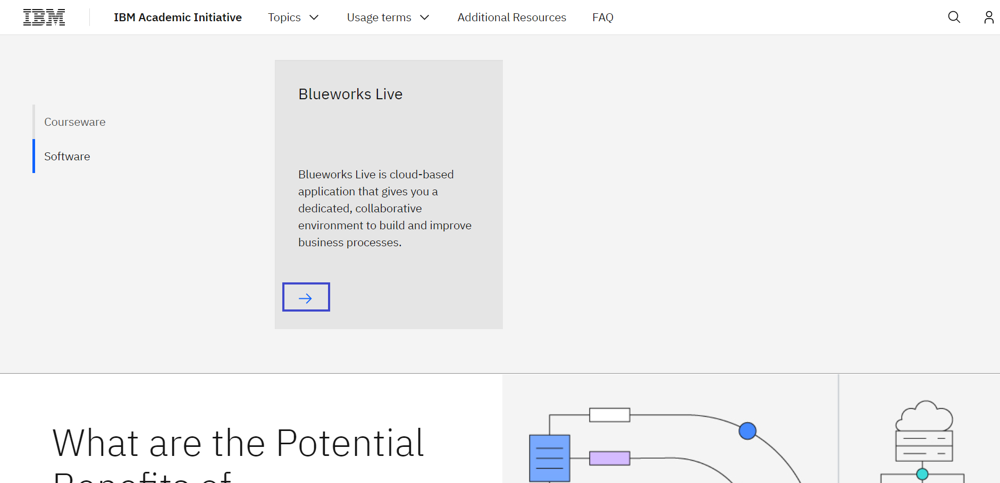
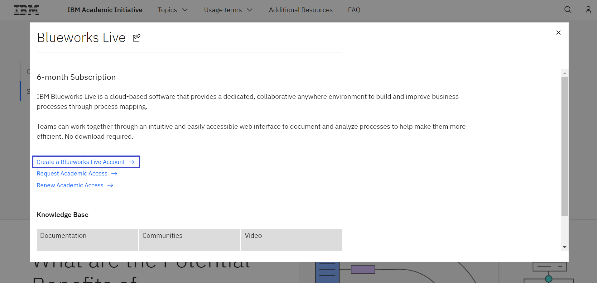
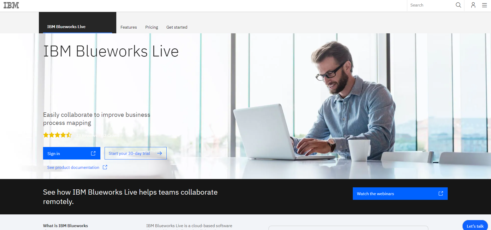
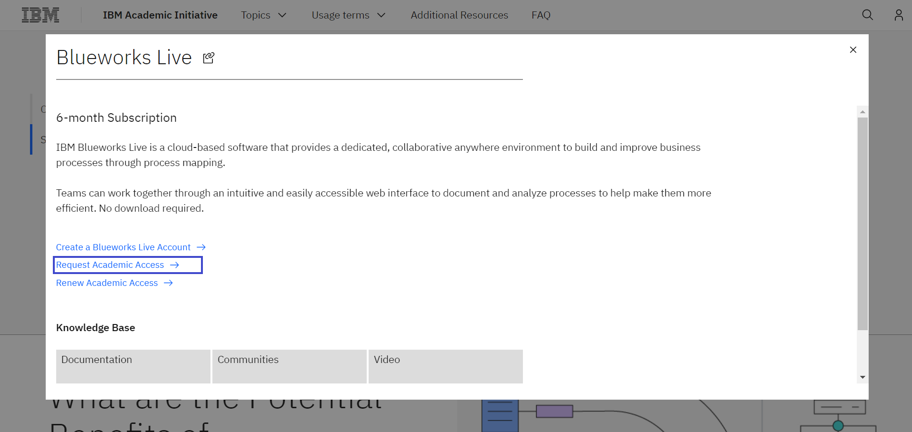

# Como solicitar acesso ao Blueworks Live

**Objetivo:** O propósito deste guia é orientá-lo pelas etapas necessárias para acessar o Blueworks Live através do site IBM SkillsBuils Software Downloads.

**Tempo estimado:** 5 – 10 minutos

## Passo 1: Abra o site [IBM SkillsBuild Software Downloads](https://ibm.com/academic) em seu navegador.
 

## Passo 2: Clique em **Already registered? Log in.**
 

## Passo 3: Entre com o e-mail ID emitido pela sua instituição de ensino, faculdade e complete o processo de login.
 

## Passo 4:  Visite em tópicos a página IBM Automation
Topics menu > See All > IBM Automation
 

 

 

## Passo 5: Role para baixo e clique na aba Software.

## Passo 6: Selecione Blueworks Live e clique no link Create a Blueworks Live Account

 

Use o mesmo IBMid que foi usado pela primeira vez para se registrar no site IBM SkillsBuild Software Downloads.
 

## Passo 7: Agora, retorne na aba IBM SkillsBuild Software Downloads. Então clique no link Request Academic Access para solicitar que sua conta teste deve ser convertida para um conta acadêmica.

