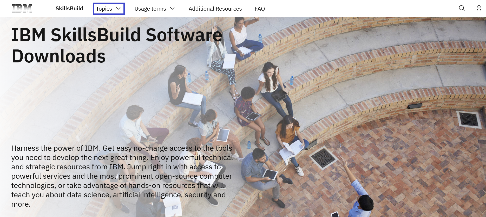
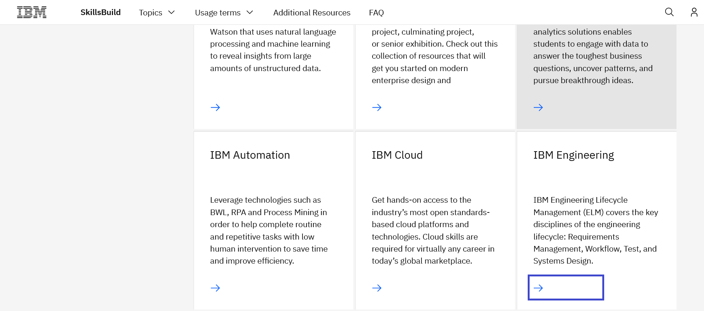
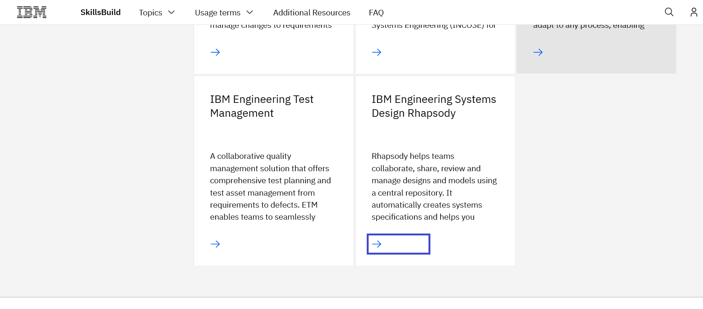
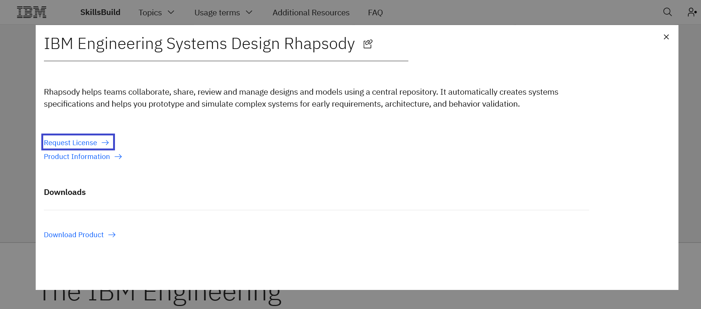
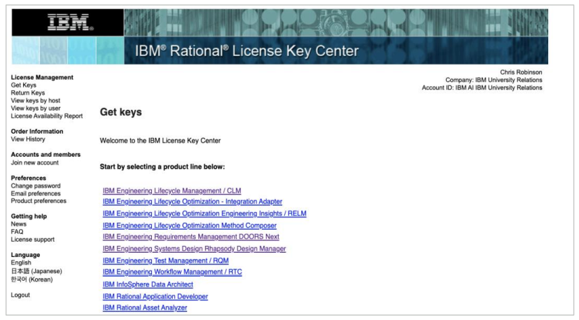

# Como solicitar uma licença IBM Rhapsody.

**Objetivo:** O propósito deste guia é orientá-lo pelas etapas necessárias ao solicitar Rhapsody v9.0 através do site IBM SkillsBuild Software Downloads.

**Tempo estimado:** 5-10 minutos

## Passo 1: Abra o site [IBM SkillsBuild Software Downloads](https://ibm.com/academic) em seu navegador.
 

## Passo 2: Clique em **Already registered? Log in.**
 

## Passo 3: Entre com o e-mail ID emitido pela sua instituição de ensino, faculdade e complete o processo de login.
 

## Passo 4: Visite em tópicos a página IBM Engineering
Topics menu > See All > IBM Engineering
 

## Passo 5: Role a página e clique na aba de Software.
 

## Passo 6: Clique em Request License abaixo da aba IBM Engineering System Design Rhapsody.
 

**Note:** Quando você clicar em Request License, a requisição é enviada pelo time IBM Engineering, uma vez que sua requisição é aprovada você receberá um e-mail com as instruções para obter a licença.
 

## Passo 7: Depois de receber o e-mail de confirmação, clique no link para IBM Rational License Key Center.
 

## Passo 8: Desça a página e clique no link (destacado abaixo) para obter a License Key necessária para o Rhapsody v9.0.
 

