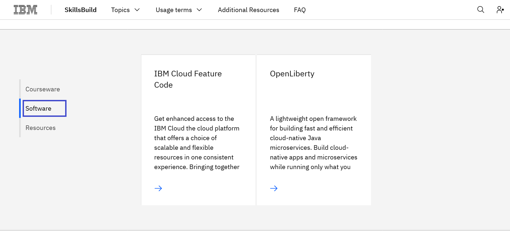
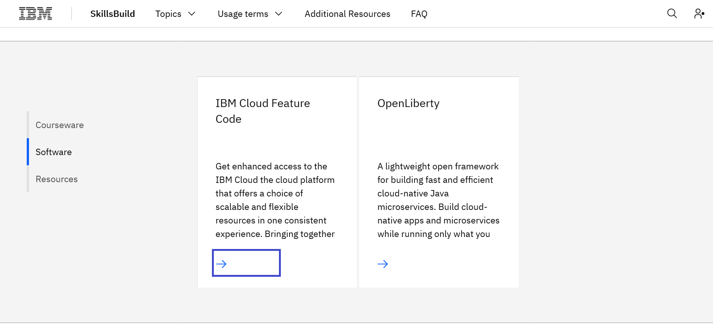

# Como solicitar um IBM Cloud Feature Code 

[日本語](/academic-initiative/how-to/How-to-request-and-IBM-Cloud-Feature-Code/readme-ja.md)

**Objetivo:** O objetivo deste guia é guiá-lo através dos passos a serem seguidos para solicitar um IBM Cloud Feature Code. Este guia assumirá que você já tem [registered with IBM SkillsBuild Software Downloads](/academic-initiative/how-to/How-to-register-with-the-IBM-Academic-Initiative/readme.md).

**Tempo estimado:** 5-10 minutos

## Passo 1: Abra o [IBM SkillsBuild Software Downloads](https://ibm.com/academic) em seu navegador web.
 

 

## Passo 2: Clique **Already registered? Log in.**
 

 
 
## Passo 3: Digite sua instituição acadêmica, faculdade, e-mail de identificação emitido pela universidade e complete o processo de login.
 

  

## Passo 4: Visite as páginas temáticas da IBM Cloud

Você pode navegar rapidamente para a página, clicando no **Topics menu > IBM Cloud**
 

  

## Passo 5: Role para baixo e clique **Software**.
 

  
 
## Passo 6: Clique **IBM Cloud Feature Code.** 
 

  

## Passo 7: Clique **Request Feature Code.**
    
 
## Passo 8: O código do recurso será exibido.  Ele também será enviado por e-mail para o seu e-mail de identificação registrado.
 

