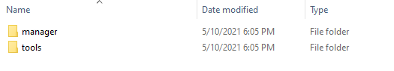
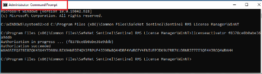
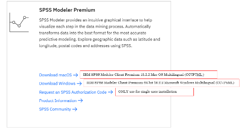
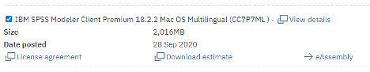

# Instruções para download e instalação do IBM SPSS Modeler Premium Network 

Revise e siga essas etapas para concluir a instalação do IBM SPSS Modeler para sua instituição.

## Determine o número de licenças necessárias:
Identifique o número de dispositivos que serão licenciados para instalação SPSS License Manager (SLM). Solicite que o(s) código(s) sejam gerados do IBM SKills Build Software Downloads website; Solicitações de códigos são normalmente processados às quarta-feiras;

## Faça o download do IBM SPSS License Manager (SLM);
Uma vez que você obter o código de autorização de máquinas do IBM SkillsBuild Software Downloads, faça o download do IBM SPSS Concurrent Licensing Manager deste local:

https://ibm.ent.box.com/s/dvf8z6ek8qkd69uhykju5webtmtwx1pt

Faça sua escolha baseado no seu sistema operacional. 

- **spss_clt_9.8_win_en.zip** (for Windows operating system)
- **spss_clt_9.8_mac_en.tar.tar.gz** (for Macintosh operating system)
- **spss_clt_9.8_lnx_en.tar.tar.gz** (For Linux operating system)

Cada um desses download são arquivos compactados que devem primeiro ser descompactados.

## Instale o SPSS License Manager (SLM):
O exemplo abaixo descreve as etapas para serem seguidas ao instalar em uma máquina servidor Windows.

1. Extraia o conteúdo do arquivo **spss_clt_9.8_win_en.zip** para uma pasta no disco. Você verá duas pastas.

2. Na pasta **manager** clique com o botão direito no arquivo `setup.exe` e selecione a opção **Run as administrator**.

 
3. Na pasta **tools** clique com o botão direito no arquivo `setup.exe` e selecione a opção **Run as administrator**.

 
**Recomenda-se usar o caminho padrão C:\Program Files (x86)\Common Files\SafeNet Sentinel\Sentinel RMS License Manager**

_NOTE: Depois de instalar os arquivos manager e tools, a versão do SLM é 9.6.2.0006, conforme visto na ferramenta Sentinel RMS Server Administration (WlmAdmin)_

## Licença do SPSS License Manager (SLM):

Para licenciar o novo instalador License Manager, abra um prompt de comando administrativo. Troque o diretório da subpasta para WinNT C:\Program Files (x86)\Common Files\SafeNet Sentinel\Sentinel RMS License Manager\WinNT) e use o comando `licenseactivator` seguido pelo seu código de autorização de rede de 20 caracteres:

 
Para completar o processo de licença, pare e reinicie o serviço Sentinel License Manager

## Faça o download do IBM SPSS Modeler 18.x Client:

No site IBM SkillsBuild Software Downloads website: (www.ibm.com/academic) faça o download do arquivo de download SPSS Modeler Premium de acordo com o seu sistema operacional.

 
Mac OS: 

 
 
Windows OS:

  

Esta nota técnica contém informações adicionais sobre download, instalação e licença do SLM:  https://www.ibm.com/support/pages/node/6233924

## Instalar IBM SPSS Modeler  18.x Client:

**Para instalar o software**, siga as etapas descritas no site da documentação IBM SPSS Modeler Premium 18.2 Installation and Configuration Guide found on the SPSS Modeler 18.2 : https://www.ibm.com/support/pages/spss-modeler-182-documentation.

Para uma instalação individual, revise as etapas descritas no capítulo 2.

Para enviar uma instalação silenciosa do software para diferentes estações de trabalho com o mesmo hardware, revise as instruções de “Silent Installation” também em:

_Note: Para fazer a instalação, você deve estar conectado ao seu computador com privilegios de administrador._