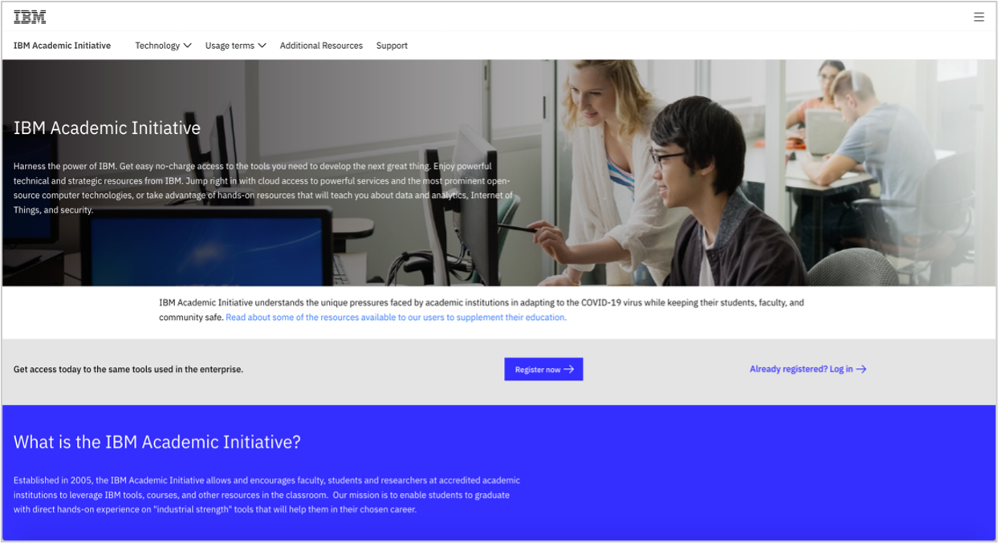
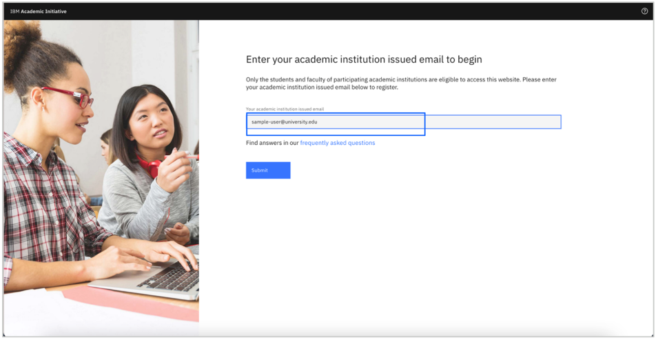
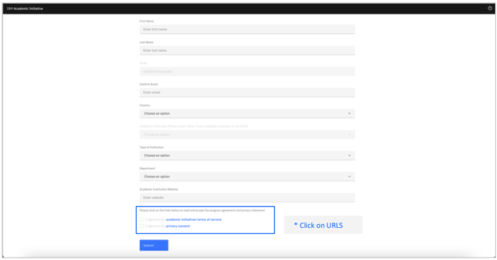
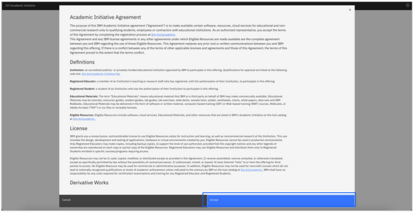
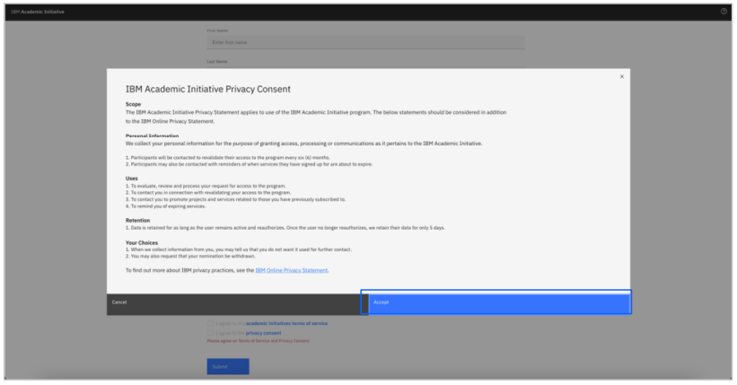
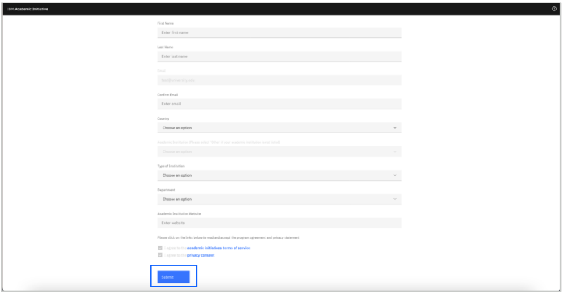

# How to nominate your institution to the IBM Academic Initiative 

**Objective:** The purpose of this guide is to walk you through the steps to be followed 
when nominating an academic institution to the IBM Academic Initiative.

**Estimated time:**  
5 – 10 minutes (registration)  
7 – 10 business days (estimated time for review)

## Step 1: Open the [IBM Academic Initiative](https://ibm.com/academic) website in a web browser.
 

## Step 2: Click **Register Now**.
 

## Step 3: Enter your academic institution, university, college issued email ID.  If your institution is not a part of the IBM Academic Initiative you will be presented with a form to complete.
 

## Step 4: From the dropdown menu, choose the “Type of user” that best describes your profile.
**Note:** Only a faculty or staff member can nominate their academic institutions.
 

## Step 5: Enter the required information.
 

## Step 6: Click and review the IBM Academic Initiative Agreement and Privacy Statement.
 

## Step 7: After reading the IBM Academic Initiative Agreement and Privacy Statement, click **Agree**.
 

# Step 8: Click **Submit**.

# Step 9: Once your registration has been processed, you will receive an email notification.
 

# Step 10 : If approved, return to the IBM Academic Initiative website and complete your registration process.