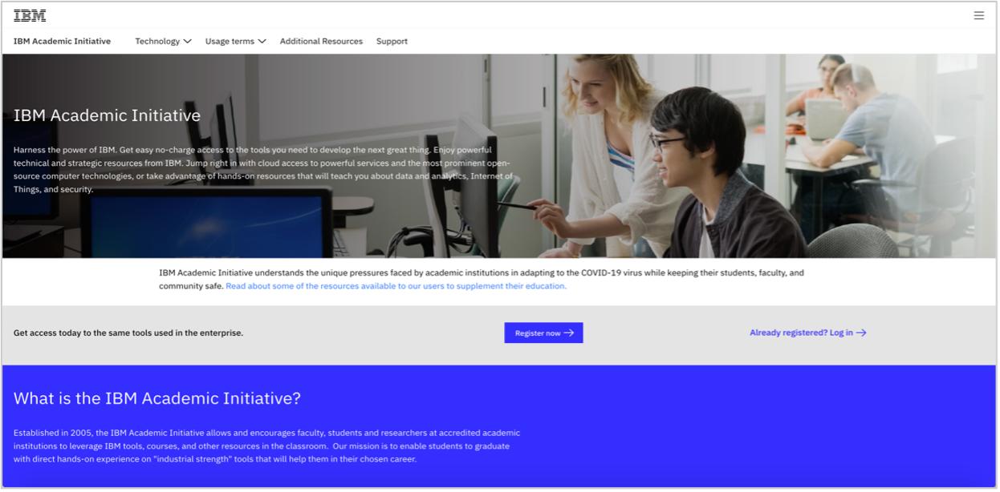
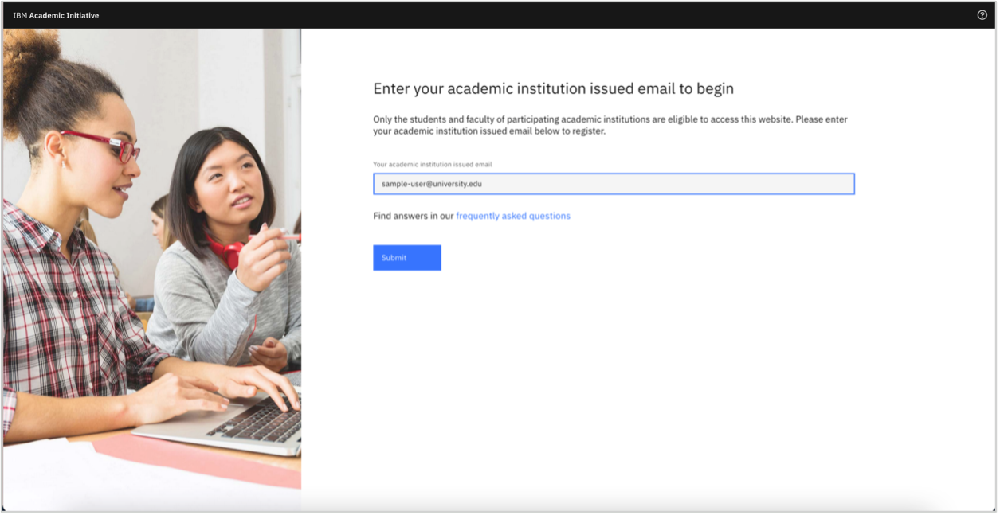
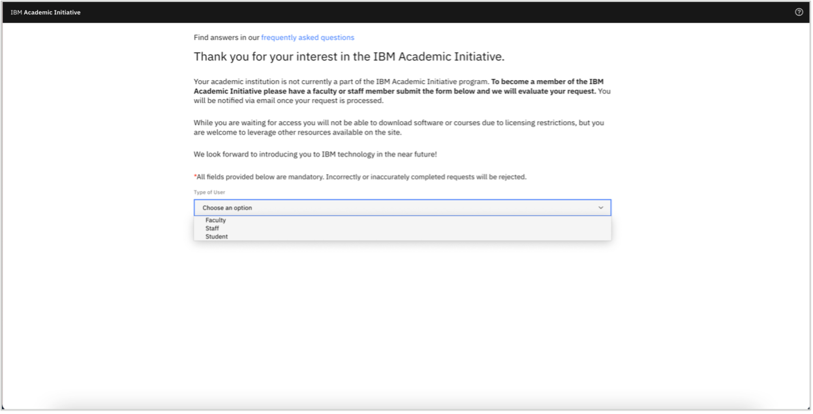
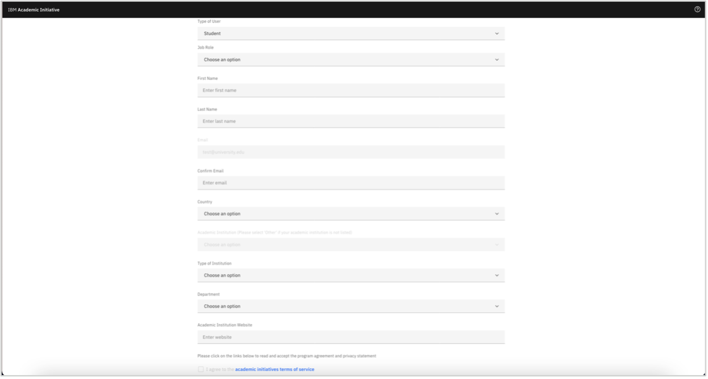
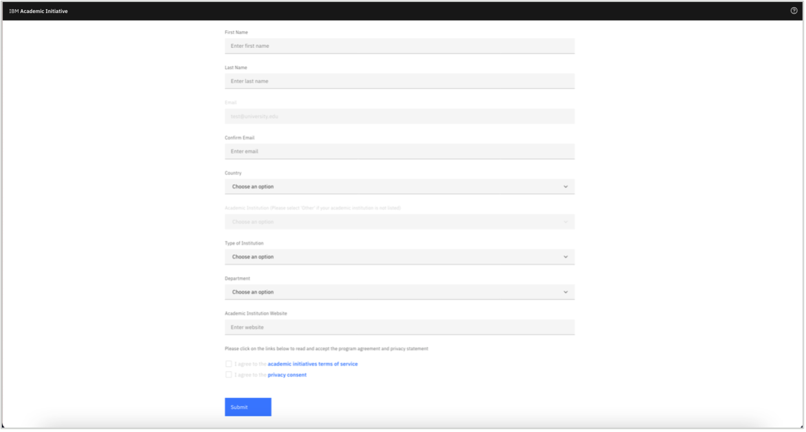

# Register with the IBM Academic Initiative 
**Objective:** The purpose of this guide is to walk you through the steps to be followed when you register and login as a student or a faculty member in the IBM Academic Initiative website.

**Estimated time:** 5-10 minutes

## Step 1: Open the IBM Academic Initiative URL ibm.com/academic in a web browser.

## Step 2: Click Register Now.

## Step 3: Enter your academic institution, university, college issued email ID.

## Step 4: Select whether you are a student or a faculty member.

## Step 5: Enter the required information.

## Step 6: After you read the IBM Academic Initiative Agreement and Privacy Statement, click, “I agree”.

 
## Step 7: Click Register.

 
## Step 8a: If you already have an IBMid with the academic institution issued email ID, you will be asked to login with that same account now.
 

## Step 8b: If you do not have an IBMid along with the academic institution issued email ID, you will be asked to create one at this time.
 

## Step 9: Return to the IBM Academic Initiative website and login.

 

