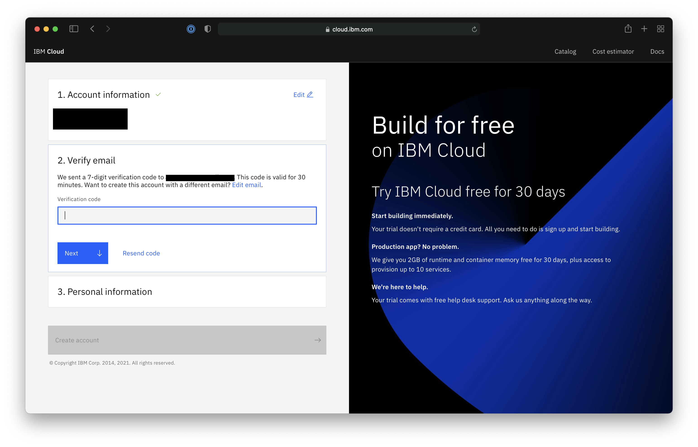
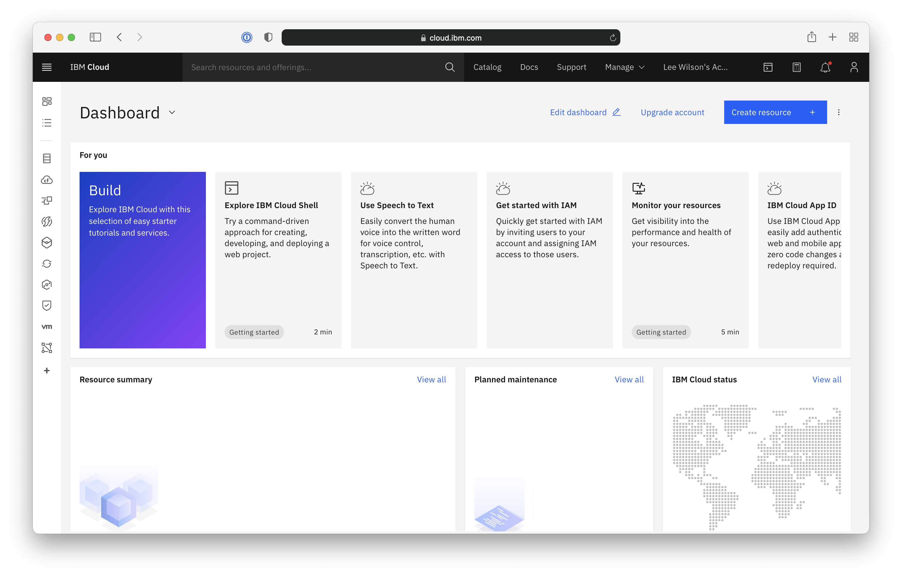
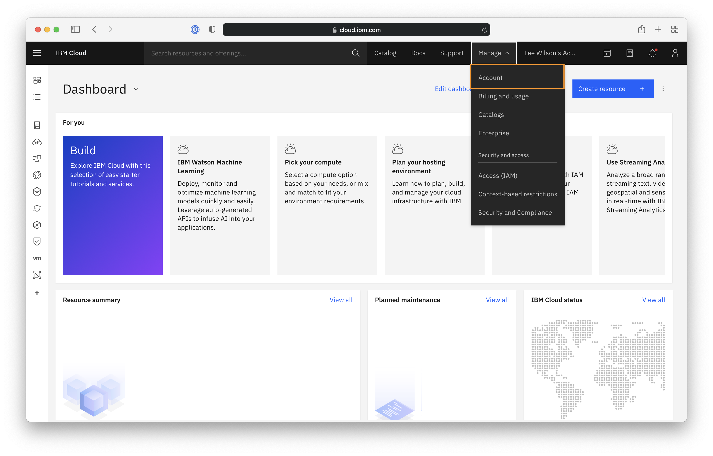
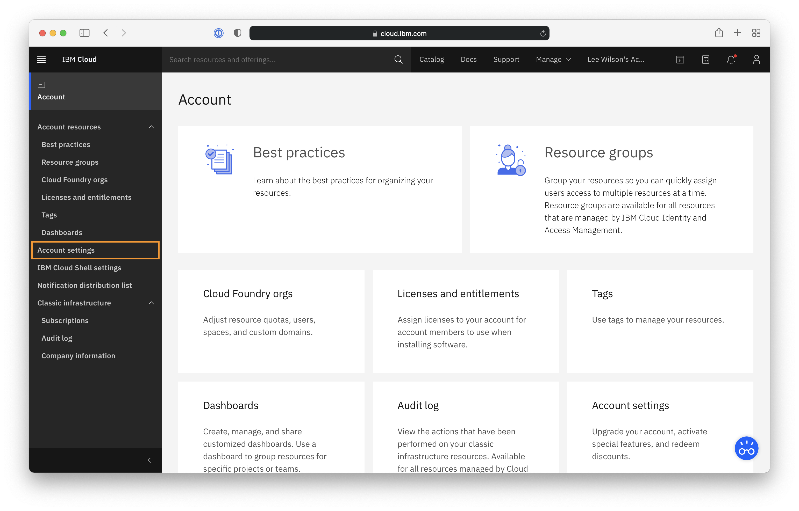
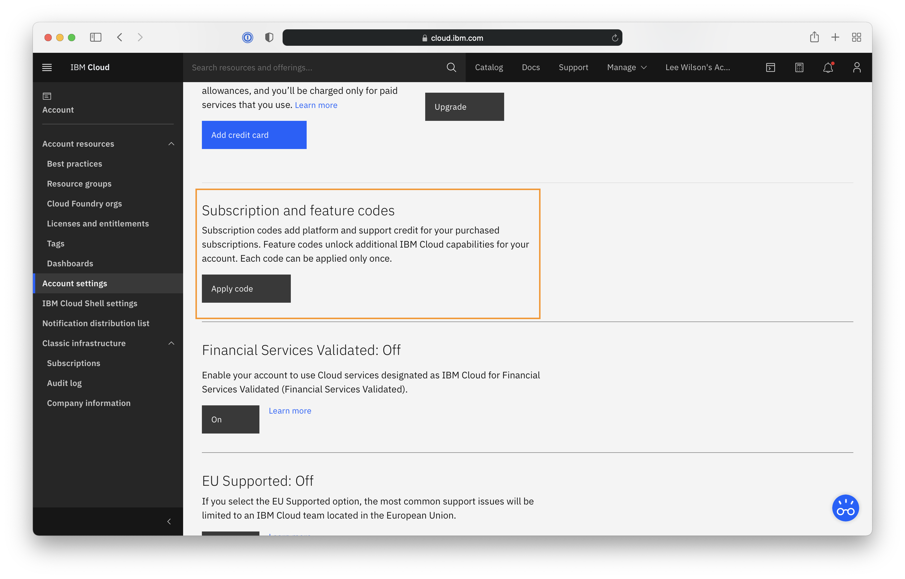
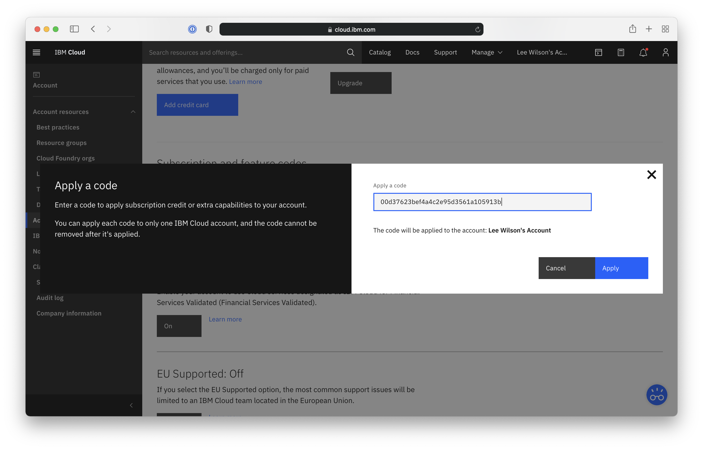
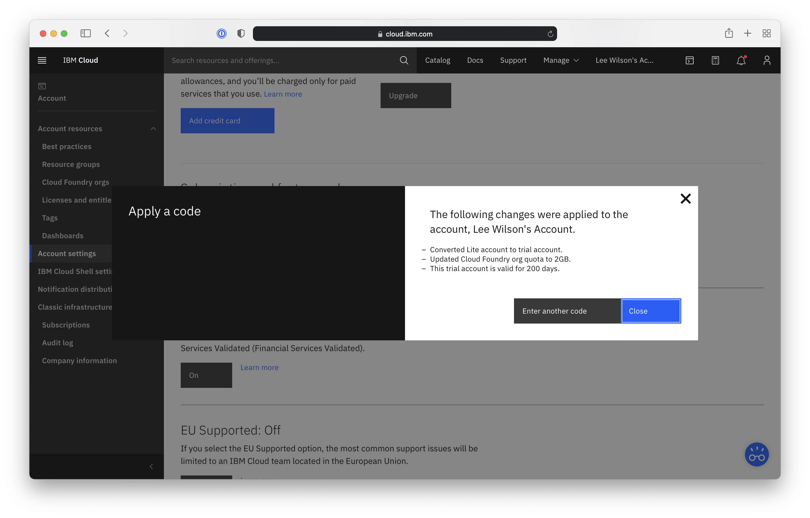

# Creating a new IBM Cloud Trial account and extend the trial duration with an IBM Cloud Feature Code

**Note:** If you already have an IBM Cloud Lite account you can skip to Step 3 to apply the IBM Cloud Feature Code.  You can check your account type by visiting Manage > Account > Account Settings.  The information will be displayed in the main section of the page.

### Step 1: Visit [IBM Cloud](https://cloud.ibm.com/registration/trial) and complete the new account registration form.

Provide your email address.

You will be sent a verification code from no-reply@cloud.ibm.com enter it into the text field and click **Next**

Provide the necessary personal information and click on the **Create Account** button.

### Step 2: Accept the IBM Cloud terms and conditions

Review the information on the following screen and click on **Proceed** to complete the creation of your IBM Cloud Trial account.

You will then be redirected to the IBM Cloud dashboard page

### Step 3: Apply the IBM Cloud Feature Code

From the IBM Cloud Dashboard, click on the **Manage** menu in the upper-right.  Then click on the **Account** menu item.

In the Account page click on **Account Settings**

Scroll down until you see the *Subscription and feature code* section and click on **Apply code**

Enter your IBM Cloud Feature Code into the text box and click on **Apply** 

Once the code is applied you will see a summary of the changes made to your IBM Cloud account.

**Note:** It may take a few minutes, and/or require you to logout and back in before you see the changes in the Account Setting page

