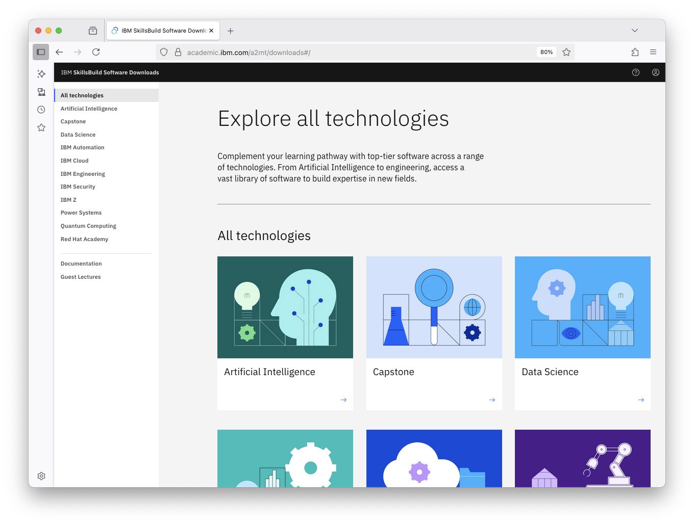

# 📘 Access Software on IBM SkillsBuild

### ✅ What You’ll Need
- A device with internet access
- A valid university issued email address

### 🚀 How to Get Started
1. Go to [academic.ibm.com](https://academic.ibm.com)
2. Enter your official college or university email address
3. If you are a first time visitor, complete the registration form for Software Downloads and click on **Register** when complete.
   - Otherwise complete the IBMid login process.
4. If you already have an IBMid with the same college or university issued email address, you will be asked to login with that same account now.
   - If you do not have an IBMid using the same college or university issued email address, you will be redirected to the IBMid account creation page to create one.
5. If necessary, return to academic.ibm.com and login with your newly created account.

###  🏁 You’re In!
- Explore the software and resources available to you.
- Looking for more guides [click here](https://github.com/academic-initiative/documentation/tree/main/academic-initiative) 

